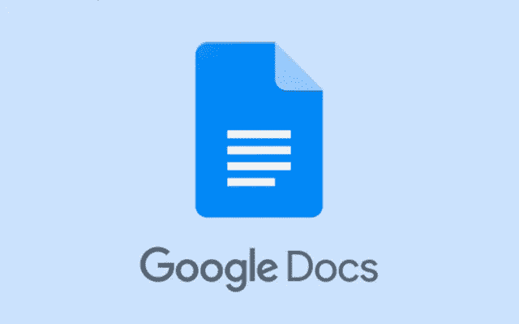

# 用猛犸导入内容指南

> 原文：<https://medium.com/visualmodo/google-docs-to-wordpress-import-content-guide-with-mammoth-e57f26cab015?source=collection_archive---------0----------------------->

你是谷歌文档的粉丝吗？你当然是。由于其简单的协作和格式化功能，这是一个了不起的工具。然而，如果你想从谷歌文档导入到 WordPress，这并不令人惊讶，因为今天你将学习如何从谷歌文档导入到 WordPress

我们大多数人使用 WordPress 编辑器或桌面编辑器写文章，如 Open Live Writer、Blogo、Desk 或其他。但是，如果你需要从别人那里得到一篇文章，你会怎么做呢？在我九年的博客生涯中，大多数用户更喜欢用谷歌文档发送文章(客座博文),或者发送普通的。docx 文件。因此，您需要花费时间来编辑和导入它。

# 安装并激活猛犸。docx 转换器插件

你需要做的第一件事是，安装并激活插件。只需进入 WordPress 仪表盘>插件>添加新项，搜索“猛犸”。点击“立即安装”和“激活”按钮。这个插件没有选项面板。一旦它被激活，你不需要改变其他任何东西。

# 下载 Google 文档文件(导入)

下一步是下载微软 Word 格式的谷歌文档。docx)。所以，去谷歌文档文件，点击文件。以 Microsoft Word 格式下载。docx)。因此，该文件将被下载到您的计算机上。

# 将谷歌文档的内容上传到 WordPress 编辑器

现在是时候把文件上传到 WordPress 了。你会发现一只“猛犸”。WordPress 帖子编辑器下的“docx converter”框。现在您需要选择。你想上传到你的 WordPress 编辑器的 docx 文件。

因此，上传文件后，您可以看到文件的“可视”和“原始 HTML”版本。如果看起来没问题，那么就点击“插入到编辑器中”按钮。处理这个文件需要一些时间。完成后，你可以在文章编辑器中看到完整的谷歌文档。大多数情况下，它会保持原来的格式。

最后，如果你对如何从谷歌文档导入 WordPress 有任何问题，请在评论中留下，我会尽力帮助你的！