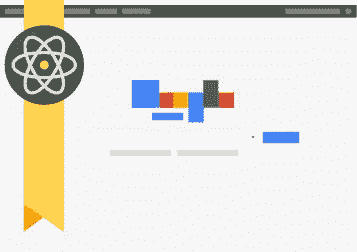

# 谷歌学术网站索引指南

> 原文：<https://medium.com/visualmodo/google-scholar-website-index-guide-c00bfd06de7f?source=collection_archive---------0----------------------->

谷歌学术是一个可免费访问的网络搜索引擎，它通过一系列出版格式索引学术文献的全文或元数据，这里有一个完整的指南来索引你在谷歌学术的网站。

当你想到学术研究时，WordPress 可能不是第一个想到的东西。当我给学生们讲授 JSTOR、谷歌学术、EBSCO、ProjectMUSE 或任何其他学术数据库时，我从未告诉他们去查看 WordPress。但也许我应该这么做！事实证明，WordPress 对研究人员和学生都有好处。如果你的研究用 WordPress 发布，谷歌学术[可以自动索引你的研究](https://scholar.google.com/)。

# 为什么以及如何使用 WordPress 进行研究？

研究领域可能会迅速变化。你的项目可能开始朝一个方向前进，但最终会完全转向另一个领域。正因为如此，一些人经常在他们进行项目研究时写博客，让他们的工作有一定程度的透明度，并邀请其他专业人士参与，这可能有助于你看到你可能会忽略或考虑的事情。

另外，定期使用 [WordPress](https://visualmodo.com/) 更新你的研究可以让你的学生不仅在学期中参与到你的课程中，而且在之后很长一段时间内都参与进来，因为他们已经投入到这个项目中了。或者他们可能有兴趣成为你的研究助理。至少，他们将近距离接触到学术研究的真实世界，众所周知，这与他们习惯的课堂环境截然不同。

总之，WordPress 是一个优秀的系统，它可以存档和展示你的出版物和研究，比其他数据库更受欢迎。

关于*如何在谷歌学术上使用 WordPress，这其实很简单。你不需要使用任何特殊的插件或者定制你的 PHP 文件。您只需将论文复制/粘贴到新页面或上传 PDF。这简单吗？*

# 开始

第一件事是建立你的 WordPress 博客。最好的情况是在你学校的域上设置它，这样你就有一个**。edu** TLD。这很重要，但不是 100%必要。它可以帮助你向谷歌学术证明。许多学院和大学已经建立了多站点安装，如果您的没有，请咨询 IT 部门。你甚至可以向他们推荐有多少学院和机构已经在使用 WP 了(包括哈佛)。或者去野营。看到了吗？这是一件事。

一旦你设置好了，就该开始发布了。但在你这样做之前，我想让你知道谷歌学术说什么是合适的，什么是不合适的，以供他们考虑:

> 您网站上托管的内容必须主要由学术文章组成——期刊论文、会议论文、技术报告或它们的草稿、论文、预印本、后印本或摘要。新闻或杂志文章、书评和社论等内容不适合谷歌学术。

这是很标准的东西，真的。不过，你可以在你的博客上发表你的书评和社论。谷歌学术并不一定对此感到沮丧。他们就是不索引。

# 谷歌学术的内容结构

首先，确保你的网站上有一个名为**出版物**的页面。那是谷歌学术想要的名字，所以让我们照他们说的做。

在这个页面上，你将只链接到你想在谷歌学术上被索引的**终稿。这不是一个保存任何导致最终结果的早期草稿或笔记的地方。这种事情应该用普通的博客文章发表。**

谷歌学术更喜欢你发布链接到不超过 5mb 的 PDF 文件，并包含可搜索的文本(这就是他们如何知道索引它们)。您可以像添加照片或视频一样将 pdf 添加到您的媒体库。

然后，简单地链接到该文件的永久链接，使谷歌学术的爬虫高兴。

你也可以用 HTML 发布整篇文章。这只是意味着你将添加一个新的博客帖子，或者(最好是 WordPress 中的一个页面，其中包含要被索引的最终草案的全文。

# 关于格式化的一个注释

谷歌学术提供了一些你需要遵守的严格规则，以确保你有资格被索引。它们主要规定格式和内容结构。我假设你已经习惯了用 APA，Chicago，MLA 或者其他专业的手稿格式写作。这真的没什么不同(尽管简单多了)。

> a.你论文的全文在一个以“.”结尾的 PDF 文件里。pdf "，
> b .论文的标题以大字体显示在第一页的顶部，
> c .论文的作者列在标题下方的单独一行中，
> d .最后有一个标题为“参考文献”或“参考书目”的参考书目部分。

# 出版出版物

然后，你可以把你的网站设计成你想要的样子，但是只要你的 [**出版物**](https://visualmodo.com/) 页面上有那些 PDF 永久链接，谷歌学术最终会成功的。样式并不重要，你可以用一个简单的列表。然而，如果你想让别人认真对待你，就要让你的页面看起来很专业。

我对 Divi LMS 布局的课程页面进行了快速编辑，因为它由简单的文本框组成，很容易改编成一个带有摘要和链接的迷你简历。谷歌学术也非常注重展示摘要和信息的方式。

> 要被收录，你的网站必须让文章的全文或作者撰写的完整摘要免费提供，并且当用户在谷歌搜索结果中点击你的网址时容易看到。

基本上，它必须易于访问，你的读者不能点击通过大量的广告，验证码，或电子邮件选择加入。谷歌学术是关于信息自由流动的，所以你的 WordPress 网站必须遵守同样的原则。

# 如果你没有被索引

即使你做了以上所有的事情--。edu 域名、简洁易用的摘要和格式完美的文档——有可能你不会像通过普通的谷歌爬虫那样被谷歌学术找到。别担心，我的朋友，[也有一种手动提交奖学金的方式](https://partnerdash.google.com/partnerdash/d/scholarinclusions#p:id=new&a=100323453)。

其实并不复杂。你只需告诉他们这是一份**个人出版物**，因为你不代表期刊或数据库，然后根据我们上面所做的填写表格。你要确保每篇文章都有不同的 URL，一个出版物页面(他们称之为**浏览器界面**)，以及列表的下方。

我想指出的是，当他们要求文章的例子时，这些是最终的，出版的版本，而不是出版页，甚至是一个摘要页，如果这导致了最终的文章。他们提供的示例 URL 是 PDF 的永久链接。到全文 HTML 版本的直接链接应该也可以，但是为什么要冒险呢？

在此之后，是时候坐下来，放松，并等待得到索引。

# 下课了

那不坏，是吗？关于 Google Scholar 如何找到要索引的文章，最好的部分是你不必采取任何武断的步骤。你不必安装插件或添加脚本到你的页面页脚。幸运的是，你可以离开你的 functions.php。

你只需要一个有组织的、容易导航的档案页面和适当格式的手稿。如果你想在第一时间成为谷歌学术的索引，你已经做了很多练习。

你对谷歌学术有什么体验？有什么技巧或诀窍吗？