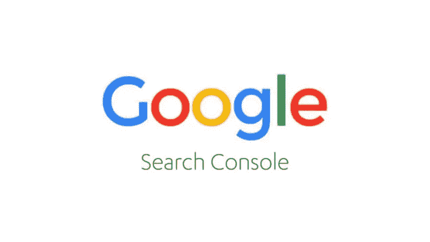
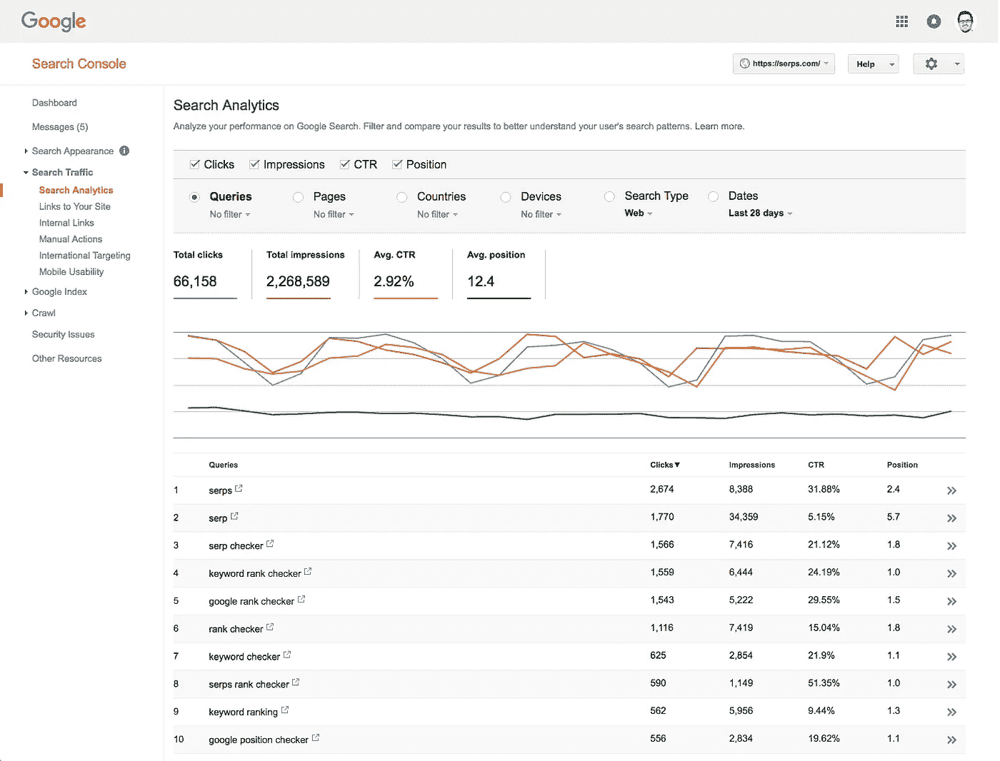

# 谷歌搜索控制台 WordPress 连接

> 原文：<https://medium.com/visualmodo/google-search-console-wordpress-connection-e293fa800059?source=collection_archive---------0----------------------->

为搜索引擎优化你的站点的一个重要步骤是将你的 WordPress 站点添加到 Google 搜索控制台，现在看看如何做。

在我们的插件中，你可以将谷歌搜索控制台连接到 Yoast SEO。这将为您的 Google 搜索控制台帐户验证您的网站，并允许您查看您的爬网错误。尤其是当你有一个大型网站时，抓取错误的数量可能会吓到你。在这篇文章中，我将解释更多关于抓取错误的信息，并向你展示如何使用 Yoast SEO [WordPress](https://visualmodo.com/) 插件修复它们。

谷歌使用所谓的谷歌机器人来抓取和索引你的页面。爬行，通俗地说，就是 Googlebot 浏览你的页面的过程，一次一个链接。当爬行时，它的目标是通过跟随页面、站点地图等中的链接到达站点上的每一个重要页面。另一方面，索引是 Googlebot 用来获取页面上的所有内容，并将其包含在搜索结果页面中。

# 谷歌搜索控制台 WordPress 连接

有两种类型的爬行错误:

*   影响整个网站的网站错误。想想 web 服务器的连接问题，以及获取 robots.txt 文件的问题。
*   影响网站上特定页面的 URL 错误。谷歌机器人试图抓取网址，但不知何故没有成功。它能够解析您的 DNS，连接到您的服务器，获取/读取您的 robots.txt 文件，然后请求 URL。但在那之后，出了问题。

# 在 Yoast SEO 中查看爬网错误

在我们的 Yoast SEO 插件(免费和付费)中，你可以查看谷歌在你的网站上遇到的抓取错误。你所要做的就是将谷歌搜索控制台连接到 Yoast [SEO](https://visualmodo.com/) 。在我们的插件中，我们会引导你完成这个过程。让我解释一下这里的步骤。

# 将 Google 搜索控制台连接到 Yoast SEO

要将谷歌搜索控制台连接到 Yoast SEO 插件，你所要做的就是在搜索控制台中导航到这个页面。

下一步是将它们连接起来。在我们的插件中，只需点击“获取谷歌授权码”按钮:

它会带你到谷歌搜索控制台。在那里，你会被要求确认你想连接谷歌搜索控制台到 Yoast SEO，并让我们的插件查看和管理你的网站的数据。单击“允许”:

最后，您将获得一个包含在我们插件中的密钥:

现在只需复制粘贴代码，并将其插入到我们的插件框中，点击“认证”

选择您想要连接的配置文件并保存。搞定了。现在，你可以在我们的插件(桌面)的同一部分的第一个标签中继续。请务必检查其他选项卡，以查找特定的爬网错误。

在这里，您可以找到我们从您的 Google 搜索控制台收集的信息。在这个表中，您可以看到出错的 URL、Google 上次抓取它的日期、Google 第一次检测到错误的日期以及 Google 发送的响应代码。在截图中，所有响应代码都是 404 未找到。

所以，如果你把谷歌搜索控制台和 Yoast SEO 连接起来，你会很好地了解谷歌在你的网站上发现了多少抓取错误。现在，你可以去为这些 404 创建重定向，或者简单地把它们改成 410，如果那个页面对你来说毫无用处的话。本文中关于状态代码的更多信息。当您“修复”错误后，将鼠标悬停在 Yoast SEO 中的 URL 上，然后单击“标记为已修复”。

# 有没有一种简单方法来创建重定向？

是啊！有一种更简单的方法可以完成这个过程，它叫做 Yoast SEO Premium。除了[插件](https://visualmodo.com/)提供的许多额外功能之外，它允许你立即在我们的插件中创建你的重定向:

只需点击“创建重定向”，与我们的免费插件不同(它将提示这仅在我们的高级插件中有特色)，您将看到以下屏幕:

我们的插件会给你创建重定向的选项，或者添加另一个状态码(301，302，307，410，451 都是可能的)。在 301 重定向的情况下，就像示例中一样，只需插入您想要重定向到的“旧”URL。如果你想告诉谷歌搜索控制台这个修复，只需保持勾选“标记为已修复”并点击“创建重定向”就这么简单。在明天的文章中，我们将介绍重定向管理器。

# 现在去把谷歌搜索控制台连接到 WordPress！

我希望这能让你明白为什么你想把 Google 搜索控制台和 Yoast SEO 连接起来。你可以在我们的免费插件中监控抓取错误，一年只需几美元，我们的高级插件甚至可以帮你修复错误！

如果你碰巧已经在我们的高级插件中使用了这个功能，我很乐意在评论中分享你的想法和经验！