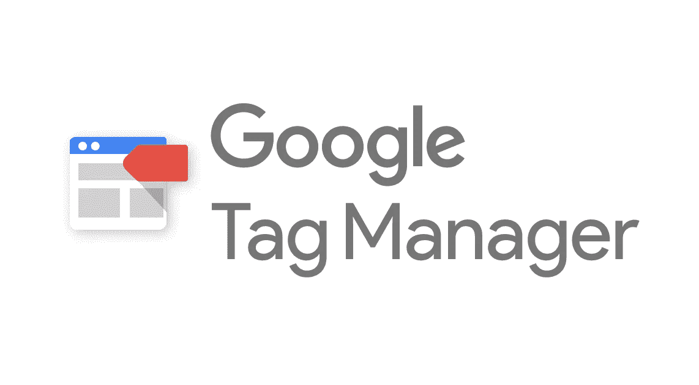

# 谷歌标签管理指南

> 原文：<https://medium.com/visualmodo/google-tag-manager-guide-41761db98631?source=collection_archive---------0----------------------->

Google Tag Manager 允许营销人员和网站管理员在一个地方部署网站标签，从而使标签管理变得简单、容易和可靠

也许你听说过它:谷歌标签管理器。谷歌在 5 年前推出了这个工具，这个工具可以让营销人员减少对开发者的依赖，从而加快你的营销过程。Google 标签管理器经过多年的发展，变得越来越完善和易于使用。在这里，我想解释一下，如果你还没有使用谷歌标签管理器，为什么你应该今天就注册。

在我继续介绍标记管理器之前，我想说一句警告的话。Tag Manager 是一个强大的工具，像任何强大的工具一样，应该小心使用。不要只是添加看起来吸引你但你并不完全理解的标签。例如，您可能会引入一个可能会损害您的站点的标签，因为代码不安全。或者使用影响数据跟踪的标签。如果您不确定或怀疑某个标签，请懂 JavaScript 的人来看看。幸运的是，Tag Manager 有一个很好的预览和调试模式，可以让你在[发布](https://visualmodo.com/)之前验证代码。

# 什么是谷歌标签管理器？

如果你仔细看看谷歌标签管理器这个术语，你就能猜出它是什么意思了。这是谷歌开发的一个工具，用来管理你的标签。但是下一个问题出现了:什么是标签？标签是一段代码。有一大堆分析和营销工具可以处理 JavaScript 代码。例如，谷歌分析跟踪代码——你添加到你的网站来跟踪你的网站流量的代码——是 JavaScript 代码。

你是否曾经不得不等待开发人员给你的站点添加一段 JavaScript 代码？或者测试这些代码是否对你的网站有害？那么你就知道这会花费多少宝贵的时间。有了[谷歌](https://visualmodo.com/)标签管理器，你可以自己添加这些 JavaScript 或标签。谷歌标签管理器甚至有能力测试你是否正确地实现了标签。

从谷歌标签管理器运行每个标签有两大优势。首先，您将对您添加的标签有一个概述。其次，你可以完全控制对营销效果的衡量。

# 这是为了什么？

因为谷歌标签管理器允许你添加 JavaScript 到你的网站，你可以用它做很多事情。你可以用它来更深入地了解访问者在你网站上的行为——“事件”，比如点击一个按钮——还可以获得你网站上第三方工具的标签。它甚至可以帮助你在页面中添加结构化数据！

# 分析和标签管理器

谷歌标签管理器中最常用的标签之一是谷歌分析标签。你不仅可以添加谷歌分析跟踪代码，还可以使用谷歌标签管理器来创建，例如，自定义维度，事件或内容分组。这意味着你可以跟踪人们是否点击你的按钮，如果他们向下滚动到你的页面上的某个点，如果他们观看你的视频等等。你可以用 [Google Analytics](https://support.google.com/analytics/answer/1033068) events 做的所有很酷的事情，现在都可以在 Google Tags Manager 中管理。您不需要开发人员来开发它！

# 其他第三方选项

谷歌标签管理器支持许多第三方标签，如 Adwords、Adobe Analytics、Bing ads、 [Hotjar](https://www.hotjar.com/) 、 [Crazyegg](https://www.crazyegg.com/) 等等。你可以在谷歌标签管理器支持论坛上找到完整的列表。您可以使用 Hotjar 标签最终获得那些热图——人们点击您站点的位置的可视化表示——这是您一直想要的。或者在你的网站上进行调查和 A/B 测试。获得这样的数据可以帮助你把转化率提高到一个新的水平。

# 谷歌标签管理器和结构化数据

但还有更多！您还可以使用 Google Tag Manager 在您的站点上实现结构化数据。结构化数据是以特定格式添加到页面中的额外信息。谷歌可以在搜索结果中显示这些信息，这使得人们更有可能点击你的结果并参与你的页面。

# 谷歌标签管理器在哪里？

谷歌的工具无处不在。如果你访问:[google.com/analytics/](https://www.google.com/analytics/)你可以找到谷歌开发的所有工具来帮助你的营销策略。除了谷歌分析，还有一些工具可以帮助你提高转化率或进行客户调查。当然，还有[谷歌标签管理器](https://www.google.com/analytics/tag-manager/)。可以免费报名！等等！你说免费？是的，免费！！那么是什么阻止了你呢？

注册后，您可以为您的网站、iOS 或 Android 应用程序或 AMP 页面创建一个帐户:

只需提供您站点的 URL 作为容器名称，然后选择 web——如果您想在您的网站上实现它。创建这个容器后，Google-tag Manager 会要求您在页面的和中添加一段代码。我保证这是使用谷歌标签管理器时需要开发者做的少数几件事情之一。

幸运的是，如果你正在使用 WordPress，你可以使用一个名为 DuracellTomi 的[Google-Tag Manager for WordPress](https://wordpress.org/plugins/duracelltomi-google-tag-manager/)的插件轻松添加 Google-Tag Manager 代码。请注意，您只需使用 GTM-XXXX 代码。

如果你正在使用另一个 CMS，查看[快速安装指南](https://developers.google.com/tag-manager/quickstart)了解更多关于如何开始的信息。

将 Google 标签管理器代码插入页面后，就可以创建自己的标签了。这可以在所谓的工作空间中完成，如下所示:

所以现在你已经设置好了，可以把这些标签添加到你的站点上了。

# 结论

我们将很快在谷歌标签管理器上发布更多帖子。我们将解释事情的实际方面，比如如何创建变量、触发器和标签，以及如何用它实现结构化数据。我们还将帮助您了解如何将谷歌标签管理器与谷歌分析结合起来，以充分利用它。敬请关注！