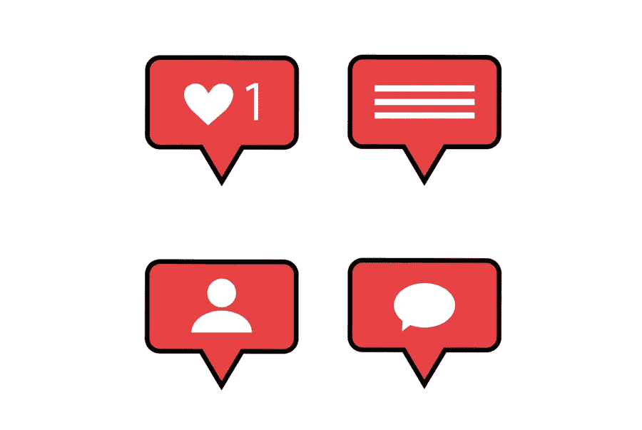

# 发展网页设计业务获得真正的 Instagram 粉丝

> 原文：<https://medium.com/visualmodo/growing-a-web-design-business-get-real-instagram-followers-6029cb984a8d?source=collection_archive---------0----------------------->

商业总是充满活力和竞争的！尽管竞争激烈，但组织一直在不断寻找和使用创新的营销理念。网站设计师也需要遵循同样的。你们提供专业的网站设计解决方案吗？如果是，那么你可以使用社交媒体来寻找更多的投资渠道。此外，如果你是一个网站设计专家，你可以用一种获得最大关注的方式来推销你的公司。其中一个理想的技巧是 Instagram 营销。在本文中，我们将分享获得真正 Instagram 粉丝的策略。

# 获得真正的 Instagram 关注者和其他策略

# 去买真正的 Instagram 粉丝吧

第一印象就是最后印象！因此，当客户在 Instagram 上看到一个网页设计师的个人资料时，他们会对这个设计师和他/她的作品有所评价。信息丰富且有创意的帖子会帮助别人对你有正面的印象。此外，人们容易被粉丝数量增加的个人资料所吸引。如果你目前没有大量的粉丝，你可以购买真正的 Instagram 粉丝。有专门的服务提供商可以帮助你。

# 使用 Instagram 来推动你的业务

根据最新的统计数据和结果，Instagram 在 2015 年至 2018 年间帮助企业主成倍扩大了业务。Instagram 受益的用户总数超过十亿，这让其他人有希望求助于这个社交媒体平台。因此，这是一个获得 Instagram 粉丝的好方法。

你想用 Instagram 来推广你的自由职业网页设计业务或网页设计机构吗？如果是，您可以选择加入以下策略:

# 1 收集增加的网站流量

很自然，你希望客户选择加入你的网站设计公司而不是其他公司！为此，你需要知道如何将潜在客户转化为老客户。要做到这一点，你必须给商业网站带来高质量的有机流量。为此利用 Instagram 是一个明智的做法。在这里，你可以在很短的时间内与大量的观众互动。流量的增加不会在一夜之间发生，但是你仍然需要耐心地计划。

当你使用 Instagram 个人资料时，你可以在你的个人资料中加入一个链接。之后就可以开始开发相关的原创内容了。通过这样做，你只会吸引真正的客户，他们想雇佣你/你的代理服务，并产生有机的流量。渐渐地，你会发现你的追随者数量在增加，这将会给你的生意带来提振。

# 2 接触重要的社会影响者，获得真正的 Instagram 粉丝

社会影响者拥有大量的追随者和观众！这些追随者可能会给你带来潜在的客户。为了让这些潜在客户[了解你的业务](https://visualmodo.com/5-common-ux-mistakes-in-web-design/)，你需要一个有社会影响力的人通过在线帖子谈论你的品牌。浏览并寻找最有社会影响力的人，与他们合作，你将为你的品牌带来收益。一旦你做了决定，确保你和他们取得联系，并提出你的商业建议。确保双方都能从合作中受益。一旦你被提及，你会发现人们会带着更多的任务逐渐接近你。您可以选择适合您的专业知识和服务带宽的服务。所以，获得真正的 Instagram 粉丝很好。

# 3 提高你的在线品牌知名度

品牌知名度在 Instagram 上是必不可少的！你可以通过尝试获得更多的关注者和喜欢来利用这一点。这是关键的一步。购买赞和关注者会在一定程度上帮助你。之后，你需要为同样的目标而努力。例如，确保你分享高质量的图片，这些图片将提供有用的信息来增加你的追随者数量。您可以创建关于以下主题的帖子:

1.  首先，您的公司如何应对封锁后的情况？
2.  其次，你即将推出的产品有哪些？
3.  最后，你目前正在做的项目有哪些？

这些帖子将为您现有的关注者创造潜在的参与机会。随着越来越多的人参与进来，对话变得越来越激烈，邮报将获得更好的收益。人们可能会在谈话中加入其他人，这将逐渐增加你的品牌回忆价值，并提高你的品牌知名度。

# 4 .确保参与进来，获得真正的 Instagram 粉丝

吸引你的追随者可以通过几个活动来实现！你可以通过分享有趣的 Instagram 故事来做到这一点，并将其作为一个亮点。或者，您可以创建公开帖子，也可以组织测验。允许您的关注者分享他们的观点和对您发布的问题的回答。这会让他们思考并参与到你的帖子中。

保持你的 Instagram 故事的相关性和直白性。不要使用过多的行话，并确保你的追随者与帖子产生共鸣。利用适当的图形、动画、字体、设计和颜色。然而，这个故事或任何 Instagram 帖子应该不难理解，这会让你的粉丝和客户远离你的个人资料。

使用这些简单易行的策略，你可以增加你的 Instagram 粉丝数。此外，你的网页设计公司会有更多的喜欢和令人兴奋的项目，从而提升到一个新的水平。回复那些直接给你发信息的人，因为你也可以通过这种方式打开潜在的商机。