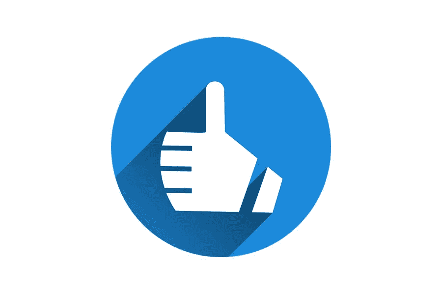

# 构建 2021 年社交媒体营销战略指南

> 原文：<https://medium.com/visualmodo/guide-to-building-your-social-media-marketing-strategy-for-2021-c77d3a37b8b3?source=collection_archive---------0----------------------->

过去的一年告诉我们，为重大变化做好准备是多么重要。全球各地的公司都被迫改变他们做生意、推销产品和接近潜在客户的方式。在这篇文章中，你会看到一个建立你的社交媒体营销策略的指南。

可以肯定地说，对于几乎所有行业来说，2021 年也将是令人兴奋的一年，因为世界尚未对新冠肺炎造成最后一击。

由于每个企业最重要的方面之一是其社交媒体存在，因此为 2021 年建立一个成功的社交媒体营销战略将产生巨大的影响。诸如选择合适的平台、分析竞争对手、发起杀手级活动只是你需要采取的一些步骤。

继续阅读，了解更多。

# 选择正确的平台

今年将要求所有营销人员努力做到准确无误。换句话说，你投入的每一份努力和每一分钱都要有回报。

疫情还没有结束，我们必须承认，我们的业务达到新的防御级别可能很快就会成为现实。

所以，当谈到你的下一个社交媒体营销策略时，你应该从第一天开始就小心谨慎。这意味着要选择合适的平台来瞄准你的潜在客户。

看看六个最受欢迎的平台，它们已经为许多企业创造了奇迹。

1.  Instagram 可能是最受欢迎的照片分享社交媒体平台，拥有超过 10 亿用户
2.  YouTube——非常适合教学、视觉和创意视频
3.  脸书——这个平台在 21 世纪的第一个十年席卷了整个世界
4.  Twitter——为短消息(tweets)、内容片段、快速链接和短视频设计的平台
5.  抖音——一个相对较新的围绕短视频剪辑的网络
6.  LinkedIn——最受专业人士和企业欢迎的网络

总而言之，要知道 2021 年社交媒体游戏的第一步是明智地选择你的平台。

# 设定正确的社交媒体营销目标

如今，大多数营销人员认为，社交媒体营销是发展业务和提高品牌在线声誉的最有效方式之一。

由于社交媒体无疑是绝大多数千禧一代和 X 一代中很大一部分人使用最多的平台之一，它有助于提升你的品牌形象。

其中一个重要的提示是正确确定社交媒体的目标。作为营销人员，你需要每个月设定营销目标，以保持对公司目标受众的良好跟踪，并正确识别客户行为。

营销目标基于不同的因素，如公司规模、行业类型、竞争对手和客户参与度，但明智地使用社交媒体平台来开展营销非常重要。

请记住，每个社交媒体帖子都需要提高品牌知名度，帮助建立社交社区，为企业带来更多流量，并创造收入。

所以，慢慢来，设定你可以实现的现实目标。一旦目标设定好了，在你的竞选过程中千万不要让它们消失在视线之外。

# 设计一个具体的内容主题:构建社交媒体营销策略指南:

你有没有注意到，当你在脸书或 Instagram 上看到帖子时，会立刻认出它们来自某个品牌？

这就是内容主题应该做的。内容主题对你的品牌来说是必须的，因为它肯定是你品牌形象的基础，它定义了你在顾客中的品牌价值。

您的特定内容主题确保您是内容的所有者，并为内容带来一致性。最重要的是，它保证了你的内容创意是独一无二的，是你的品牌所特有的。

因此，为你的品牌找到一个体面但有吸引力的内容主题是你的首要任务。制作有价值的内容并保持一致，因为这是你必须做的，以增加你的追随者数量，增加帖子或网站的参与度。

此外，一旦你坐下来决定你的内容主题，试着关注更多的用户生成的内容和特定受众的内容。