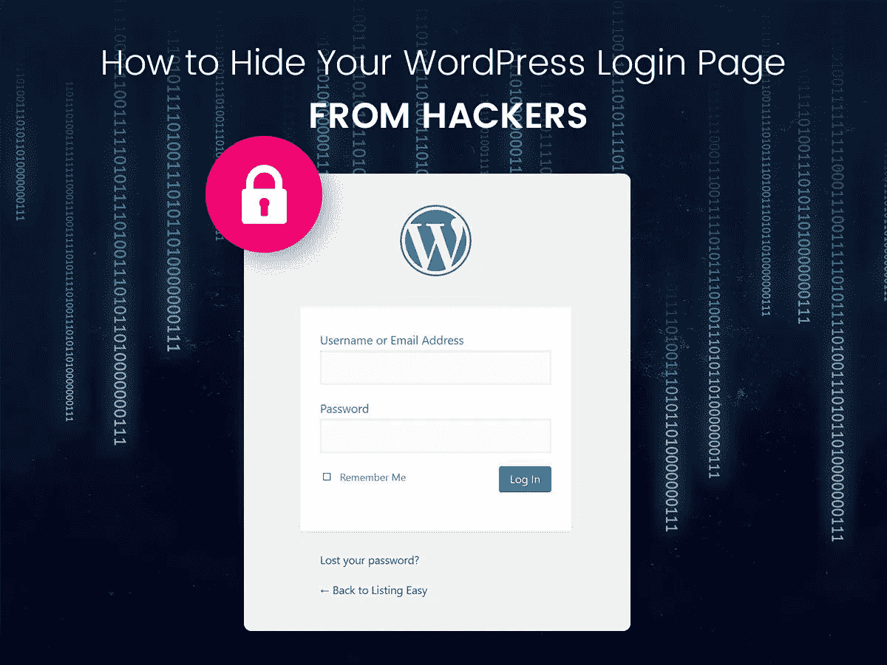
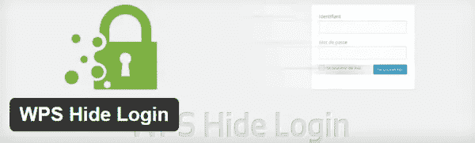

# 隐藏 WordPress 登录页面

> 原文：<https://medium.com/visualmodo/hide-wordpress-login-page-ddd3e46c6849?source=collection_archive---------0----------------------->

免受黑客和暴力的攻击

看到一个重要的方法和实践来保护你的网站免受黑客攻击和暴力:隐藏 WordPress 登录页面来阻止这个网站的攻击。

运行一个 WordPress 网站感觉就像管理一个吸引恶意登录的磁铁。暴力登录 WordPress 的尝试是如此普遍[在 Codex](https://codex.wordpress.org/Brute_Force_Attacks) 中有一页专门讨论这个话题。

处理这个问题有很多策略，最好的策略是部署多个策略。在这篇文章中，我将解释我如何实现一个最简单的策略:隐藏 WordPress 登录页面。

我有一个特别的 [WordPress](https://visualmodo.com/wordpress-themes/) 网站，它是几年前安装的。这是一个标准的 WordPress 安装，运行一系列典型的插件。要进入登录页面，你只需进入 */wp-admin* 或 */wp-login.php* 。

这个网站流量不大。在一个典型的月中，它产生了大约 5000 次页面浏览。然而，该网站的登录页面经常出现恶意登录的尝试。我在这个网站上激活了 [Jetpack 的保护模块](https://jetpack.com/support/security-features/)，它跟踪被阻止的恶意登录尝试的数量。自去年 3 月添加该模块以来，已阻止了超过 11，600 次恶意登录尝试。

如果你计算一下，每月有近 800 次恶意登录尝试，大约每天 25 次，或者每 58 分钟有一次恶意登录尝试。

但是，我可以告诉你，登录尝试不会以每小时一次的常规速度发生。几个星期过去了，没有一次恶意登录尝试被记录。然后，突然之间，在很短的时间内会记录几百次甚至几千次登录尝试。很明显，这个网站定期受到暴力攻击，试图登录到 [WordPress](https://visualmodo.com/wordpress-themes/) 仪表板。

如果你运行任何被设置为标准安装的 WordPress 网站，你可能会经历同样的事情——不管你是否知道。

# 为什么你应该隐藏你的网站登录页面

在开始之前，我应该放弃一个免责声明。如果您的站点允许用户登录，恶意登录尝试是不可避免的。这种策略对你不起作用。您需要您的登录页面易于查找，以便您的用户可以轻松找到它。相反，您需要做其他事情来防止恶意登录尝试。

但是，如果您的站点不是会员站点，并且登录尝试仅限于十几个或更少的管理员、作者、编辑和贡献者，那么隐藏您的登录页面是减少恶意登录尝试数量的一种方法。找不到你登录页面的机器人就无法尝试登录。

需要澄清的是，我并不是主张你通过模糊的方式完全*依赖*T2 的安全。你肯定还是应该使用其他安全措施，比如限制登录尝试、验证码或验证码验证、要求强用户密码和唯一用户名，以及安装并正确配置一个[好的安全插件](https://premium.wpmudev.org/blog/security-scanning/)。

然而，当作为综合安全策略的一部分使用时，隐藏是一个有效的安全层，如果你想减少针对你网站的恶意登录尝试，让你的登录页面难以被发现是一种方法。

所以让我们言归正传。

# 对黑客隐藏 WordPress 登录页面

# 步骤 1:将 WordPress 安装在它自己的目录中

我们之前已经讨论过[何时以及如何在子目录](https://premium.wpmudev.org/blog/install-wordpress-subdirectory/)中安装 WordPress。这不是一个过于复杂的任务，无论你是在处理一个全新的 WordPress 安装还是现有的 WordPress 网站，你都可以从一个子目录中运行 WordPress。

和往常一样，如果你在做任何事情之前移动一个现有的 WordPress 安装，创建一个完整的站点备份，并把它保存在一个你不会意外删除或修改它的地方。

许多例子和教程会使用一个子目录，命名为类似于[*【http://example.com/wordpress】*](http://example.com/wordpress)或[*【http://example.com/wp】*。](http://example.com/wp.)我个人不喜欢在子目录中安装 WordPress 时使用可预测的东西。相反，我用了一些没人能猜到的东西，比如 http://example.com/dwiiw 的[*。没有人会猜到我在那个目录下安装了 WordPress，但是我能够记住它，因为它是以下内容的缩写:***d****I rectory****W****这里****I*******I****installed***](http://example.com/dwiiw.)

****使用您选择的目录名，但是使用您容易记住并且其他人很难或不可能猜到的独特名称。****

# ****第二步:隐藏登录页面的网址，重定向 wp-login.php****

****我相信你知道，当你访问 wp-login.php 的*时，默认的 WordPress 行为会加载登录页面。改为键入 *wp-admin* ，你会自动重定向到*wp-login.php*。*****

***如果你已经在子目录中安装了 WordPress，那么你已经迈出了隐藏登录页面的第一步，在你的域名和 wp-login.php 之间添加了一个目录。希望你给它起了一个独特的名字，但事实是现在有人仍然可以很容易地找到你的登录页面。***

***除非你已经采取措施阻止标准的 WordPress 行为，即使 WordPress 安装在子目录中，如果有人试图去*http://example.com/wp-login.php，他们将被重定向到正确的登录页面 URL，看起来像[*http://example.com/dwiiw/wp-login.php*。](http://example.com/dwiiw/wp-login.php.)****

****就目前情况来看，你真的让你的登录页面更难找到了吗？不，还没有，但你会很快。****

****下一步是锁定对*wp-login.php*的访问，并将其重定向到一个 404 页面或者除了你的登录页面之外的任何页面*，并用一个完全定制的、难以猜测的登录 URL 替换它。*****

****我再一次建议你想出一些你容易记住的东西，但是其他任何人都不可能随便猜出来。你可以使用我用来想出目录名 *dwiiw* 的缩写技巧，或者任何其他方法，但是想出一些独特的东西，比如:****

****[T3【http://example.com/dwiiw/gli】T5](http://example.com/dwiiw/gli)****

****在这种情况下， *gli* 就是***g****et****l****ogged****I****n*的替身，完成了同时易记难猜的目标。****

# ****WPS 隐藏登录****

********

****标语说的就是:*把 wp-login.php 变成你想要的任何东西*。****

****这个插件只做一件事。它使得使用自定义 URL 而不是标准的登录 URL 变得容易。一旦这个插件被安装并激活， */wp-admin* 和 */wp-login.php* 将无法访问，取而代之的是你选择的自定义 URL。****

****拥有超过 50，000 个活跃安装和 4.7 星的星级评级。如果你想要一个最轻的插件来创建一个自定义的登录 URL 来隐藏 WordPress 登录页面，WPS 隐藏登录是一个可靠的选择。****

****所有的主题都与这个插件兼容。****