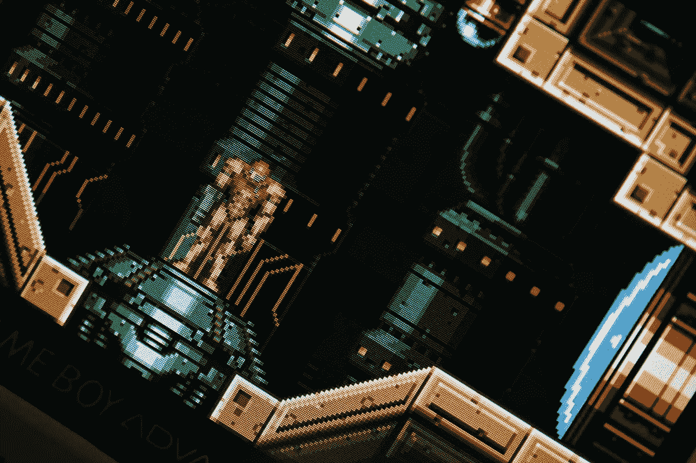

# 诚实是最好的政策——业界如何从 Metroid Prime 4 的发展中学习

> 原文：<https://medium.com/visualmodo/honesty-the-best-policy-how-the-industry-can-learn-from-metroid-prime-4s-development-9dd37ec1cea6?source=collection_archive---------0----------------------->

在当前的视频游戏环境中，这已经成为太多的常态。你把一张光盘放进你的机器，或者你让你的下载准备在 99.9%的顶点，等待分针滴答到午夜，这样你就可以释放几个月甚至几年的期待和兴奋，却被第一天几千兆字节大小的更新/补丁所阻碍。在本文中，我们将分享行业如何从 Metroid prime 4 开发中学习，以改进他们的产品。

诚实为上策——行业如何从 Metroid Prime 4 的开发中吸取经验

就这样，你的喜悦又回到了现实。所有被压抑的孩子在圣诞节早晨的能量都消散了，你只能盯着一个缓慢移动的进度条，听着硬盘驱动器发出的细微嗡嗡声，改变着每一个像素和字节。

接受状态:从 Metroid 开发中学习

这已经是老一套了，因为这个声明是几年前发布的，但这几乎让较少的电影公司采用同样的策略变得更加奇怪。

对于那些错过了它的人来说，许多任天堂粉丝(包括我自己)都在等待萨姆斯·阿兰自 2017 年非常有限的宣布以来的下一个 FPS 冒险的任何消息。这终于在 2019 年到来，但这不是任何人希望的消息。

任天堂的高级管理执行官 Shinya Takahashi 出现在屏幕上，并发表了一个非常坦率和诚实的演讲，谈到这款游戏没有达到标准，远远没有达到他们想要向粉丝提供的质量。在同一份声明中，高桥透露，Metroid Prime 4 的开发从一开始就重新开始，现在由系列老兵复古工作室掌舵。

期望从 Metroid 开发中学习

虽然这给世界各地的粉丝带来了很多最初的失望，但这很快就平息了，这种情况的积极因素开始暴露出来，就像一束阳光在暴风雨后穿过云层。

事实上，任天堂有勇气减少损失，从头开始，而不是苦笑着承担发布一款批评者和粉丝都不会满意的游戏的后果，这表明他们以坚定的严肃态度承担起品牌名称的重量。

当然，你可以用 D1 补丁来修复游戏，但这在数字上等同于承认开发者未能管理好时间和/或预期。

电子游戏在这之前和之后都为此付出了沉重的代价。为什么要用这种方法来处理其他人在大版本开发中遇到的问题。尤其是在任天堂既是第一个做这种公关活动的公司，又有诚实的价值观之后，这让我很困惑。