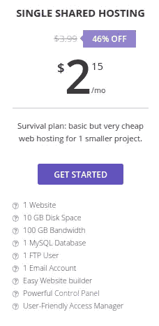
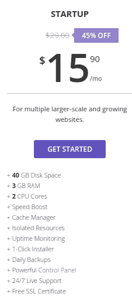
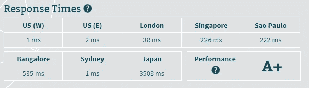
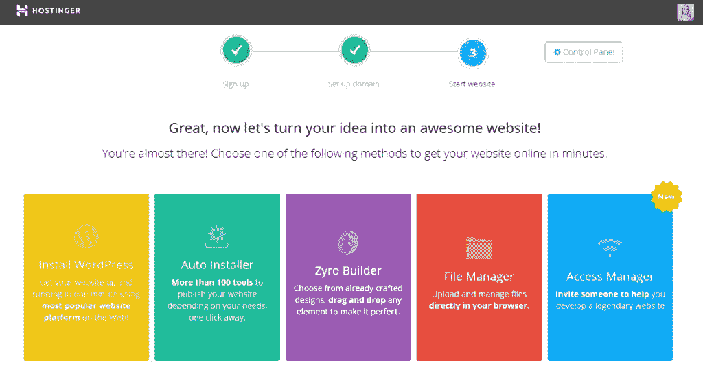

# 霍斯汀格评论 2018

> 原文：<https://medium.com/visualmodo/hostinger-review-2018-9a4867f3dd90?source=collection_archive---------0----------------------->

在当今竞争激烈的世界里，当每一个大大小小的公司都开始在网上做生意时，网站所有者在竞争中保持领先就变得非常必要。为此，你需要从各个方面改进你的网站。例如，你的网站应该准备好强大的营销策略和大量的流量涌入。

那么，选择一个高质量的主机服务可以是你的一大步，使你的网站对你的观众来说是完美的。一个好的虚拟主机不仅能让更多的人访问你的网站，还能帮助你获得更好的搜索引擎排名。

这篇文章的目的是帮助你在选择虚拟主机时做出正确的决定。今天，我们将探索一个在主机行业已经存在了十多年的知名公司，它以低廉的价格提供优质的主机服务。对于没猜到的人，我们说的是 [Hostinger](https://www.hostinger.com/) 。

由于它是目前广为接受的托管平台之一，我们认为应该向你展示一下它的优缺点。所以不要再拖延了，让我们开始吧。

**霍斯汀格的背景**

作为世界上最大和最受欢迎的托管公司之一，Hostinger 致力于提供创新的托管解决方案。从共享托管到商业托管到 VPS 托管再到域名注册，他们在同一个屋檐下安排了各种各样的托管解决方案。Hostinger 于 2004 年作为“托管媒体”出现。14 年后的今天，它在超过 179 个国家拥有超过 2900 万个域名。

如今，Hostinger 在易于使用的控制面板、正常运行时间和客户支持等功能上向许多竞争对手发起了挑战。然而，像每一个主机提供商一样，它也有一些优点和缺点，我们将在接下来的章节中看看。

**他们迄今为止的重大成就**

自成立以来，该提供商一直在经历一场史诗般的旅程。这家位于立陶宛的托管公司成立的目的是为人们提供在线表达自己的自由。然而，为了支持同样的人，有必要为他们提供一个预算友好的托管解决方案。这就是为什么在 2007 年，该公司推出了 000 web host——有史以来第一个没有广告的免费主机服务。今天，000webhost 是免费虚拟主机的世界领导者。就在第二年，该公司推出了名为 host 24 的一流 cPanel 主机。

谈到他们的国际扩张，2012 年，Hostinger 开始在塞浦路斯运营他们的第一个国际办事处。如今，他们已经在超过 39 个国家提供本地化服务。每天他们都会收到超过 15，000 个新注册。这对任何主机提供商来说都是一个巨大的数字。不是吗？

# 同一屋檐下的所有托管解决方案

# 霍斯汀格服务公司

正如我们上面所说的，Hostinger 在同一个屋檐下提供了所有主要的托管解决方案。无论你是博客爱好者还是大公司，你都会发现 Hostinger 有能力满足你的主机需求。

共享主机是他们的入门级主机服务，最符合小型企业的需求。实惠是他们吸引大多数人的独特卖点。他们的共享主机计划每月最低收费 2.15 美元。

谈到企业托管，这项服务旨在托管需要强大托管环境的项目。经营电子商务商店和资源密集型网站的人通常需要独立的托管环境，他们可能会选择这项服务。Hostinger 商务托管的费用是每月 15.90 美元。

说到 VPS 托管，它允许用户将资源完全控制在手中。如果你正在运行一个专业网站，并且不想在速度、稳定性和安全性上妥协，你必须[考虑使用 VPS 托管平台](https://www.hostinger.com/vps-hosting)。

Hostinger 拥有基于 Linux 的虚拟专用服务器，这些服务器授权专用服务器空间、SSH root 和完整的云基础架构。Hostinger 有 6 个 VPS 托管计划。你可以以 7.86 美元的价格买一个月的基本款。

# 霍斯汀格的优点

**服务器速度快&响应时间快**

良好的服务器速度和响应时间为您提供了超越竞争对手的所有重要优势。任何超过 3 秒钟就加载的网站都会导致客户的烦恼，最终客户会离开你的网站，跳到你的竞争对手身上。

相反，快速的用户体验有助于更长的访问持续时间，重复访问，并最终提高你的销售额。此外，良好的网站加载速度是搜索引擎排名的关键因素。

Hostinger 的服务器遍布美国、亚洲和欧洲(英国)的所有重要地点。好消息是，他们还使用 1000 Mbps 的连接。不用说，像这样的快速连接有助于提高速度。

要亲自测试他们的服务器速度，你可以使用 Bitcatcha 工具，这是一个测试服务器响应时间的流行工具。以下是我们收到的结果:

Hostinger 的业务托管自带内置缓存功能，在一定程度上提高了网站加载。

**易用性**

我们希望从他们的注册过程开始，这个过程非常简单和标准。你只需要选择你想要的托管服务和计划，填写必要的信息，并选择一个域名(你可以从 Hostinger 或外部获得)。

如果你是一个新手，不想依赖网站设计师来制作你的网站，你可以使用他们的网站构建工具。这个神奇的拖放工具让用户在没有技术知识和编码知识的情况下创建一个专业的网站。

谈到控制面板，它模仿了微软磁贴的环境，你可以很容易地找到选项以及提供关于选项的一点洞察力的图片。

**奥斯廷格反对**

我们在引擎盖下发现了一些小问题，但它们并不是真正的交易破坏者。

**缺少手机支持**

虽然他们支持所有主要媒体来访问他们的客户支持，如 24/7 实时聊天支持、票证支持和论坛支持，但缺少电话支持可能会让喜欢电话支持的用户失望。

**无传统 cPanel**

Hostinger 自带控制面板，使他们的服务更容易使用。然而，如果你是一个高级用户，你可能会发现它很少不寻常。

# 最后的话

Hostinger 是一家可靠的虚拟主机提供商，一直被推荐给中小型网站。我们在诸如服务器响应、定价和客户支持等方面的经验确实很棒。此外，该公司在使其服务安全、可靠方面投入了大量资金。由于他们提供 30 天退款保证，我们不认为尝试一下会有任何损失。