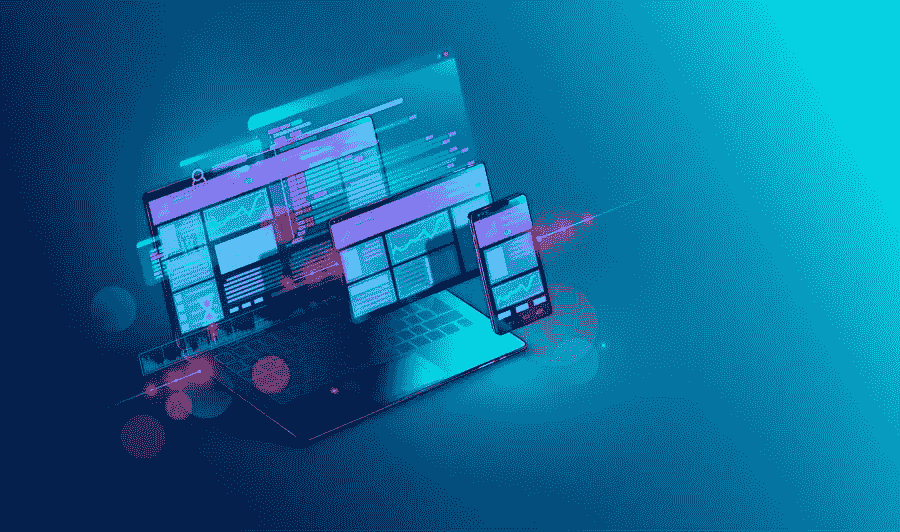

# 一个优秀的网页设计如何帮助你增加利润

> 原文：<https://medium.com/visualmodo/how-a-great-web-design-can-help-boost-your-profits-9a1025149b55?source=collection_archive---------0----------------------->

用户体验和专业的网页设计是赢得在线客户和提高利润的核心要素。随着数据驱动的市场经济的需求，开发一个令人印象深刻的网站设计有助于创造一个更容易访问的用户体验。这两个因素的结合对于实现更好的转化率是至关重要的，并最终为提高你的利润铺平道路。

网页设计不仅仅是让你的网站访问者看起来美观。事实上，构成网页的每一个元素都会对网站访问者登陆你的页面时的活动产生重大影响。作为一名网站管理员，你的目标是抓住网站访问者的心，回答他们的问题，吸引他们，鼓励他们订阅，并促使他们响应你的号召。

# 提高利润的网页设计

现在，一个优秀的网页设计到底是如何帮助你增加利润的呢？在这篇文章中，让我们来探索它可以帮助吸引更多潜在用户的不同方式，以及他们在将他们转化为长期客户方面的作用。与此同时，让我们学习新的和令人兴奋的方法，你可以如何为你的企业制作一个改变游戏规则的网页设计。

# 它会影响你的客户对你业务的看法

就像管理实体店一样，在潜在客户第一次来到你的店面时，抓住他们的注意力是很重要的。留下第一印象是你赢得顾客的第一步。

说到虚拟销售，你的网站就像是你的 storefront⁠.与实体网站不同，你的网站几乎可以被任何人在任何时间访问，anywhere⁠.它的无处不在对你的潜在客户和现有客户如何看待你的业务产生了重大影响。

以下是设计良好的网站给你带来的一些好处:

*   建立一个无缝的、可访问的网站向你的客户传递了一个信号，即你把他们的需求放在首位。
*   一个组织有序、反应灵敏、用户友好的网站告诉你的潜在客户，你的企业不仅仅是一个赚钱的实体，还是一个服务提供商。
*   从你网站的域名到你的产品分类和结帐标签，客户可以判断你的企业是否有信誉。因此，确保他们购买体验的顺畅流动以增加他们成为忠诚客户的机会是至关重要的。

# 它影响你的搜索引擎优化排名

许多，如果不是所有的企业，今天投资在搜索引擎优化，以提高他们的网站排名。仅在谷歌上就有超过 120 亿次搜索，拥有一个有效的搜索引擎优化策略真的会让所有提供相同产品或服务的网站相形见绌。

现在，网页设计和你的搜索引擎优化有什么关系？SEO 在哪些方面影响了你在搜索引擎结果页(SERPs)上的排名？

# 以下是网页设计对搜索引擎优化的影响:

*   谷歌复杂的搜索算法是由网络爬虫组成的，网络爬虫从不同的网站获取信息并组织成搜索索引。然后，这些爬虫对它们索引的信息进行排序，找出最能回答搜索者查询的信息。
*   为了让你的网站出现在 SERPs 上，你需要让搜索机器人有可能抓取你的网站，阅读你的内容，并保存在索引中进行排名。要做到这一点，你需要建立强大的和相关的内部联系。
*   通过你的网站传播链接资产，你需要在相关网页之间创建足够的内部链接。为此，将相关网页组织成金字塔结构。最上面的部分代表主页面或主页，而不同的部分和子部分位于底部。
*   内部链接帮助谷歌更好地理解和浏览你的网站。因此，记住将一个主要主题链接到所有其他相关页面，反之亦然，这将向谷歌发出信号，表明你的网站应该针对某个特定的关键词或主题进行排名。
*   开发一个有响应性的网站是谷歌决定你的网站是否应该在 SERPs 上排名的另一个基准。因此，确保你的网站为移动应用而优化是很重要的。这意味着你的网站会自动调整大小，并适合其他设备，而不是 PC 或笔记本电脑。
*   有了一个优化的网站，你就可以强化一个客户友好型企业的形象。这将是成为适应性服务提供商的一个很好的指标。

# 它加强了你的品牌一致性

品牌是让你在竞争中脱颖而出的因素。没有一个独特的品牌，你的目标客户会发现很难确定是什么让你的产品比别人的更好。更糟糕的是，你最终会淹没在一堆远非首选的普通产品中。好的品牌让你一眼就能认出来！

因此，设计和开发一个传达品牌元素一致性的网站肯定会帮助你增强客户对你企业的信任。

# 以下是一些关于创建独特和可识别品牌的建议:

*   如果你的品牌主要定位于千禧一代，选择颜色、字体风格、网页布局和其他元素来匹配这个特定市场的个性和偏好。当你计划调整你的网页设计时，有具体的品牌指导方针会让你保持在正轨上。
*   请注意，网页设计包括网站的内容、布局、文本、结构、图形和所有其他交互式功能，网站访问者每次访问网站时都会用到这些功能。在这些元素中强化你的品牌将有助于你向你的目标消费者传达正确的信息。
*   最简单的形式是，品牌一致性可以通过保持网站信息最新的形式来告诉客户，从线下到虚拟平台上的微小细节，您都掌握着自己的业务运营。

# 它有助于传达您的企业提供了什么解决方案

你的网站存在的目的是什么？你能恰当地向你的消费者表达它吗？一个好的网页设计应该弥合你的商业目标和你的消费者的期望之间的差距。有了一个整洁、有价值、易访问的网站的帮助，当你的客户在你的网站上寻找它时，很容易对他们的需求做出反应。

*   在你的网站上展示一个清晰的价值主张将是你告诉你的客户为什么他们应该与你做生意的第一枪。它总结了你的潜在客户可以从分拣业务中获得的好处。
*   你的价值主张应该是一个清晰简洁的陈述，网站访问者可以很容易地在你的主页上看到。
*   另一种在网站上展示营销产品的方式是通过搜索系统插件。拥有一个功能搜索系统将有助于客户方便地浏览你网站的功能。今天，大量用户友好的搜索插件包含了有用的功能，可以对你网站上的大量信息进行分类。

# 它建立了你的品牌权威

在数字世界里，有用是新的酷。消费者现在更看重那些能保证为他们的问题提供具体解决方案的品牌。随着今天的消费者在购买决策上变得越来越见多识广，越来越明智，作为企业主，你有责任强调你在行业中的权威。

除了展示你的产品或服务的有用性，你还必须在消费者每次登陆你的网站时为他们提供额外的价值。

例如，博客是很好的工具，通过它你可以在你的行业中建立权威。例如，如果你在为一家医疗机构运营一个网站，你可以上传一些文章，告诉人们应该如何照顾年迈的家庭成员，照顾痴呆症患者时应该做和不应该做的事情，这样的例子不胜枚举。

这里的要点是，告诉人们你能为他们提供什么服务就足够了，但你需要通过相关的博客帖子来教育你的潜在客户和现有客户。

接纳行业专家的客座博文是建立网站权威的另一种方式。你甚至可以利用所谓的“日常专家”来分享他们所在行业的相关故事。

例如，如果你在运营一个数字营销代理网站，你可以突出影响者营销如何改变产品和服务广告的故事。你可以定期更新你的图书馆，让人们了解你所在领域的最新进展。

最终，好的网页设计让你的生意不仅仅是销售。但是要讲一些有用的故事来激励潜在的顾客。您的产品或服务如何缓解他们现有的问题。

# 它与您的客户建立了有意义且持久的关系

推动业务增长和赢得客户。如今，营销人员已经适应了从客户营销漏斗到飞轮模式的转变。与传统的漏斗模型相反。飞轮模型将客户视为连续循环中的恒定组件。获得新的客户群。

这种[模式](https://www.hubspot.com/flywheel)特别注重利用快乐顾客的势头，通过口碑和重复销售来推动推荐。在飞轮模型的每个阶段，您的网页设计在改善客户体验方面都起着至关重要的作用。当吸引潜在客户时，您的网页设计必须展示适合目标客户的内容。

例如，如果你的网站的主要目的是出售家庭家具。然后它将有助于有一个面向家庭的设计和内容。您的目标访客必须能够感受到温暖。每次他们浏览你的网站时，家里都很舒适。此外，通过在博客中加入醒目的视觉效果来吸引客户。让您的网站内容具有互动性。通过添加社交媒体插件，您的访问者可以更容易地在他们的个人社交媒体帐户上共享内容。您也可以在网站上添加评论部分。因此，客户可以立即在一篇文章上分享他们的想法和评论。

# 网页设计可以通过反馈提高您的利润

通过这种方式，您能够了解访问者对您的网站的看法。从用户反馈中，您可以找到改进服务的方法。

在你的网页设计上有一个优化的登录页面是另一个转换和提高利润的可靠方法。从长远来看，一个[优化的登陆页面](https://www.forbes.com/sites/theyec/2018/05/08/11-ways-to-optimize-landing-pages-for-a-better-conversion-rate/)将会降低你的客户获取成本并最大化广告花费。

为此，您可以从开发复杂的设计开始。直截了当的[行动呼吁](https://visualmodo.com/call-to-action-buttons-usage-guide/)，以及让您的客户对您的网站充满信心的权威徽章。

# 它有助于创建丰富的客户数据库

在快速发展的数字经济中，数据是新的石油。大型企业利用用户数据来提高利润。例如，您在电子商务网站上的购买行为。与其他客户一起整理。他们有相似的购买习惯，可以预测您未来想要购买的产品类型。

幸运的是，你也可以应用网页设计来增加你自己生意的利润！

*   当你的客户登陆你的页面时，你可以通过使用数据分析他们的活动来启用这种营销策略。您可以进一步利用这些数据来策划一个有用的线索捕获页面。
*   销售线索捕获页面的功能就像典型的登录页面一样。然而，它的主要任务是获取联系信息。其主要原则是向你的潜在客户询问相关信息，并以有价值的报价作为回报。
*   用一个有趣且引人注目的标题来补充您的线索捕捉页面。正文和相关设计来吸引你的潜在客户提供他们的信息。
*   根据经验法则。你的目标是不要让你的潜在客户觉得你在窥探他们的个人数据。因此，保持您的销售线索捕获页面不超过三个字段会有所帮助。
*   拥有丰富的客户数据。你可以影响你的客户的行为，并在他们需要的时候提供他们想要的东西。

# 简而言之，提高利润的网页设计

优秀的网页设计给你的企业带来的好处超乎你的想象。从优化内容到简化获取重要数据线索的方式。一个设计良好的网站肯定能带来更大的转化率和更高的利润。您计划如何为您的客户创造更难忘的网络体验？说来听听！