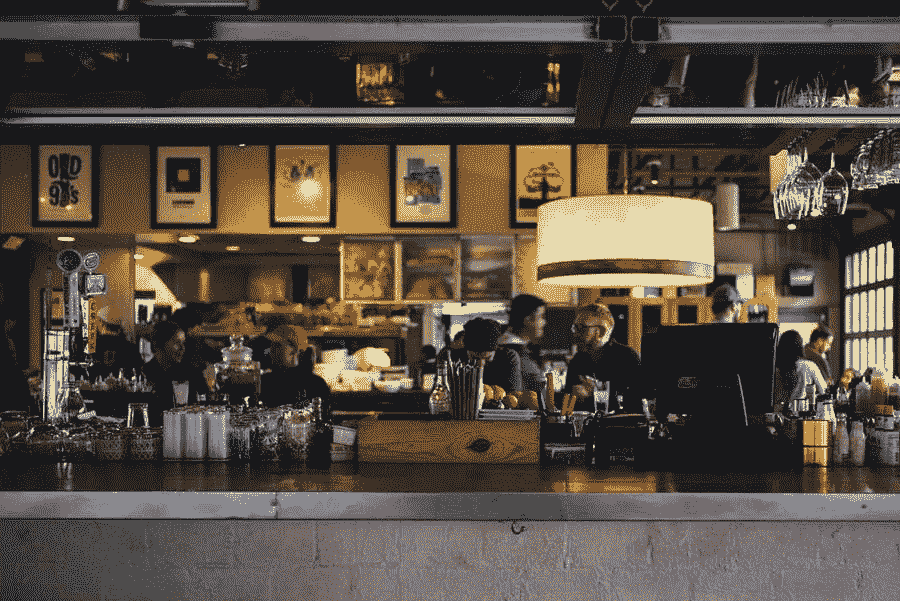

# POS 系统如何改善你的餐厅

> 原文：<https://medium.com/visualmodo/how-a-pos-system-can-improve-your-restaurant-21d80d422357?source=collection_archive---------0----------------------->

餐饮业处理大量的信用卡支付和现金交易。因此，需要一种工具来帮助跟踪通过系统的每一分钱。但是使用像 Restaurant Pro Express 这样的 POS 系统可以让他们刷信用卡，使他们的工作更容易。它让员工对他们的销售负责，因为除非你有密码，否则不容易改变系统的条目。它大大增加了透明度，减少了盗窃。

销售点系统是计算机化的，使企业主能够跟踪现金流和销售。它还允许他们跟踪库存，并有助于简化簿记。POS 系统具有使管理变得高效的工具。

这篇文章深入探讨了 POS 系统如何帮助改善餐厅。

# 管理库存

POS 系统有助于管理库存。它们的特点是餐馆老板需要工具来跟踪准备的菜肴和消费的饮料。此外，它们允许管理人员实时生成报告。这是至关重要的，因为它有助于他们快速判断哪些项目做得好，哪些需要从菜单中删除。

# 允许业主轻松管理餐厅

POS 系统是基于互联网的。因此，他们允许企业家从世界任何一个角落监控他们的餐馆。此外，这也给了他们远程管理餐厅的自由。

这一点至关重要，因为它为其他活动创造了时间，包括经营不止一家餐厅。此外，它允许经理实时更新他们的菜单。POS 系统让经理们只需点击几下鼠标就可以改变价格、检查职员、设定证券。

# 利用 POS 系统减少错误和盗窃

拥有一个有效的 POS 系统可以确保所有的数据和其他细节都在云中。关于销售、库存、进货和退款的记录被准确地输入。因此，您不需要花费时间来修复人为错误。请注意，当盗窃猖獗时，库存会减少。盗窃是餐馆多年来不得不努力解决的问题之一。但是，如果您安装了正确的 POS 系统，这将不再是问题。

# 增强客户服务

安装一个现代化的系统将节省你的员工的时间，并改善客户服务。如果它是直观的，它确保您的员工有时间快速准确地处理订单。它允许用户打印账单和票据以加快订单的交付，从而加强了管理。它让一切按计划运行，让经理能够专业地经营餐厅。

# 通过 POS 系统为餐厅提供洞察力

POS 系统带有内置功能，可以帮助经理监控从管理员工和库存在内的所有事情。它允许实时报告，经理可以使用它来洞察餐厅的表现。它可以收集关于顾客的数据，以允许管理层做出未来的决策。

POS 系统可以通过多种方式促进餐馆的发展。它允许经理监控库存和职员。它还收集有助于管理层改进服务的信息。因此，安装一个 POS 系统对任何一个经营餐厅的经理来说都是至关重要的。