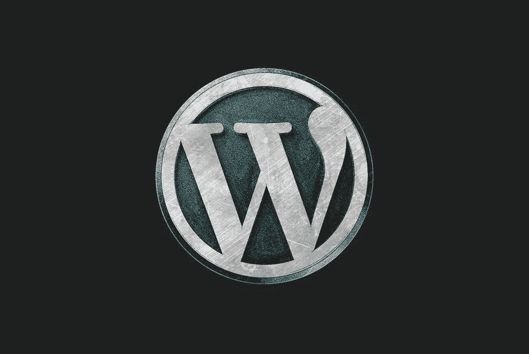

# 我如何使我的 WordPress 站点成为静态的？

> 原文：<https://medium.com/visualmodo/how-do-i-make-my-wordpress-site-static-19c34d941f4f?source=collection_archive---------0----------------------->

以前，网站只能通过在文本编辑器中编写代码来创建，这使得过程变得复杂，并且在对网站进行更改时带来了困难。FLATsite 的 WordPress 静态站点生成器提供了一个解决这个问题的方法，它允许你从 HTML 静态站点生成器创建 WordPress 静态页面。一个预先生成的静态站点将胜过缓存插件:世界上所有的用户都会打开你的站点，就好像它就在“拐角处”在这篇文章中，我们将回顾如何制作一个静态的 WordPress 网站。

# 什么是静态站点生成器？

FLATsite 是一个拖放式静态站点生成器和静态页面生成器。所以，这是一个生成安全、高质量响应的 WordPress 站点的工具。一个静态站点生成器是一个软件工具，它将文本帖子(有或没有标记)转换成静态 HTML 页面。所有这类工具的工作方式都差不多。内容被“粘贴”到一个模板上，然后发送到托管服务器。

今天互联网上的大多数网站都是动态呈现的。这意味着不是将所有内容存储在服务器上的 HTML 中。此外，他们从数据库中提取内容，并动态地创建页面来为他们提供服务。

使用静态网站生成器，您将能够创建静态页面来发布公司。或者雇员数据、联系人、运输或支付方式、驾驶路线等。

使用 WordPress 静态站点生成器，你可以:

*   首先，创建页面，添加和编辑文本
*   其次，在网站的给定部分发布视频和照片
*   最后，自定义视频播放