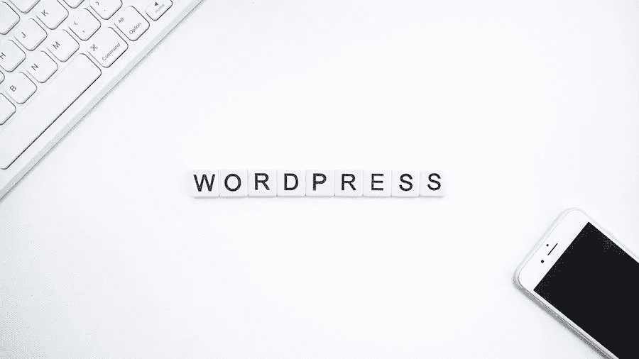

# 如何在 WordPress 中创建页面？

> 原文：<https://medium.com/visualmodo/how-do-you-create-a-page-in-wordpress-87a2b7f379c9?source=collection_archive---------0----------------------->

如果你需要知道如何在 WordPress 中复制一个页面，你需要制作一个初始模板来复制。创建 WordPress 页面是一个相对简单的任务，允许你添加更多的内容到你的站点。通过这些简单易行的步骤，你可以快速地把一个高质量的网站放在一起，在 WordPress 中添加文章和创建页面。

# 什么是 WordPress 页面？

从技术上来说，页面不属于博客内容，因为它们不依赖于时间，保持静态。您可能遇到的一些最常见的页面类型包括"*联系"*或"*关于"*页面。

它们被归类为静态的，因为信息不会随着时间的推移而改变或移动。您可以用来识别页面的一些关键功能包括:

*   包含复杂的主题
*   比帖子更高级别的定制
*   允许组织成子页面和附加页面
*   用户可以利用模板和 PHP 代码

与帖子相比，它们也有几个不同之处，包括:

*   等级关系而不是分类
*   不允许使用标签或类别
*   RSS 源中未包含的页面
*   可以被指定为静态首页

# 如何在 WordPress 中创建页面

学习如何创建 WordPress 页面很简单，这应该会使建立网站更容易。无论你打算使用页面上的帖子还是纯页面的网站，选择权在你。

# 步骤 1:添加新页面

当你登录到你的 WordPress 站点时，你会想要找到 WordPress 仪表盘导航菜单。然后您可以点击“*添加新的，”*，这将提示您创建一个全新的页面。

一旦点击，链接将带您到页面编辑器，现在被称为块编辑器。这一新功能允许管理员以块为单位处理内容，而不是单个内容。你会发现管理你的网站布局变得异常简单。

每个模块都有其定制和控制的[分类，例如对齐和模块宽度。您也可以选择添加或隐藏任何块，这取决于您为站点选择的布局。](https://visualmodo.com/vimeo-on-revolution-slider-build-video-sliders/)

# 第二步:创建标题

你的网站上的每一页都应该有一个标题，因为它可以让你的网站的前端和后端更加直观。打开块编辑器后，可以在页面顶部添加标题。

您需要选择一个最能描述特定页面信息的标题。例如，如果你正在分享你最喜欢的食谱，选择“*食谱”*作为标题是一个很好的选择。

重要的是要注意，如果你使用永久链接，你的页面标题是必不可少的，因为它是你的 URL 的一部分。