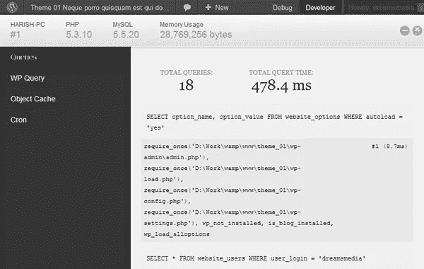
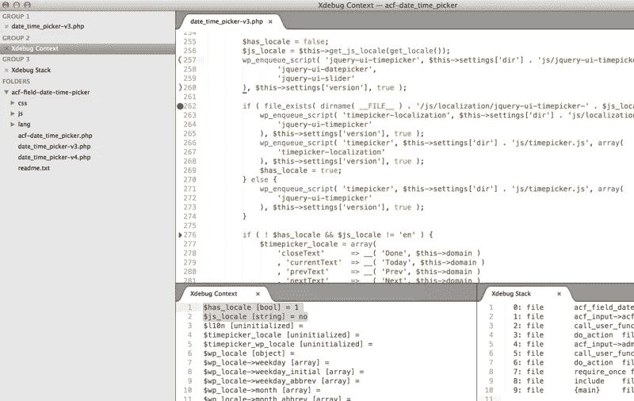

# 如何在 WordPress 中启用/禁用调试模式

> 原文：<https://medium.com/visualmodo/how-enable-disable-debug-mode-in-wordpress-fd592e690775?source=collection_archive---------0----------------------->

WordPress 有一个调试模式，当出现问题时，你可以很容易地得到信息。要启用调试模式，必须在 wp-config.php 文件中添加一个常量。但是，有没有一种简单的方法可以打开调试模式，甚至不用访问 wp-config.php 呢？

首先要做的是将下面的代码添加到你的*wp-config.php*文件中。这个文件位于你的[安装的根目录下。](https://visualmodo.com/)

```
if ( isset($_GET['debug']) && $_GET['debug'] == 'debug')
  define('WP_DEBUG', true);
```

完成后，只需向您想要调试的页面的 url 添加一个 GET 参数，如下所示:

```
[https://www.visualmodo.com/?debug=debug](https://www.visualmodo.com/?debug=debug)
```

# 什么是调试模式？

调试 PHP 代码是任何项目的一部分，但是 [WordPress](https://visualmodo.com/) 附带了专门的调试系统，旨在简化过程以及标准化核心、插件和主题的代码。这一页描述了 WordPress 中的各种调试工具，以及如何在你的编码中更有效率，以及增加你的代码的整体质量和互操作性。



# WP_DEBUG

WP_DEBUG 是一个 PHP 常量(一个永久的全局变量)，可以用来触发整个 WordPress 的“调试”模式。默认情况下它被认为是假的，通常在 WordPress 的开发副本上的[wp-config.php](https://codex.wordpress.org/Editing_wp-config.php)文件中被设置为真。

```
define( 'WP_DEBUG', true );
define( 'WP_DEBUG', false );
```

注意:示例中的 true 和 false 值没有用撇号(')括起来，因为它们是布尔值(true/false)。如果您将常量设置为“false”，它们将被解释为 true，因为引号使其成为字符串而不是布尔值。

不建议在实时网站上使用 WP_DEBUG 或其他调试工具；它们用于本地测试和试运行安装。



# 历史

在 WordPress [版本 2.3.1](https://codex.wordpress.org/Version_2.3.1) 中增加了 WP_DEBUG 选项。

从 WordPress 版本 2.3.2 开始，只有当 WP_DEBUG 设置为 true 时，才会打印数据库错误。在早期版本中，数据库错误总是被打印出来。(数据库错误由 [wpdb 类](https://codex.wordpress.org/Class_Reference/wpdb)处理，不受 [PHP 错误设置](http://www.php.net/errorfunc)的影响。)

从 WordPress 版开始，将 WP_DEBUG 设置为 true 还会将[错误报告级别](http://www.php.net/error-reporting)提升为 E_ALL，并在使用不推荐使用的函数或文件时激活警告；否则，WordPress 会将错误报告级别设置为^电子通知^电子用户通知。