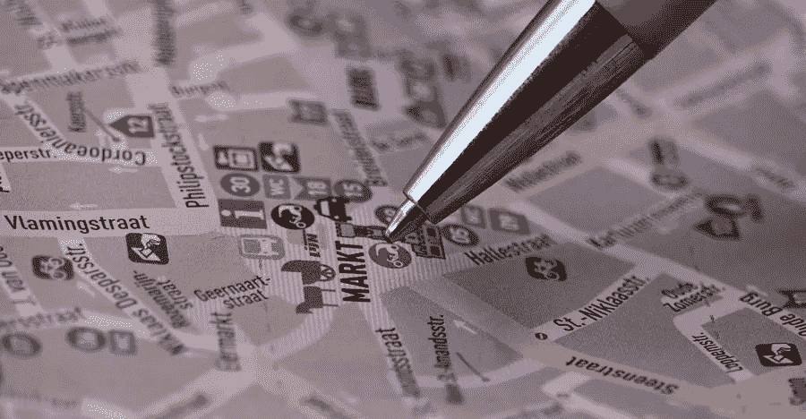

# Instagram 上的定位广告如何帮助当地营销人员最大限度地扩大客户范围

> 原文：<https://medium.com/visualmodo/how-location-targeted-advertisements-on-instagram-help-local-marketers-maximize-customer-reach-e68cc6fd5135?source=collection_archive---------0----------------------->

如今，亚马逊和易贝等大型电子商务巨头似乎正在主宰消费者的思想、情感和钱包。因此，与几十年前相比，今天的市场让当地企业更加望而生畏。因此，企业主可能担心销售正在枯竭，尽管他们的业务为客户提供了巨大的价值。在本文中，你将了解 Instagram 上的位置广告如何帮助当地营销人员。

那么，是否有可能保持现有的，并让潜在客户看到你的公司相对于大型销售平台的价值，这些平台提供各种可以想象的商品，还可以为买家提供即时购买和接收商品的能力？

这一情景描绘了当地企业主可能面临的严峻现实。然而，在这个沉闷的隧道的尽头有一线光明，它以世界上最受欢迎的社交媒体网站之一 Instagram 的形式出现。通过这篇文章，您将了解如何使用这个无价的平台来最大限度地扩大您的客户范围并促进销售。

# 为什么要在 Instagram 上打广告？

Instagram 已经成为许多有影响力的人、博主、品牌和普通人的家园，其中有 5 亿人几乎每天都会登录。事实上，它非常受欢迎，每月用户数量已超过 10 亿，预计随着该平台继续以高质量的视频和图像吸引观众，用户数量还会增加。

此外，每天有 2 亿 Instagram 用户访问一个品牌的账户，70%的购物狂使用 Instagram 来发现产品。它的参与率高达 2.2%，超过了脸书的 0.22%。2019 年，Instagram 上的广告被证明非常有效，社交媒体平台获得了惊人的 200 亿美元广告收入。

从上面的数字来看，没有一个商业 Instagram 账户将会对你的企业的整体健康造成很大的危害。对于拥有 Instagram 账户并以更具成本效益的方式与客户互动的竞争对手公司来说，你可能会面临被客户忽视的风险。这是 Instagram 的一个好广告创意。

# 你如何通过 Instagram 最大限度地接触客户？

幸运的是，Instagram 配备了各种定位功能，可以帮助你最大限度地增加你可以接触到的正确客户的数量，同时也节省了你的广告预算。以下步骤向您展示了如何微调目标设置以实现这些目标:

# 1 切换到 Instagram 上的企业简介

岗位参与的重要性怎么强调都不为过。当然，获得追随者很重要。这意味着你已经可以向追随你的潜在客户推销产品了。然而，你拥有的关注者的数量可能具有欺骗性，因为不是所有的关注者都会关注你的帖子，而这对于推动销售是至关重要的。

你可以通过确保你的企业简介有足够的相关信息来鼓励有兴趣的人向你发送直接信息，甚至促使你进店参观，从而最大限度地提高参与度。

要做到这一点，你必须首先建立你的业务档案，然后添加所有相关信息。转到您的个人资料上的“设置”菜单，选择“切换到业务个人资料”选项。填写您的业务联系信息，如电话号码、电子邮件地址、公司网站、脸书页面链接等。一旦你完成了这个初步的步骤，是时候个性化你的广告工作了，这样他们就可以接触到正确的人群。

# 2 使用 Instagram 位置广告定位功能

Instagram 的奇妙之处在于，你可以根据人们的位置来锁定他们。然而，这个功能有点贵，虽然从长远来看你会省钱。毕竟，向错误的群体营销是没有回报的。

这种定位功能提供了大量选项供您选择，您可以选择广告的目标人群。这包括:

*   目前在特定区域的人。
*   居住在特定区域的人。
*   到过某个特定地区的人。
*   人们朝着一个特定的区域前进。

此外，添加以下选项后，您还可以详细了解高级位置首选项:

*   国家
*   州/地区
*   城市
*   地址

通过提供这些关键信息，现在您可以在地图上看到您的商店地址。将屏幕上的大头针拖到此地址上，并调整您所在位置周围的圆的半径。这表明您的广告将显示给生活在该圈子内的人们。因此，伟大的位置广告 Instagram 的想法。

# 3 添加所有其他相关信息，以便于确定目标

我们已经描述了您应该如何选择定位选项，以接触到在正确位置购买您商品的客户。然而，如果你想推动你的销售，你还需要一双正确的眼睛来看你的商品。

一个例子。如果你是一个青少年时尚品牌，你需要将你的目标受众的年龄设定在 18-25 岁之间，这样你的广告才能到达这个细分市场。你不能到处向 40 岁的人推销。

因此，你必须详细说明诸如性别、年龄、职业、群体等标准。以达到最佳效果。这是通过“详细定位”选项完成的。

此外，指定目标受众的职业是推动 B2B 营销的一个好方法。由有特殊兴趣的特殊观众组成。“该规范还允许您[区分并锁定](https://visualmodo.com/the-most-popular-pdf-forms-for-any-situation/)某些群体，如“新妈妈”或大码女性等

# 4 在 Instagram 中使用文本指定您的位置广告

如果你想把人群吸引到你的商店，你需要在广告中提到一个非常具体的地点。例如，假设您在学校提供缝纫课程，目标是来自南卡罗来纳州格林维尔的学生。为了吸引学生，而不是在你的广告上写“学缝纫”。你需要写“在格林维尔学习缝纫”。通过提供这些信息，你将能够吸引目标受众。有谁可以在本地学缝纫？然而，如果你写了“在南卡罗来纳州学习缝纫”。这看起来很模糊，会分散你的目标受众查看你的个人资料的注意力。

# 5 在 Instagram 上购买关注者

如果你刚刚起步，追随者很少。有机种植它们需要相当长的时间。此外，追随者很少的不幸之处在于，潜在客户可能会质疑你企业的合法性。毕竟我们都对新事物充满好奇和警惕。

我们不建议仅仅依靠购买追随者。然而，它们可以作为一个很好的补充来帮助你发展业务。银河营销为您提供了以各种可承受的价格从不同数量的真实地理目标追随者中进行选择的选项。这将有助于推动依赖 Instagram 粉丝数量的客户做出购买决定。尤其是如果他们是由产品，其质量和品牌证书。

# Instagram 中的位置广告

优化 Instagram，以帮助企业主通过其目标选项展示最佳一面。它有一个用户友好的界面，将指导您以最佳方式使用这些功能。希望这篇指南能给你一些如何开始的建议。祝你好运！