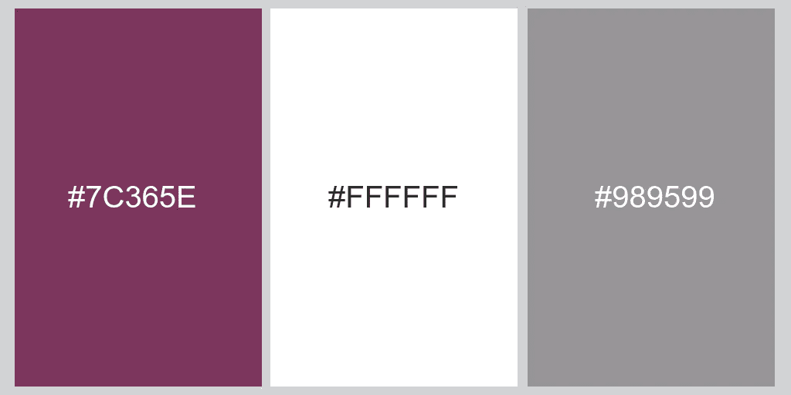

# 你的网站应该使用多少种颜色

> 原文：<https://medium.com/visualmodo/how-many-colors-you-should-use-for-your-website-d9f3be9104f9?source=collection_archive---------0----------------------->

让我们言归正传。说到网页设计，越少越好，越有吸引力。你的网站是你品牌的一部分。它反映了你是谁，以及你如何与你的观众互动。那么你的网站应该使用什么颜色和多少颜色呢？这是你的网站应该使用的颜色数量

为了回答这个问题，让我们来看看这五个顶级美食家网站，我相信它们也是你最喜欢的设计和色彩创意网站。

# 这些食品网站使用的颜色组合

# [杰米·奥利弗](https://www.jamieoliver.com/)

绿色的阳刚色彩平衡了粉色强烈的阴柔色彩。这使得网站能够吸引男性和女性观众。使用三种主要颜色:

[**所有菜谱**](https://www.allrecipes.com/)

这个网站使用灰色和白色的柔和，同时，使用充满活力的图片和生动的橙色色调。使用三种主要颜色:

# [美味杂志](https://www.deliciousmagazine.co.uk/)

就像杰米·奥利弗的网站一样，这个网站有一种女性的感觉，包括少量的粉红色，而不是绿色，他们使用了经典时尚的黑色。使用三种主要颜色:

# [家的味道](https://www.tasteofhome.com/)

这个食品网站大多使用灰色，并使用黑色和红色使按钮和其他元素更加流行。

使用三种主要颜色:

# [撮百胜](https://pinchofyum.com/)

你在这里会看到白色和紫色的使用来显示标题，标志和按钮。他们还使用充满活力和色彩丰富的食物照片来为他们的网站增添更多的活力。

使用三种主要颜色:

# 你应该使用多少种颜色

我上面展示的五个网站都有一个共同点，那就是使用白色。白色让你的网站看起来干净专业，就像是由专业的网页设计师设计的一样。

所以最后回答这个问题，只用三种颜色——确保其中两种是你的品牌颜色，另一种应该是白色。

如果你有一个彩色的标志，如果你的目标是极简设计，你可以在你的网站上放一个白色的标志。并且，以防万一，你还没有 logo，即使你没有设计技能，也可以使用[即时 Logo 设计](https://instantlogodesign.com/)来创建一个。