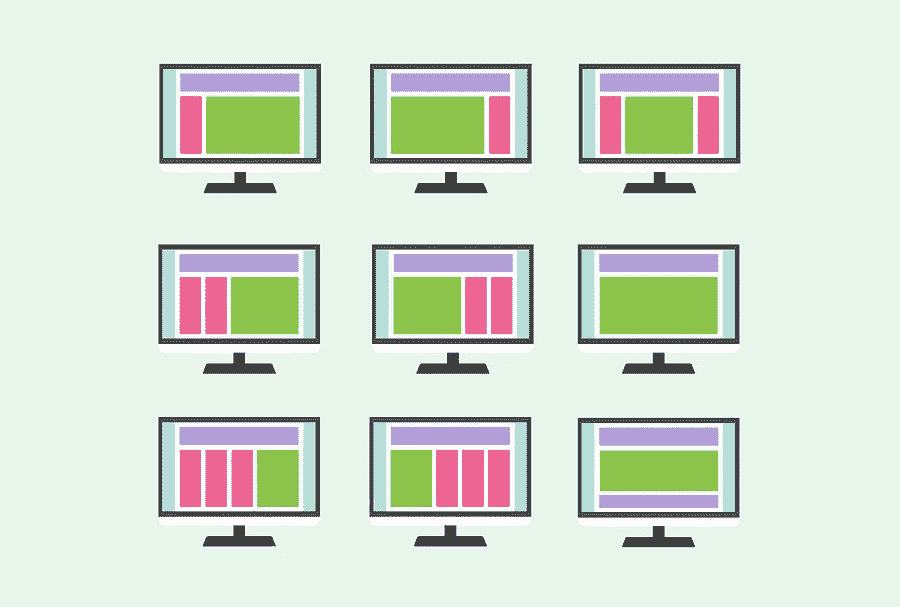

# 一个网站到底需要多少页面？

> 原文：<https://medium.com/visualmodo/how-many-pages-does-a-website-really-need-471af5d57c8e?source=collection_archive---------0----------------------->

建立一个网站从来没有这么容易过，虽然专业设计师仍然扮演着重要的角色，但任何人都可以相对容易地建立一个网站。像 WordPress 这样的开源内容管理系统使得建立结构变得轻而易举。与此同时，数以千计的不同主题确保了令人惊叹的视觉效果和独特的设计，而不需要外界的帮助。在这篇文章中，我们将回答一个网站到底需要多少页面的问题。

然而，虽然建立一个网站相对容易，但基本要素只能通过经验来学习。例如，对于以前从未做过网站的人来说，一个重要的考虑因素是要包含多少个页面。大多数 CMS 平台能让用户在几分钟内创建数百个页面，但重要的是要考虑什么是成功的关键，或者是浪费时间和金钱。此外，如果你使用的是 WordPress 网站，你可以尝试 WordPress 开发服务让专业人士来做。

# 从大处着眼——从小处着手:一个网站需要多少页面？

当建立一个网站时，想得大一点是很有诱惑力的。世界上一些访问量最大的网站有成千上万的网页，这是他们成功的一部分。一些全球访问量最大的网站，如微软的官方域名。是基于现有品牌的成功。然而，大多数网站，如谷歌、YouTube 和亚马逊，都是纯在线的。这些网站上海量内容的重要性可以理解。

更重要的是，这些网站都是从某个地方开始的。根据 Alexa Top Sites 的数据，YouTube 是世界上访问量第二大的网站。YouTube 官方博客称，用户每分钟上传超过 500 小时的视频。然而，这一切都是从一个视频开始的。

这些网站有一个共同点，它们依赖功能和内容一样多，在[创建一个庞大的内容](https://expo.ooo/directory/)时间表之前，这是至关重要的。把基本的事情做好，其他的事情就会水到渠成。

对于个人网站，几页就足够了。这取决于网站背后的意图。随着网站所有者写更多的帖子，个人博客自然增长。起步可以简单到一个主页和第一个帖子。

在公司网站上，情况可能更复杂。访问该网站的用户通常希望更多地了解该公司，并衡量信任度。单页网站可能还不够，还需要考虑关于页面的隐私政策和其他要点。考虑访问者想从网站上得到什么，并根据这些受众定制你的输出。