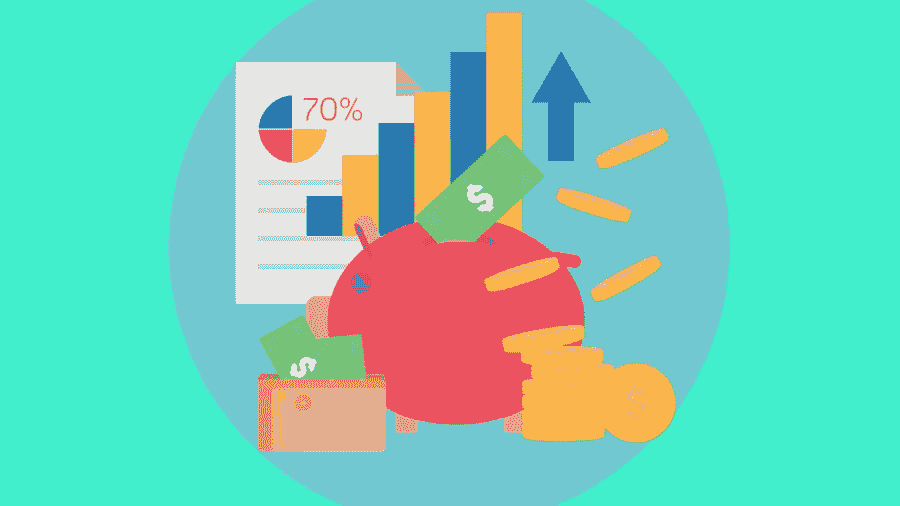

# 平均 30 岁存了多少钱？

> 原文：<https://medium.com/visualmodo/how-much-does-the-average-30-year-old-have-saved-d19a36032084?source=collection_archive---------0----------------------->

当涉及到财务决策时，我们都需要小心谨慎。我们如何处理我们的财务对我们的生活有巨大的影响。人们经常面临的主要挑战是计划有效地使用他们的财务。在我们今天的讨论中，我们将详细讨论这个问题。你现在这个年龄应该存了多少钱？即使你才 20 多岁，你也应该已经存了一些钱。

# 应该存多少钱？

当谈到计划时，我们简单地说就是以最合适的方式预算和花费你的收入。个人做出的最重要的决定之一就是储蓄。我们承认这样一个事实，在某一点上我们不会像现在这样富有成效，或者毫无疑问我们会退休。然而，生活并不止于退休，需要为退休后的生活储蓄资金。

这个讨论将帮助你知道你现在需要的大概数量。虽然有些人善于储蓄，但有些人却很挣扎。善于储蓄的人把他们的目标定为每当他们收到固定收入时首先支付自己。这里的秘密是量入为出。

这些人会区分他们的基本成本和非基本成本。通过量入为出，他们尽一切可能减少娱乐等不必要的花费。他们不是用额外的收入来改善生活，而是经常储蓄或投资，因为他们知道从长远来看他们会得到好处。这些人通常被称为天生的储蓄者，他们甚至会在很小的时候就开始储蓄。然而，我们都需要储蓄，不管我们是不是天生的储蓄者。

# 30 岁要存多少钱？

生产年龄在 65 至 70 岁之间。这意味着如果你 30 岁了，你还有长达 40 年的时间为你未来的生活储蓄资金。一般年轻人有很多时间多做储蓄。

如果你在 20 多岁的时候碰巧存了更多的钱，事情很可能会变得很好。我们实际上需要相信复利。如果你在年轻时进行现金投资，投资金额将有几十年的增长时间，因此，如果你在以后的生活中贡献较少，也不会有问题。此外，随着时间的推移，生活变得越来越昂贵，你可能会想要其他基本的东西。例如，你想成为一名房主或者资助你孩子的教育。

# 退休储蓄

在年轻时为退休储蓄资金将帮助你在年老时在预算中适应其他重要的目标。那么，30 岁时你需要存多少钱呢？嗯，财务建议金额相当于你的年薪。这意味着如果你一年挣 87，000 美元，那么在你 30 岁的时候，你应该已经存了 87，000 美元，这个值应该特别包括你为退休所存的钱。

此外，专家建议，为了达到这个目标，你每年至少要存下 15%的年薪。更重要的是，明智的做法是将你的储蓄用于投资，而不是把它们放在账户里。然而，你打算退休后过奢侈的生活。如果是这样的话，那就以多存钱为目标吧。

即便如此，即使你生活奢侈，15%的储蓄仍然会让你有足够的钱维持生活。如果你不能马上开始存钱，没必要担心。你还有时间，你可以从一个较低的百分比开始，然后增加 1%，直到你达到目标。不要因为你能存的钱少而气馁。最后，即使是 1 美元也算。但是他们的紧急情况也需要考虑。作为千禧一代，你应该存多少钱以备不时之需？

# 存多少钱以备不时之需？

嗯，强烈建议你至少存下相当于你 3-6 个月生活费的钱。你在这里是怎么做数学的？这很简单。使用 50/30/20 规则，你将成功管理。记住，由于税收和其他扣除，你的总工资可能不是你带回家的。一旦你付了税，对你的净收入应用 50/30/20 规则。将你的支出分为固定支出和可变支出。前者应包括日常开支，如住房费用等。这些费用会消耗你净收入的 50%。

另一方面，可变费用会发生变化，可能包括娱乐和杂货费用等。可变成本应该最多占你净收入的 30%。剩下的 20%应该用于储蓄。综上所述，你的生活费用总计占你每月净收入的 80%。

你的应急基金应该等于这个数额乘以 3-6。紧急情况发生在最意想不到的时候，拥有这些资金将是一个强有力的防御。然而，我们可能是乐观主义者，一些错误的事情总是注定要发生，这就是为什么你真的需要存钱以备不时之需。未能储蓄可能会迫使你转向贷款，这可能会导致成本过高。如果情况要求你贷款，那也没关系。一些放款如即时贷款将批准你的申请，甚至在分钟。

# 结论

不考虑你的年龄，你需要为你未来的生活存些东西。平均 30 岁的人存了多少钱？据专家称，你需要在 30 岁时存下相当于你年薪的钱。为了达到这个目标，在 20 多岁的时候就开始尽可能多地存钱吧。随着年龄的增长，你可能会承担其他责任，这可能会限制你能存多少钱。但如果你在人生的早期就开始存钱，那么在承担其他责任的同时还能继续存钱就更容易了。