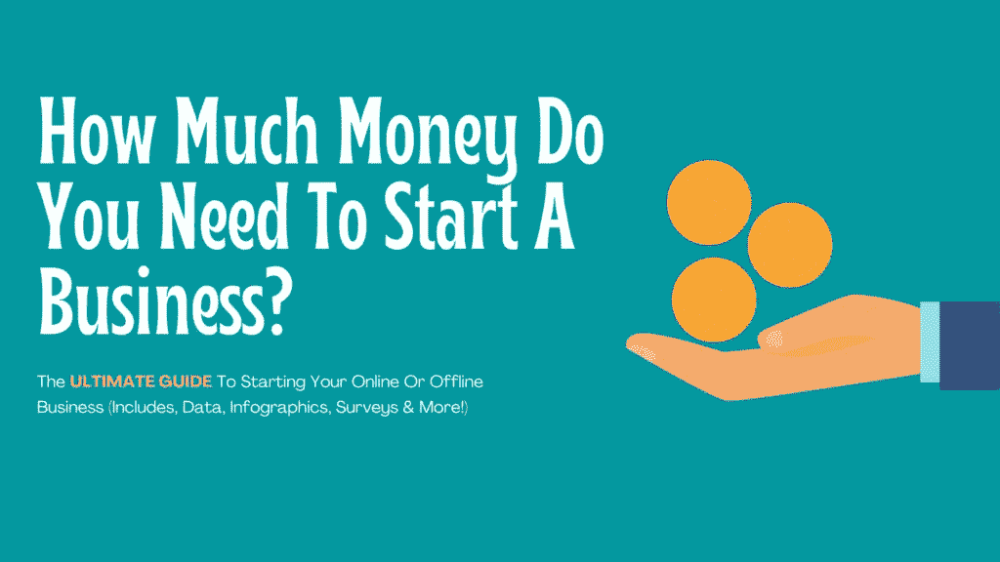

# 创业需要多少钱？小型企业的间接成本

> 原文：<https://medium.com/visualmodo/how-much-money-do-you-need-to-start-a-business-overhead-costs-for-small-businesses-d10f66a53adf?source=collection_archive---------0----------------------->

几千年来，人们创立了企业。人们用来创建他们梦想中的企业的利基和平台的数量是没有限制的。与普遍看法相反，企业失败的原因并不总是因为我们的想法没有市场需求。(尽管这可能是一部分原因)事实上，潜在企业主面临的最大挑战之一纯粹是财务方面的。(例如，启动业务所需的资金。)所以也许你在想，“创业需要多少钱？”

特别是在美国，小企业的管理费用从未如此多样化。有些商业模式的启动成本极低，有些则需要巨额投资。(特许经营可能是许多人所知道的最常见的创业类型，然而大量的前期资本只是潜在特许经营所有者面临的众多障碍之一)

我设计了这个深入的教育资源，让任何人都能自信地理解创业需要什么。

## 您将从本文中学到什么:

1.  小企业的平均管理费用。(网上和网下)
2.  关于企业为什么失败，为什么成功的统计和数据。
3.  如何快速启动一项业务？
4.  一家企业是否有辅导或教育。
5.  每个小企业主必须知道的重要原则。
6.  任何人都可以创办的最安全、最赚钱的创业公司。
7.  为什么 68%的企业有未偿债务(以及如何利用这一点)
8.  甚至更多！

让我们直入主题，好吗？

# 创业需要多少钱？网上便宜吗？(资料图)

创业比以往任何时候都容易，而且不需要大量投资！

因为互联网使用如此频繁，以各种方式将数十亿人联系在一起，这已经成为美国最常见的商业模式。(而且通常是最实惠的！)甚至在实体建筑外经营的“实体”企业也在使用基于互联网的营销技术来获得曝光率。此外,《企业家》发布的一项研究显示，51%的美国人更喜欢网上购物！(那是在 2018 年)

此外，OptinMonster 重新发布的一项研究表明，67%的互联网用户喜欢在智能手机上“逛商店”!

互联网已经成为企业的一个非常有用的工具，事实上，它为我提供了一个完美的借口来制作一个信息图表，显示为什么你应该从一开始就考虑把你的业务放在网上的统计数据。