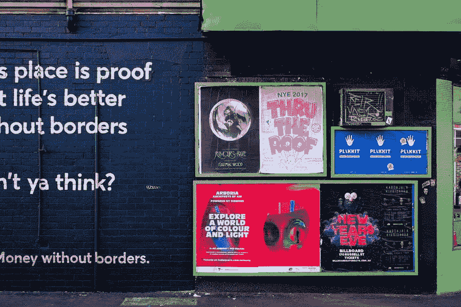

# 你应该在 AdWords 上花多少钱

> 原文：<https://medium.com/visualmodo/how-much-should-you-spend-on-adwords-660338629b49?source=collection_archive---------0----------------------->

Google AdWords 是小型企业的强大广告工具。我们一直与客户合作，他们通过使用 Google AdWords 获得了巨大的成功，带来了巨大的投资回报。每当我们与潜在客户交谈或举办谷歌 AdWords [网上研讨会](https://visualmodo.com/blog/)时，我们听到的最常见的问题之一是:你应该在 AdWords 上花多少钱？

# 计算价格

当谈到[AdWords](https://adwords.google.com/home/)——以及大多数其他在线营销平台——费率并不是一成不变的。点击你的一个广告可能会让你付出几分到几美元的代价，这取决于很多因素。主要的两个因素如下:竞争力。越多的人希望根据特定的搜索条件显示他们的广告，这些广告就会变得越贵。你想展示广告的地方。例如，在谷歌搜索结果中展示你的广告往往比通过他们的展示网络更昂贵。

给你一个概念，对于谷歌搜索页面，AdWords 的平均点击成本(CPC)在 1-2 美元之间。然而，AdWords 并不能让你直接购买和展示。相反，它使你能够连续竞价关键词。你需要为你的广告设定一个出价，如果你的出价“赢了”，你的广告就会上线。因此，你需要确保你的出价足够有竞争力，这样它才能开始获得点击和印象。

如果你想让你的广告出现在屏幕上，关键词的竞争力越强，你的出价就需要越高。在某些情况下，人们会为承诺高投资回报(ROI)的利基市场支付超过 50 美元的点击费。

然而，金钱并不是 AdWords 发挥作用的唯一因素。当你发起一项活动时，谷歌也会给你的广告分配一个[质量分数](https://support.google.com/adwords/answer/140351?hl=en)。在某些情况下，谷歌认为高质量的广告甚至可以以较低的出价“赢得”拍卖，并获得更高的“广告排名”。这意味着其他广告的排名将会靠后，但它们仍然可以被刊登。通过这种方式，AdWords 确保没有任何一家企业可以垄断搜索结果，即使他们可能有更大的预算。

计算你的广告的质量分数需要考虑很多因素，所以我们今天不讨论这个。然而，可以说，从长远来看，质量较低的广告最终会支付更多的费用。如果你想获得最好的投资回报，你需要寻找有竞争力的关键词，制作高质量的广告，并留出一笔可观的预算。

# 在 AdWords 营销活动上花费

谈到在线广告，有几种类型的活动你可以运行。其中两个最常见的是:每次点击费用(CPC):在这种类型的活动中，每当有人点击你的广告时，你就要付费。每千分之一成本(CPM):在这种情况下，每次广告公司展示你的广告一千次，你就要向他们付费。

从成本角度来看，CPM 广告往往更便宜。这听起来可能更划算，因为你为一千次浏览支付的费用更少。然而，CPC 广告的转换率要高得多，所以在大多数情况下，当你比较 ROI 时，你最终为点击支付的费用要少于为浏览支付的费用。

由于 CPC 广告在行业中如此普遍，所以没有太多关于 CPM 平均值的信息。因此，我们将主要关注 CPC，同时也讨论每次行动的成本(CPA)。后者是你每次获得转换率的预期广告支出，根据你所在的行业不同，平均值会有很大差异。

让我们从一些最贵的油田开始，根据它们的 CPC 价格:

*   保险:54.91 美元
*   贷款:44.28 美元
*   律师:47.07 美元
*   信用:36.06 美元
*   托管费:31.91 美元

这些领域非常昂贵，因为它们都有惊人的投资回报率的潜力，例如让客户获得经常性付款。因此，一次转换可以导致多个发薪日。早些时候，我们提到了平均每次点击费价格约为 1-2 美元，这意味着这些溢价领域是异常值。

如果你想知道对于任何给定的关键词，你应该期望在 CPC 广告上花费多少，你可以使用诸如 [SEMRush](https://www.semrush.com/) 这样的工具来帮助你找出答案。这是一项收费服务，但它能让你用一个免费账户进行多达十次的免费搜索。

# 成本

对于你分析的每一个关键词，SEMRush 会给你一个估计，你可以预计花费多少 CPC 广告。在本例中，我们查找了“衣架”这个词，这个词的竞争远不如保险领域激烈:

使用该工具，您还可以访问相关关键字及其原始报告的估计 CPC:

然而，点击费数据不足以告诉你应该在 AdWords 上花多少钱。重要的是你的注册会计师，其中“A”代表行动和收购。这个指标告诉你每次转换的预期花费。

所有行业的平均注册会计师在 60 美元左右。例如，如果你每天预算 20 美元，你可以平均每三天转换一次。然而，这也取决于你的点击费，你的目标行业，等等。

根据我们的经验，你需要为每个目标关键词的*至少* 100 次点击做预算。这样，你就有足够的数据来确定关键词是否值得你努力，并确定你的广告做得更好。这可能是一大笔钱，但重要的是你要获得足够的数据来进行具有统计学意义的[实验](https://shots.visualmodo.com/)。没有它，你只能盲目地发布广告，只希望其中一个能发大财。

# AdWords 控制

如果你想获得足够的数据以获得显著的结果，你至少需要大约 100-200 美元来测试你想要针对的每个关键词的广告。那是一大笔钱，所以你需要小心你如何花费它。

理想情况下，你不应该在一天之内花光所有的预算。如果你想快速得到结果，这样做可能很诱人，但是有很多因素会影响转化率。例如，人们可能更愿意在特定的时间或日期购物。在其他情况下，你的广告在特定地点的人[那里会做得更好。](https://support.google.com/adwords/answer/1722043?hl=en)

你的目标应该是把你的预算分散到至少一两周。就当是测试阶段吧。，这有助于您生成足够的数据来发展您的营销活动。一旦你知道你的广告在哪些受众中做得更好，你就可以有针对性地瞄准这些用户。这应该会让你获得更多的转化率和更高的投资回报率。

幸运的是，AdWords 为您提供了[高级定位](https://support.google.com/adwords/answer/1704368?hl=en)和[每日预算](https://support.google.com/adwords/answer/6312?hl=en)，因此您可以配置自己的活动。然后就是经常查报表的问题了。如果你发现一个活动进行得太久而没有得到结果，你可以取消它，重新开始。

# 轮到你了

在网上投放广告可能会相当昂贵，有些人每天在广告词上花费数百或数千美元。然而，你也可以用更少的预算获得好的结果。不过，在你开始之前，明智的做法是预算你可以在 AdWords 广告上花多少钱，并在一开始就坚持这个数字。

在大多数情况下，你至少需要花 100-200 美元在平均点击费的关键词上，才能发现你的广告是否成功。如果此时你的投资没有回报，你可能需要重新考虑你的策略。