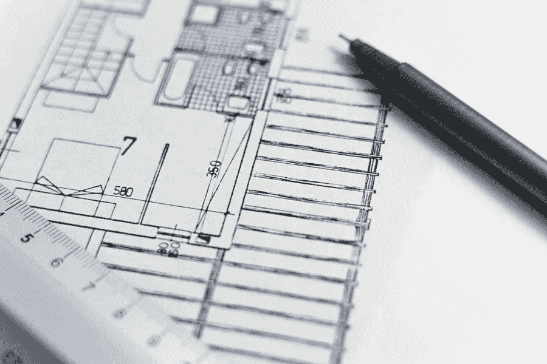

# 响应性网页设计如何能大幅增加你的建筑网站

> 原文：<https://medium.com/visualmodo/how-responsive-web-design-can-drastically-grow-your-construction-website-efe72e390989?source=collection_archive---------0----------------------->

无论你是否意识到，响应式网页设计是你每天都会看到的。如果你在笔记本上阅读这篇文章，它看起来会和你在手机上看到的不一样。响应式设计是其背后的原因。在这篇文章中，你将会看到响应式网页设计是如何大幅提升你的建筑网站的。

目标是让网站、文章或图片在所有设备上都可读。你不希望网站在电脑上看起来很棒，但在手机或平板电脑上却不容易导航。这种设计缺陷会让人们离开你的网站，去别处寻找他们需要的东西。

如果你仍然不确定这是什么意思，想象一下。你在手机上打开一个网站，阅读你需要为一个特定项目订购的木材……登陆该网站后，文本太小，你必须不断放大才能阅读，然后缩小才能转到下一行。

那会很快让人沮丧，不是吗？这种挫败感正是响应式网站设计要防止的。它为桌面和移动设备创造了用户友好的体验，以保证最佳的观看效果。

现在你知道了什么是响应式网页设计，让我们来谈谈它是如何大幅提高你的网站建设的。

# 建立清晰的品牌:建筑网站的网页设计

响应式网页设计帮助你创建一个清晰的信息。当客户不必花时间费力地浏览你的内容时，他们可以专注于你的品牌。

这种类型的网页设计对于[品牌建设](https://visualmodo.com/improving-the-branding-of-your-website/)来说非常理想，因为它能让你的内容在搜索引擎中排名更高。写内容的时候要记住这一点，确保你网站上的所有内容都反映了你想要传达的信息。

在建筑这样的行业，品牌是至关重要的。重点突出你能提供什么服务，是什么让你在竞争中脱颖而出。客户应该确信你是他们项目的正确选择。

响应式设计也是图像的理想选择。这可以确保它们清晰，并且大小适合正在观看它们的设备。你可以自信地加入你作品的例子，它们看起来会和你想要的一模一样。

响应式网站设计提供的清晰性和易用性让客户很容易看到你能为他们做什么。它创造了一种舒适感，这转化为你的网站有更多的观众，你的企业有更多的客户。

# 超越你的竞争对手

如果移动网站设计糟糕，57%的人不会推荐某项服务。为什么？因为它看起来廉价且不专业，这不是客户想要从他们付钱为他们工作的公司那里得到的东西。

你可以利用这一点，设计一个在各方面都胜过竞争对手的网站。正如我们已经讨论过的，响应式设计让页面更容易阅读。这也使它在视觉上更具吸引力。

适当大小的文本和图像吸引眼球。当你把它和易于导航的标签、清晰标注每个部分的标题以及优秀的布局结合起来，你就有了成功的秘诀。

# 建筑网站的布局与网页设计

总的来说，潜在客户会寻找你的工作，你的资格和你的价格的例子。为每一个都创建一个部分，让它们成为你主页设计的关键部分。

为示例部分拍摄一些专业的作品照片。不需要几十个，只需要几个你做的好镜头，这样客户就知道工作完成后会发生什么。

在资格部分快速总结你的工作经历。如果你正在寻找脱颖而出的方法，今天你可以参加一个预备课程来帮助你获得或更新你的承包商执照。获得执照会让你在一些竞争中获得优势，尤其是有许多未经许可的承包商在“为了更少的钱而偷偷摸摸地”工作。另外，大多数州都要求获得执照，这取决于你所从事的工作类型。