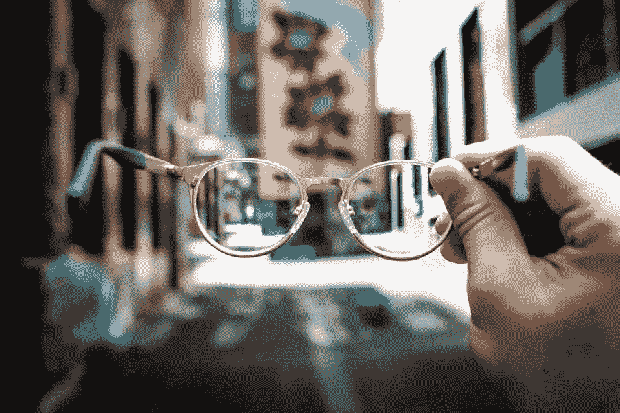

# 技术如何引领眼镜行业新视野

> 原文：<https://medium.com/visualmodo/how-technology-leads-eyewear-industry-new-vision-b57dc3bd8858?source=collection_archive---------0----------------------->

一些人声称眼镜或太阳镜这些年来没有太大变化。也没有购物体验。嗯，眼镜商和眼镜公司对此不敢苟同。在本文中，我们将分享技术如何引领眼镜行业的新视野。

眼镜和太阳镜已经成为时尚，就像其他时尚配饰一样。2018 年，全球眼镜市场的价值估计为 1313.2 亿美元。它包括眼镜、太阳镜和隐形眼镜。这种增长支持了一个事实，即人们期望的不仅仅是金属框架和曲面透镜的排列。随着技术进步触及到每一个行业，眼镜行业对它并不陌生。从透明镜片到在镜架上安装一台小型电脑，该行业已经正式移除了眼镜上的“无聊”标签。

# 让你的眼镜与众不同的东西

当 2001 年有人建议我戴眼镜时，我母亲担心眼镜会扭曲我的容貌。那是眼镜由又厚又圆的金属框架和镜片制成的时代。但是现在，发生了巨大的变化。

创新者不仅改变了镜架和镜片的设计，还试图克服其他问题。例如，镜片公司在镜片中添加了一种防眩光材料，以方便夜间驾驶。人们通过佩戴零度数镜片眼镜来表达自己的风格。

除了处方眼镜，美国 83%的男性和 89%的女性经常使用太阳镜。根据它们的框架，有多种选择——飞行员、蝴蝶、猫眼、球杆、椭圆形、矩形、盾形、圆形、方形和旅行者。

# 镜片技术眼镜的材料

现代的镜片由高科技塑料制成，而不是普通玻璃。它提供了耐用性，使它们不那么脆弱。此外，它们重量轻，可以保护眼睛免受有害紫外线的伤害。

# 水晶般清晰的夜视和雨天用偏光镜片

最重要的是，镜片增加了防眩光功能，在水下或下雨时有清晰的视野。防反射涂层使其在强光下容易看清，尤其是在驾驶过程中。

# 全焦距

请记住，你的祖父母有一个双焦点镜片，即在一个框架内的镜片，以帮助远视和近视。他们有点不安，因为需要一些时间来适应这两者。

全焦透镜有一个光滑的透镜，它有一个透明的液晶，可以弯曲通过它的光线。它们配有一个处理单元，用于确定眼睛和聚焦物体之间的距离。有了这些，人们可以更快地在两种类型的视觉之间切换，而无需聚焦在镜头的一个区域。

# 轻松佩戴眼部科技眼镜

约有 64%的美国人因过度使用屏幕设备而出现数码眼睛疲劳。是视网膜损伤和黄斑变性的主要原因。眼镜带有保护涂层，可保护您的眼睛免受数字屏幕发出的眩光、反射和高能量蓝光的影响。

# 运动员运动眼镜

眼镜行业为运动发烧友提供单独的眼镜和太阳镜。他们的设计和镜头技术都以运动为中心，无论是高尔夫、自行车、水上运动、冬季运动、跑步还是其他更多运动。除了提供具有晶莹剔透和防眩光视觉的镜片外，这款眼镜还可防止光线条件、速度和空气中微粒的突然变化。

# 在线眼镜店的实时试戴功能

根据 Statista 的调查，2019 年，美国约有 9.3%的处方眼镜在网上出售。一个人可以在像 GlassesUSA 这样的网站上尝试不同的太阳眼镜框架，根据他们的脸型选择最合适的一个。

此外，实时眼镜试戴功能可以使用 HTML5 的 FitMix。这是一个试用模块，通过网络摄像头实时在浏览器屏幕上提供虚拟镜像。

# 用户化

3D 打印的力量和定制的奢华同样存在于眼镜行业。人们可以定制完全定制的 3D 打印相框，以适合他们的面部或想要的风格。

# 增加了增强现实技术眼镜

眼镜行业的技术讨论是不完整的，没有提到增强现实。具有增强现实功能的智能眼镜通过将眼镜与手机或其他数字设备连接，可按需为您提供眼前的视觉效果。您可以查看您的电子邮件，拨打和接听电话。所以，查看信息，拍照，听听你的播放列表，通过看你的可佩戴镜片导航。

# 在你离开之前

这款眼镜在保护眼睛、打造正确风格和改善购物体验方面付出了大量努力并取得了长足进步。无论您的眼镜是在商店购买的，还是您在网上订购的，最棒的是，公司可以提供很多。