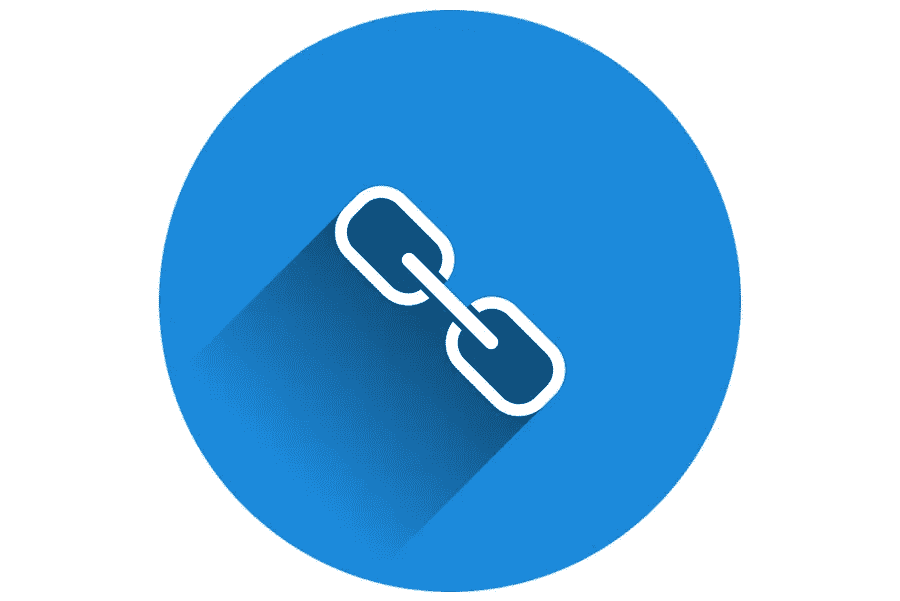

# 如何添加链接到 WordPress 文章或页面

> 原文：<https://medium.com/visualmodo/how-to-add-a-link-to-wordpress-posts-or-pages-3244ba619c05?source=collection_archive---------0----------------------->

你想在你的 WordPress 网站上添加一个链接吗？所以，我们的一个用户问我们如何在 WordPress 中添加链接。因此，在本文中，我们将向您展示如何在 WordPress 帖子、页面、文本小部件等中添加链接。

# 在 WordPress Gutenberg 添加链接:

1.  首先，转到你想链接的网页。
2.  其次，复制网址。它应该以“HTTP://”开头
3.  写下你想成为超链接的文字。最好是描述性的，避免使用“点击这里”这样的短语
4.  突出显示要转换为超链接的文本。
5.  点击古腾堡的链环图标，它看起来像这样
6.  粘贴步骤 2 中的 URL
7.  最后，单击如下所示的“enter”按钮

# 在 WordPress 经典编辑器中添加链接

1.  首先，转到你想链接的网页。
2.  复制网址。它应该以“HTTP://”开头
3.  写下你想成为超链接的文字。最好是描述性的，避免使用“点击这里”这样的短语
4.  选择文本。
5.  点击 WordPress 中的制作链接按钮。它看起来像这样
6.  将第一步中的 URL 粘贴到链接字段中。
    看起来是这样的:
7.  然后单击插入。

# 如何在导航菜单中添加链接

您想在网站的导航菜单中添加链接吗？因此，WordPress 自带了一个直观的菜单编辑器，允许你在你的 WordPress 站点上创建和管理导航菜单。

只需进入外观菜单页面。如果您没有导航菜单设置，那么您可以通过输入菜单名称来创建一个。如果您已经设置了导航菜单，那么您可以添加、编辑或删除其中的链接。看看我们的初学者指南，如何在 WordPress 中添加导航菜单。

# 最后的话

最后，你的链接应该像网络上的其他链接一样[变成蓝色](https://visualmodo.com/)。你也可以使用 WordPress 热键来插入链接。综上，就是这样！如果您有任何问题，请在下面留下您的评论。