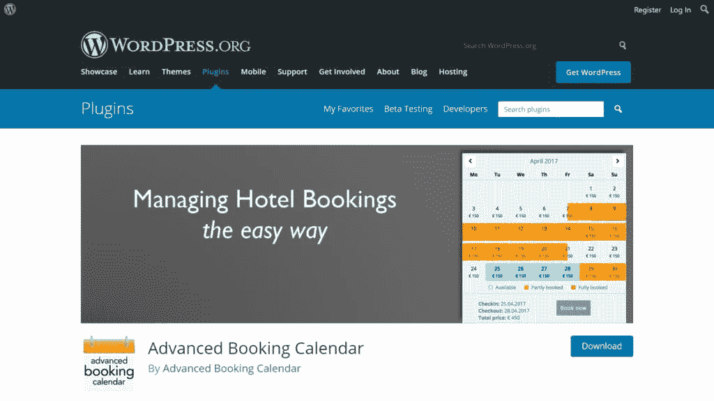

# 如何在 WordPress 网站中免费添加预约和预订？

> 原文：<https://medium.com/visualmodo/how-to-add-booking-and-reservation-in-wordpress-websites-for-free-7305f9cb15b9?source=collection_archive---------0----------------------->

你想让你的客户直接从你的 WordPress 网站免费预订吗？我们会告诉你怎么做。许多企业需要一个预约 WordPress 表单，允许客户轻松地在线预约。因此，在这篇文章中，我们将免费展示如何在你的 WordPress 网站上做到这一点。

对于本指南，我们将使用一个免费的 WordPress 插件，高级预订日历插件。因为你可以在 WordPress org 网站上免费下载。此外，这个插件有一个专业版，但我们将在本文中保持免费。因此，表明你可以有结果，即使是在免费版。

# 第 1 部分显示预订表单

激活插件后，你会在 WordPress-Admin“高级预订日历”中看到一个新元素。点击它，进入设置。首先，仔细检查这个电子邮件地址，因为所有预订请求都将发送到这个地址。

此外，您可以选择一个放置了预订表格短代码的页面。你必须手动添加短代码[abc-bookingform]到这个页面，以便在 WordPress 中进行预订。该页面将在链接中。因此，如果[用户在单个日历短代码上选择日期](https://visualmodo.com/best-self-development-books-to-become-a-better-professional/)。如果您尚未创建预订表单页面，请忽略此设置。您可以稍后回来编辑该链接。

货币:输入您要记帐的货币代码。日期格式:请选择最适合您的日期格式。它将被所有日历和预订表单使用。价格格式:当显示价格时，总是使用价格格式。Cookies: