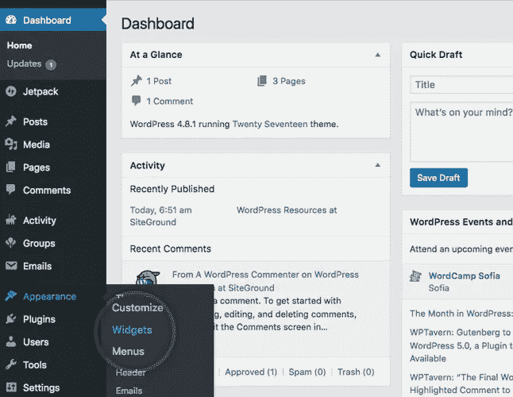
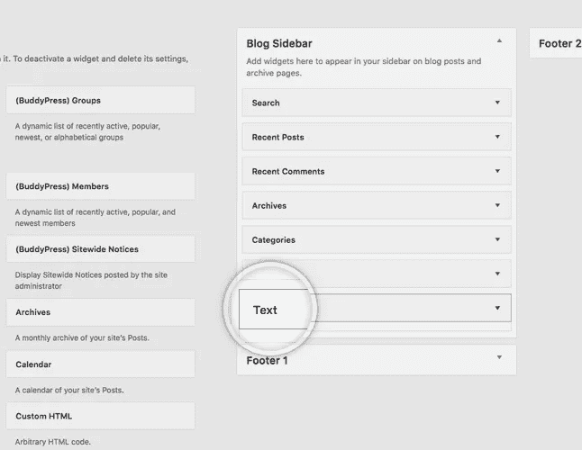
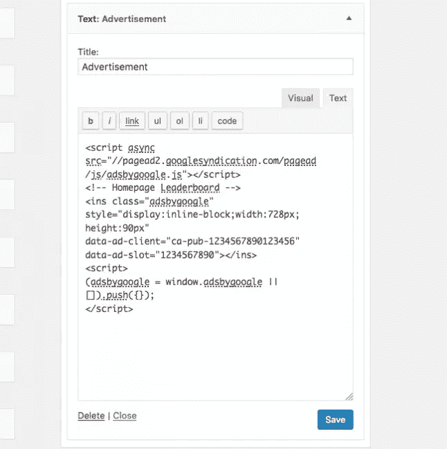

# 如何在 WordPress 上添加 Google AdSense

> 原文：<https://medium.com/visualmodo/how-to-add-google-adsense-on-wordpress-a0f993985758?source=collection_archive---------0----------------------->

用你的 WordPress 博客赚钱，以一种简单的方式将 Google AdSense 添加到 WordPress。

使用 WordPress，你可以很容易地将你的 AdSense 代码添加到你的博客中。为了做到这一点，首先登录到你的网站的管理端。然后，进入**外观**->-**Widgets**菜单。

Google AdSense 是最受欢迎的网站赚钱方式之一。你知道吗，你可以很容易地将谷歌广告添加到你的[网站，并开始赚钱。在本文中，我们将向您展示如何在 WordPress 中添加 Google AdSense，并分享一些最佳实践和技巧来增加您的收入。](https://visualmodo.com/)

# Google AdSense 入门

你需要做的第一件事是注册一个谷歌广告账户。如果您有 Gmail 帐户，那么您可以使用现有的帐户。

提交申请后，您将在 6-8 小时内收到一封电子邮件，告知您是否通过了审核流程的第一步。如果您通过了第一次检查，那么您可以登录到您的 AdSense 帐户，并获得您的广告代码。

在该页面中，选择将一个**文本**小部件拖放到您的**博客侧边栏**上。

然后你应该添加一个标题(在我们的例子中是*广告*，在标题下，点击**文本**标签，然后粘贴你从 Google 获得的实际代码。最后，点击**上的**保存按钮。

广告将自动保存并出现在你的 WordPress 工具条中。

你需要确定你想在你的网站上显示广告的位置。最常见的广告显示在侧边栏。你可以使用 [WordPress](https://visualmodo.com/) widgets 在你的工具条中添加广告。虽然广告位置很重要，但我们发现最佳尺寸是 336×280 和 300×260。这些广告往往适合大多数屏幕尺寸，也有最好的支付率。