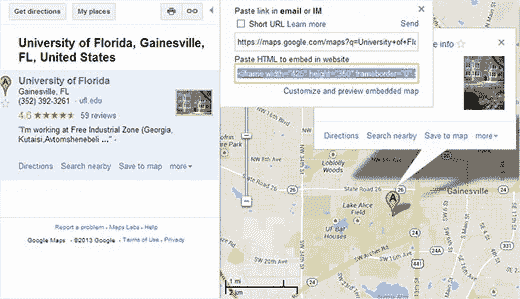
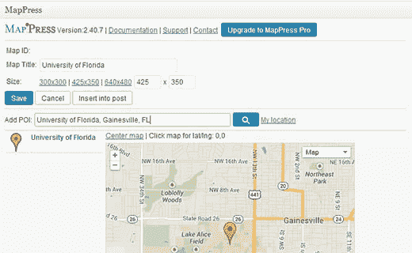
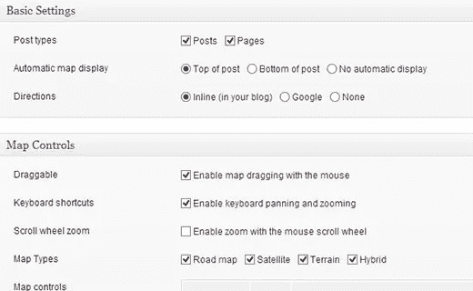
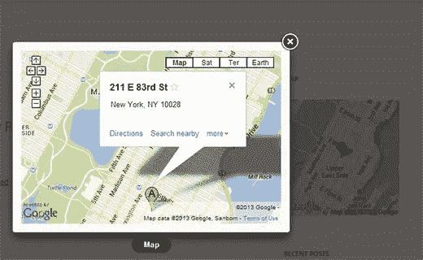

# 如何在 WordPress 中添加谷歌地图

> 原文：<https://medium.com/visualmodo/how-to-add-google-maps-in-wordpress-edda3895eef4?source=collection_archive---------8----------------------->

你可以在你的 WordPress 站点上添加各种内容。从外部来源添加内容允许您创建有用且高度互动的丰富内容。在这篇文章中，我们将向你展示如何在 WordPress 中添加谷歌地图。

## 在 WordPress 中手动添加谷歌地图

进入[谷歌地图](http://maps.google.com/)网站，只需输入您想要显示的位置地址或搜索位置。找到位置后，单击右侧面板中的链接按钮。这将向您显示嵌入代码。复制 iframe 代码，或者您也可以单击*“定制并预览嵌入的地图”*来进一步定制您站点上的地图外观。

转到你的 WordPress 网站，将代码粘贴到帖子、页面或模板中。就这样，保存你的帖子/页面，在你的网站上查看 Google map live。

## 使用插件在 WordPress 中添加谷歌地图

如果你只想在 WordPress 站点的一个位置嵌入谷歌地图，第一种方法是好的。但是如果地图在你网站的主要内容中扮演着重要的角色，并且你需要经常在你的帖子中添加地图，那么我们建议你使用插件。

你需要做的第一件事是安装并激活[地图新闻简易谷歌地图](http://wordpress.org/plugins/mappress-google-maps-for-wordpress/)插件。编辑要添加地图的帖子/页面。向下滚动到帖子编辑界面的地图新闻部分，点击*新地图*按钮。

这将打开 MapPress 编辑器，您可以在其中输入地址或点击我的位置链接，让插件自动检测您的位置。为地图提供标题并选择地图大小。对地图满意后，点击保存按钮，然后点击插入帖子按钮，将地图添加到帖子中。更新或发布您的帖子并查看预览。

使用 MapPress，您可以在帖子或页面中添加多个地图。尽管它开箱即用，但它也在你的 WordPress 管理侧边栏中添加了一个插件设置菜单。点击它，你可以改变插件设置，如地图类型，边界，对齐，控制等。

## 在 Widget 和 Lightbox 中添加谷歌地图

将谷歌地图添加到你的 WordPress 站点的另一个简单方法是安装[谷歌地图插件](http://wordpress.org/plugins/google-maps-widget)。激活插件后，进入**外观小部件**，将谷歌地图小部件拖放到侧边栏。

在微件设置中输入您想要在地图上显示的地址。您还可以选择地图大小、大头针颜色、缩放级别等。单击灯箱选项卡以配置灯箱设置。最后点击*保存*按钮保存您的小工具设置。请访问您的站点，查看小部件的运行情况。

我们希望这篇文章能帮助你在你的 WordPress 站点中添加谷歌地图。如有疑问和反馈，请在下方留言。

来源:https://visualmodo.com/