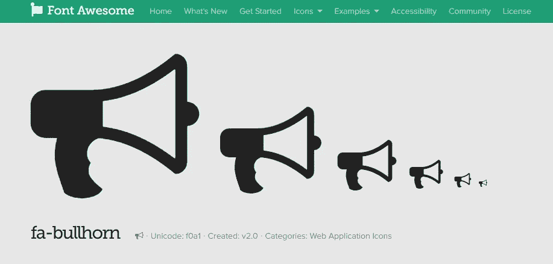
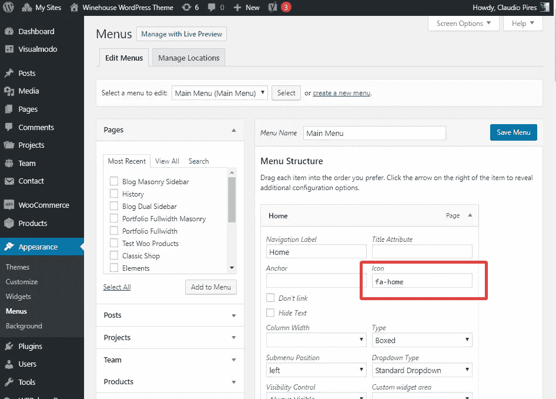

# 如何给 WordPress 标题菜单添加图标

> 原文：<https://medium.com/visualmodo/how-to-add-icons-to-wordpress-header-menu-eea2953e43d9?source=collection_archive---------0----------------------->

导航标题菜单上的图标

在本教程中，我们将展示如何使用我们的 WordPress 主题菜单引擎在你的 WordPress 标题菜单和导航菜单上添加字体精美的图标。

# 如何给 WordPress 标题菜单添加图标？

首先，你需要登录你的 WordPress 仪表盘。登录导航到“外观”选项卡后，在菜单编辑器面板上单击“菜单”一次，确保您在主菜单上(您保存为主菜单的菜单显示在您的网站标题导航上)。

在菜单编辑器页面上，选择菜单项选项卡打开菜单项编辑器，您将看到一个名为“图标”的字段。您将在此字段中输入图标代码。要获得图标代码，你可以进入 n[font-awesome](http://fontawesome.io/icons/)网站并选择你想要的图标，让我们来看一个例子'**fa-bull horn【T3]'你将点击图标获得图标名称，都以' fa-iconName '开头。复制这段代码。**

回到你的菜单项编辑器，把你从 font-awesome 复制的图标代码放到“图标”栏。点击“保存菜单”保存您所做的更改。标题导航菜单中的新图标。

请观看下面的视频教程，为 WordPress 导航菜单添加一个图标。注意:所有的 Visualmodo WordPress [主题](https://visualmodo.com/wordpress-themes/)都有这个简单的选项来添加图标，你会注意到你的菜单编辑器上有一个图标选择器来更好地选择图标。