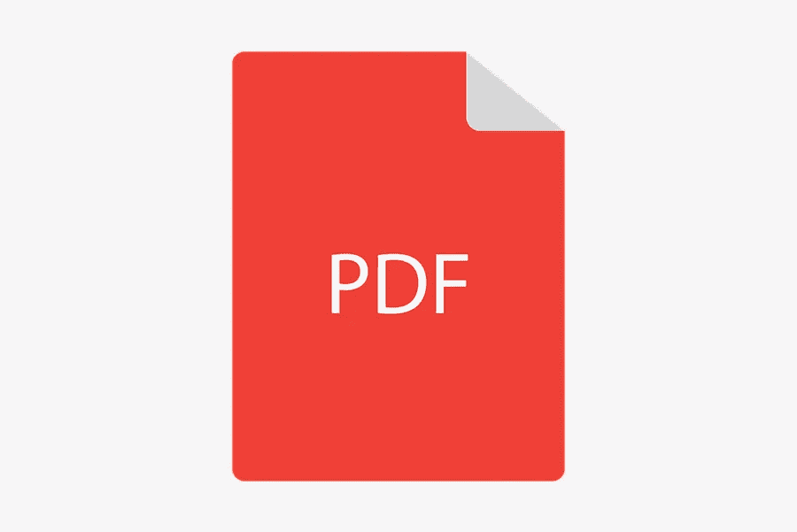

# 如何在 WordPress 中添加 PDF 文件

> 原文：<https://medium.com/visualmodo/how-to-add-pdf-files-in-wordpress-d756a01ea789?source=collection_archive---------0----------------------->

有时候你会想在你的 WordPress 文章或页面中嵌入一个 PDF 文件。一本书的作者可能想给读者一个免费的副本。在您的网站上添加产品目录。与客户分享您的 PDF 格式设计。您可能正在经营一家旅行社，并希望显示旅游套餐的路线。但是，有一个问题！虽然 WordPress 允许你嵌入音频，视频，当然还有图片。您的帖子和页面中不可能嵌入 PDF 文件。这个功能目前还没有，也许以后会有。

如果您想添加 PDF 文件，您可以使用添加媒体选项上传文件。插入它，该文件的链接将出现在您的页面上。你的访问者可以下载或者离开你的网站在浏览器中查看文件。

但是，如果你想在文章中嵌入 PDF 文件呢？所以，让你的访问者在不离开你的网站的情况下浏览它？对此有什么解决办法吗？简单的回答是肯定的。所以在这篇文章中，我们将展示如何在你的 WordPress 文章或页面中嵌入 PDF 文件。此外，使用或不使用插件。列出来。

# 如何在 WordPress 中嵌入 PDF 文件

WordPress 的美妙之处在于，你几乎可以不用写一行代码就可以做任何事情。你所要做的就是简单地[安装一个插件](https://visualmodo.com/install-wordpress-plugins/)来实现某种类型的功能。有许多插件可以帮助你在 WordPress 中嵌入 PDF 文件。

我们使用和喜欢的是 PDF 嵌入器插件。这是一个已经可以从 WordPress 插件目录下载的免费插件。还有其他的我会在下面提到，但是这个插件将是这篇文章的重点。

# 安装 PDF 嵌入程序插件

安装这个插件的过程非常简单。你可以像安装其他插件一样安装它。转到 WordPress 仪表盘>插件>添加新的。键入名称“PDF 嵌入程序”。第一个结果将是插件。只需点击安装并激活插件。你也可以下载它，并将 zip 文件上传到你的 WordPress 站点。

# PDF WordPress 插件设置

一旦你安装了插件，你就可以直接嵌入 [PDF 文件](https://en.wikipedia.org/wiki/PDF)。但是如果您想确保嵌入的文件如您所愿地出现，这里有一些在嵌入您的 pdf 文件之前要配置的东西。

您可以根据需要配置宽度和高度。使用 Max 时，它将以 100%的宽度和/或 100%的高度显示。您也可以自定义可用的工具栏。此工具栏将使访问者能够放大和缩小，并转到下一页或上一页。自定义其位置和悬停。使其仅显示在文档的顶部、底部或同时显示在顶部和底部。您也可以使其仅在悬停在文档上方时可见或始终可用。

在说明中，它们向您展示了如何轻松地覆盖特定文件的设置。

[pdf-embedder URL = " http://your site . com/WP-content/uploads/2019/08/site upload . pdf " width = " 700 " toolbar = " top " toolbar fixed = " off "]

对于这个链接，例如，我们使用宽度为 700 像素，工具栏出现在顶部，不粘。如果您可以访问付费许可证，那么您会看到更多的配置选项，尽管这对大多数人来说可能不是必需的。

# 将 PDF 文件嵌入到 WordPress 帖子或页面

你可以很容易地使用古腾堡块编辑器或经典编辑器这个插件。

以下是如何添加到古腾堡编辑器:首先，你点击添加块图标，找到 PDF 嵌入块，然后选择它。其次，选择，上传您的 PDF 文件或选择它从文件已经可用。最后，你完成了。

在经典编辑器里怎么做？很简单。只需像添加图片或视频一样添加 PDF 文件。点击“添加媒体”按钮，上传/选择您的 pdf 文件，点击“插入文章”按钮，您就可以开始了。将自动创建一个短代码，PDF 将直接嵌入显示。

# 其他 WordPress PDF 查看器插件

现在你知道如何使用 PDF 嵌入器插件，这里有其他选项，你可能想考虑添加到列表中，以便能够嵌入你的 PDF 文件给你的读者。

# WordPress 的 PDF 查看器

PDF Viewer 是 Code Canyon marketplace 上可用的 WP 插件之一，它允许你直接在 WordPress 站点上查看 PDF 文件。您可以用日志来个性化外观，完全控制工具栏来显示什么要显示，什么不要显示。如果你想要一个能让你完全控制一切的高级选项，这是一个很好的选择。

# Google Drive 嵌入程序

Google Drive Embedder 是 WordPress marketplace 目录上的一个免费选项。它让你能够轻松地将文件从谷歌硬盘直接嵌入到你的网站或页面。您将使用谷歌只读交互式浏览器。如果你在谷歌文档上有你的文件，这个插件是很棒的。但是没有给你太多的选择去控制。

# Real3D 动画书 WordPress 插件

想变得有点花哨，把你的 PDF 文件作为杂志展示，在那里你或者有翻阅杂志的相同经历？不用再看了，因为这个插件可以帮你做到这一点。这是一款功能强大的 [3D 动画书](https://roadtoblogging.com/go/real3d-flipbook/)显示器，允许您将 PDF 或图像显示为动画书。说真的。无需使用闪存，您就可以完全控制一切，而且它的响应速度也很快。在 Code Canyon 市场上可以买到。

# 流动纸

Flowpaper 是 WordPress 插件目录中的一个免费插件，它可以让您将 PDF 文件作为动画书嵌入。如果你不想使用上面提到的高级选项，这是一个很好的插件，尽管定制功能在这里并不多。

# 奇妙的 PDF 嵌入

Wonder PDF 是另一个可以考虑在 WordPress 站点上直接显示 PDF 文件的免费选项。您可以使用它与自己的灯箱弹出来显示您的 PDF 文件。这可能是一个很酷的功能。

# 最后的话

直接在你的 WordPress 站点上添加一个 PDF 文件不再是一个问题。现在，您有了一个完整的逐步指南，可以最终将您的 pdf 文件直接嵌入到您的网站上。此外，您还可以考虑其他选项，包括显示 PDF 文件的能力。作为一本很酷的动画书。你用的是哪个插件？在下面分享你的帖子的链接和你使用的插件。