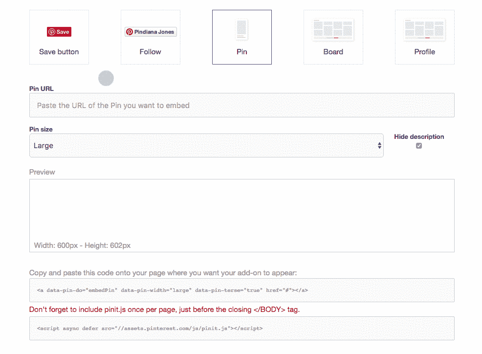

# 如何在 WordPress 中添加 Pinterest 图片

> 原文：<https://medium.com/visualmodo/how-to-add-pinterest-images-in-wordpress-4c666552286d?source=collection_archive---------0----------------------->

在这篇文章中，我们将向你展示在 WordPress 文章或页面中用简单的方法展示 Pinterest 图片所需的一切。Pinterest 拥有超过 2 亿活跃用户和超过 10 亿个版块，是世界领先的想法和灵感分类网站。

# 如何在 WordPress 中添加 Pinterest 图片

有些人不知道的是，Pinterest 允许你在自己的[网站上展示来自该网站的内容。在 WordPress 展示一张 Pinterest 图片比其他社交网络稍微复杂一点(*内部链接此处？*例如 YouTube 和 Instagram)，但仍然是一个简单的过程。](https://visualmodo.com/)

# 构建 Pinterest 小部件

第一个任务是找到一张你想在你的 WordPress 网站上展示的 Pinterest 图片。你需要在桌面上做这件事，而不是在手机或平板电脑上。将您希望显示的图像的 URL 复制到剪贴板。

接下来，前往 Pinterest 开发者的 [widget builder](https://developers.pinterest.com/tools/widget-builder/?type=pin) 。您可以在这里创建允许您在站点上显示图像的小部件。

添加你想要显示的图片的 URL，选择大小(**大**对大多数 WordPress 站点来说是全幅)并选择是否显示描述。Pinterest 将在你的网站上生成图片的预览。如果你[高兴](https://visualmodo.com/)，是时候把代码嵌入到你的 WordPress 站点了。

# 将 Pinterest 图片嵌入 WordPress

Pinterest 的 widget builder 会为你生成两行代码。第一行(顶行)需要放在你希望你的图像显示的地方，第二行(底行)是一些 Javascript，它将驱动嵌入，并且需要每页添加一次——所以如果你嵌入多个图像，你只需要添加一次底行。

Pinterest [推荐](https://visualmodo.com/)你在你的站点的结束< /body >标签之前添加 Javascript，这是正确的。然而，对于中低流量的网站，在文章或页面的底部添加代码就可以了。因为你只需要包含 Pinterest 图片的页面上的代码，所以这样做比在你网站的每个页面上都加载 Pinterest 代码更有效——不管是否需要。

我们现在准备添加代码。这个过程对于 [WordPress](https://visualmodo.com/) 的文章和页面都是一样的，所以你用哪个都没关系。创建新的帖子或页面，或者编辑您已经创建的帖子或页面。

切换到**文本**模式，找到你想要添加 Pinterest 图片的地方。按两次 return 键为 Pinterest 图片添加一个新行。现在回到小部件构建器，复制第一行代码并粘贴到 WordPress 中。

您现在需要立即返回到小部件构建器，并复制最后一行代码。切换回 WordPress，滚动到文章底部，再次添加两行新内容。现在粘贴第二行代码。如果你在同一页上添加多张图片，记住每页只需要第二行。

# 在 WordPress 中显示 Pinterest 图片

最后一步是你需要小心的地方:发布或更新你的帖子或页面，但**不要切换出文本模式**(并返回到 [**视觉**](https://visualmodo.com/) )。由于 WordPress 处理某些类型代码的方式有些古怪，切换回 **Visual** 将会删除你添加的第一行代码——以及你的 Pinterest 图片。

如果您切换回来，您将需要再次添加第一行代码，所以要小心！一旦你发布或更新了，查看帖子或页面的公开版本，你会看到添加了 Pinterest 图片。

# Pinterest 任务完成

Pinterest 的 widget 创建工具可以很容易地将社交网络上大量内容的图片添加到你的 WordPress 网站上。这篇文章已经向你展示了你需要知道的一切——所以现在就去利用这个伟大的[资源](https://visualmodo.com/)！

