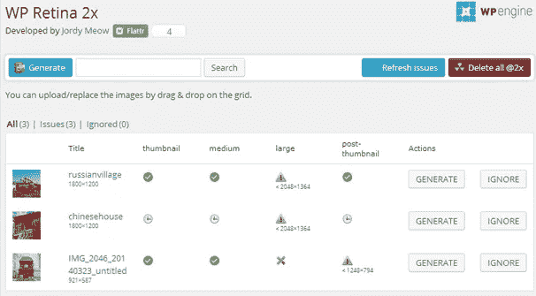

# 如何添加 Retina 显示屏支持

> 原文：<https://medium.com/visualmodo/how-to-add-retina-display-support-aeb63cd307c0?source=collection_archive---------0----------------------->

## 到你的 WordPress 网站？

苹果的视网膜显示器 T1 或 T2 的 HiDPI T3 是网页设计者和开发者讨论的话题。WordPress 开发者和设计者已经开始通过提供 Retina 显示主题和插件来响应这项技术。*“我真的需要准备好我站点的 Retina 显示屏吗？”*是大多数网站站长都在问自己的问题。我希望这篇文章能帮助人们决定是否应该为苹果的视网膜显示器优化他们的网站。

# 什么是视网膜显示器？


Retina Display 是苹果公司使用的一种 *HiDPI* 显示技术的注册商标，他们开始在他们的最新设备中使用该技术，如 iPad、iPhone 和 MacBook pro。这项技术基本上比旧设备每英寸显示更多的点数(大约 300 DPI)。这意味着更清晰的图像和更流畅的字体渲染。但是，需要注意的是，已经有许多其他设备具有更高的 DPI [显示屏](https://visualmodo.com/)。


配备 Retina 显示屏的苹果 MacBook Pro 屏幕分辨率为 2880×1800，每英寸 220 像素。你可能会认为 15 英寸屏幕的分辨率会让东西看起来更小。

# 为什么说是挑战？

我完全支持高清网络。我觉得为现代设备优化网站并利用它们的显示功能是正确的做法。已经有很多用户不仅通过苹果设备，还通过其他具有类似功能的设备访问网络。如果趋势是任何迹象，我觉得更多的改进将出现在显示技术，所以变化是不可避免的，适应它将最终变得重要，如果不是必要的。

另一方面，网站所有者需要考虑其他几个因素。首先，提供更高分辨率的图像意味着页面加载时间的小幅增加，对于更繁忙的网站，这也将增加带宽的使用。其次，随着如今人们使用的浏览器和设备数量的增加，很难对浏览器和设备进行分类，并为所有浏览器和设备准备[网站](https://visualmodo.com/)。


# 如何给你的 WordPress 站点添加 Retina 显示支持

给你现有的 WordPress 主题添加 Retina 支持其实很容易，你所要做的就是添加一个两倍大小的额外图像，然后使用一个脚本来决定是提供标准清晰度图像还是高分辨率图像。

你可以在这里下载并添加 [Retina.js 脚本。](http://imulus.github.io/retinajs/)


将它添加到主题的 js 目录中，然后将脚本放入 functions.php 文件中。当用户加载页面时，retina.js 会检查页面上的每张图片，看看服务器上是否有该图片的高分辨率版本。如果存在高分辨率变体，脚本将就地换入该图像。

你所要做的就是，当你在网站上添加一张新图片时，保存一个文件，比如 logo.png，另一个文件的大小是 logo@2x.png 的两倍，脚本会检测显示哪个版本。这适用于任何文件名，只需在文件名后添加@2x。

其他要注意的事情是尽可能使用图标字体，因为这些字体总是以高分辨率显示，以 32×32 的尺寸而不是标准的 16×16 尺寸重新创建你的 favicon，并确保任何背景图像也是两倍大小，因为这个脚本不会检测背景[图像](https://visualmodo.com/)。

显示背景图像的代码是:

```
.background {
  background-image: url(example.png);
  background-size: 200px 300px;
  height: 300px;
  width: 200px;
}

@media only screen and (-Webkit-min-device-pixel-ratio: 1.5),
only screen and (-moz-min-device-pixel-ratio: 1.5),
only screen and (-o-min-device-pixel-ratio: 3/2),
only screen and (min-device-pixel-ratio: 1.5) {
  .background {
    background-image: url(example@2x.png);
  }
}
```

# 用插件在 WordPress 中实现视网膜显示

我们已经有 WordPress 开发者对这一挑战做出了回应，并提供了一些非常实用和有创意的解决方案。目前，在 [WordPress](https://visualmodo.com/) 中有两种常见的方法来提供视网膜显示就绪图像。希望我们能看到一些更好更完美的解决方案。

# WP Retina 2x 插件

WP Retina 2x 插件试图检测用于访问网页的设备，如果该设备支持 Retina 显示，则它会在您的网站上提供更高分辨率的图像版本。由 Jordy Meow 编写，WP Retina 2x 为您的网站提供了一个管理 Retina 图像的仪表板。此仪表板显示媒体库中文件的当前状态，其中哪些文件具有 Retina 显示就绪版本，以及哪些图像有问题。这个令人敬畏的插件提供了四种不同的方式来显示视网膜图像:

*   picture fill:picture fill 方法动态重写 HTML，以便使用新的 SRCSET。因为浏览器还不支持它，所以使用 JS polyfill Picturefill 来加载图像。这是现在推荐的方法。
*   Retina . js:Retina JS 方法是 100%的 JS 解决方案。HTML 加载正常图像，然后如果检测到视网膜设备，将加载视网膜图像。它是故障安全的，但效率不高(图像被加载两次)。
*   IMG 重写:IMG 重写方法直接用视网膜图像重写 IMG 的 SRC 标签，如果设备支持的话。这种方法不适用于大多数缓存解决方案。
*   Retina-Images:Retina-Images 方法使用了一个服务器处理程序:图像将通过 Retina-Images PHP 处理程序加载。你的。htaccess 将被自动修改。

安装后，插件会在管理菜单中添加一个 WP Retina 2x 标签，带你进入插件的仪表板。在那里，您将看到两个选项卡，分别用于基本设置和高级设置。在基础页面上，你可以告诉插件你不想为视网膜显示重新生成的图像尺寸。它会显示中、大、小等尺寸，你也可以看到你的主题添加的其他尺寸来生成文章缩略图或滑块。我通常在文章和缩略图中使用中型或大型图片作为索引和存档页面上的特色图片。所以我会让它们不被选中，并选中其他我不想被优化的网站。



“高级”选项卡允许您在服务器端和客户端方法之间进行选择。这个插件还在管理菜单的媒体标签下增加了一个 Retina 2x 标签，在那里你可以看到你上传的图片的状态，哪些已经准备好了 Retina 版本，哪些有问题。插件作者建议您使用“启用媒体替换”插件，它会在有问题的图像旁边放置一个替换按钮，您可以轻松地替换这些图像。

[下载 WP Retina 2x](http://wordpress.org/extend/plugins/wp-retina-2x/)

# 单纯性 WP 视网膜

一种快速简单的方法来实现你的[网站](https://visualmodo.com/)的视网膜显示功能。简单的 WP 视网膜插件在服务器端工作，检测视网膜或高像素密度的设备，并为这些访问者显示高分辨率的图像。它简单、简短而甜蜜。然而，这个插件有一些限制。例如，它不支持缓存，所以如果你的网站上安装了任何缓存插件，那么这个插件就不能正常工作。没有仪表板，也没有简单的方法来调试插件，并实际看到它可以检测并向高像素密度设备提供@2x 图像。

*   检测高 DPI 屏幕，如视网膜显示屏
*   检测使用 add_image_size()添加的所有图像大小，并添加@2x 版本。
*   为高 DPI 屏幕用户将特色缩略图和内容图像替换为@2x 版本。

一旦安装了简单的 WP Retina 不会自动重新生成图像，你将需要使用[重新生成缩略图](http://wordpress.org/extend/plugins/regenerate-thumbnails/)插件。它还可以重新生成所有图像的 2x 版本。因此，如果你的主题增加了多种图像尺寸，那么它们都会有@2x 版本。这是一个新插件，我希望插件作者将扩展和改进它。

[下载简单 WP 视网膜](http://wordpress.org/extend/plugins/simple-wp-retina/)

# 视网膜图像支持


另一个简单的解决方案是视网膜图像支持插件，它基本上执行我们上面概述的步骤，它将添加 retina.js 脚本，并且您必须上传带有@2x 名称的图像。

[下载简单 WP 视网膜](https://wordpress.org/plugins/retina-image-support/)

# HiDPI Gravatars

这个插件将更新你网站的 gravatars 到高分辨率，只需上传和激活。为了在上传新头像时获得最佳效果，请使用大小至少为 128 x 128 像素的图像。


[下载 HiDPI Gravatars](https://wordpress.org/plugins/hidpi-gravatars/)