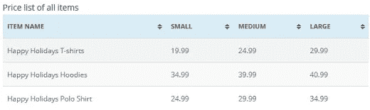
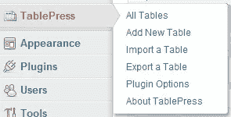
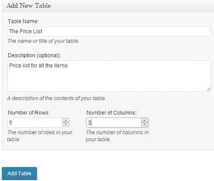
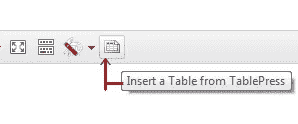
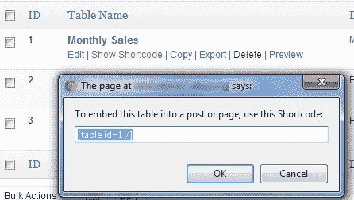
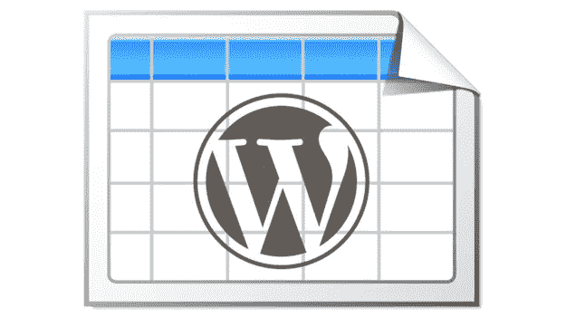

# 如何在没有编码的情况下在 WordPress 文章和页面中添加表格

> 原文：<https://medium.com/visualmodo/how-to-add-tables-in-wordpress-posts-and-pages-without-coding-3d2ac8ef9561?source=collection_archive---------5----------------------->

WordPress 附带了一个可视化的帖子编辑器，这很好，但是有些事情它不能做。创建表就是其中之一。WordPress 中的表格是一个重要的工具，它以一种可理解的格式来排序和呈现数据。尽管你可以通过在文章中手工编写 HTML 和 CSS 来创建表格，但是对于很多缺乏 HTML 和 CSS 知识的人来说，这并不是一个可行的选择。在这篇文章中，我们将向你展示如何在 WordPress 文章和页面中添加表格。最棒的是，使用本教程，你不需要知道任何 HTML 或 CSS 就可以在 WordPress 中添加表格。

## 视频教程

[https://www.youtube.com/watch?v=9GtQ_ZK1EvM](https://www.youtube.com/watch?v=9GtQ_ZK1EvM)

你需要做的第一件事是安装并激活 [TablePress](https://wordpress.org/plugins/tablepress/) 插件。一旦激活，插件会在你的 WordPress admin 中添加一个 *TablePress* 菜单项。

要创建新表，点击*添加新表*。这将带您进入*添加新的*选项卡。给表格命名和描述后，选择所需的行数和列数。不要担心，在输入数据或稍后编辑表格时，您可以随时添加/删除表格中的列和行。完成后点击*添加表格*按钮。

现在，您将进入编辑表格屏幕。这是表格编辑器，您可以在其中向表格添加数据。您还可以添加和删除列或行。所有行和列都可以拖动和重新排列。一旦创建了表格，就可以将这个表格添加到文章中了。

打开现有帖子或创建新帖子以进入表格。如果您正在使用可视化编辑器，那么您将在可视化编辑器中看到表图标。按下按钮将打开一个弹出窗口，显示您的表。按下你想要的表格旁边的插入短代码按钮，它会在你的文章中添加一个短代码。

如果您不使用可视化编辑器，那么您可以简单地手动插入短代码。单击 TablePress 菜单项，它将显示您已创建的表格列表。将鼠标放在要添加的表格上。单击 Show Shortcode，这将打开一个带有表格 Shortcode 的弹出窗口。复制短代码并将其粘贴到帖子中您想要插入表格的任何位置。

就是这样。在你的 WordPress 文章中创建和添加表格就是这么简单。您不必编写任何 HTML 或 CSS 代码。如果您想要定制表格的外观，那么有一个选项可以实现这一点(您需要为这一部分定制 CSS)。

这个插件还可以从 csv 文件、json 文件、HTML 表格和 json 格式导入数据。您还可以导出 CSV、HTML 和 JSON 格式的所有表格。如需更多使用说明，请查看官方[表格新闻文档](http://tablepress.org/documentation/)。

如何在没有编码的情况下在 WordPress 帖子和页面中添加表格— Visualmodo —来源【https://visualmodo.com/