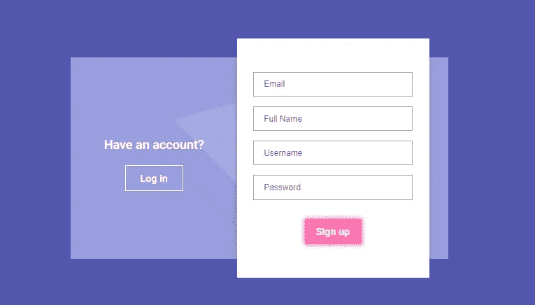

# 如何在注册表中添加 WooCommerce 自定义字段

> 原文：<https://medium.com/visualmodo/how-to-add-woocommerce-custom-fields-in-registration-form-79fe7414b0ca?source=collection_archive---------0----------------------->

任何电子商务商店的登记表都是用来收集客户数据的重要方面。借助收集的数据，您可以根据自己的需要和要求对注册客户进行组织和分组。现在看看如何在上面添加 [WooCommerce](https://www.wpblog.com/setup-woocommerce-paypal/) 自定义字段。

WooCommerce 是电子商务世界中受欢迎的平台之一。它包括各种有价值的和伟大的功能，对店主很有帮助，同样，它为您提供了设置 WooCommerce 注册表单的选项。默认情况下，它有两个字段，电子邮件和密码。然而，有时你必须添加你的自定义字段，这也是可以做到的。

所以，今天在本教程中，我将教你如何在 WooCommerce 注册表单中添加自定义字段。

# 在注册表中添加 WooCommerce 自定义字段

要做到这一点，您需要遵循以下步骤:

*   启用网络商务注册表单
*   在 WooCommerce 注册表单中添加自定义字段
*   向前端添加自定义字段
*   向自定义字段添加验证
*   将自定义字段的数据保存到数据库

# 启用网络商务注册表单

打开你的 WordPress 管理面板，从仪表板左侧导航到 **WooCommerce →设置**:

现在这里首先点击**账户&隐私**选项卡，然后选择复选框**允许客户在“我的账户”页面创建账户:**

然后点击页面底部的**保存更改**:

进入账户页面，你会看到默认的 WooCommerce 注册表单:

# 在注册表中添加 WooCommerce 自定义字段

从仪表板左侧导航到**外观→编辑器**:

在右边你会看到**主题文件**部分，在这里点击**functions.php**打开该文件:

现在你会看到你的**functions.php**文件的编辑器:

在这里，您将在 WooCommerce 注册表单中添加自定义字段。

# 向前端添加自定义字段

首先，将您的自定义字段添加到 WooCommerce 注册表单的前端。为此，在 functions.php 的末尾添加以下代码:

函数 woo com _ extra _ register _ fields(){？>

"/>

”/>

}

add_action( ‘woocommerce_register_form_start’, ‘woocom_extra_register_fields’ );

In the above code, I have created function woocom_extra_register_fields() in which I have added the fields **(名和姓)**显示在前台。您可以根据需要添加更多字段。我还在每个自定义字段的名称前添加了前缀“billing_ ”,以便将它与账单地址联系起来。以下是您可以添加到 WooCommerce 注册表单中的所有有效字段的列表，这些字段可以与账单[地址](https://www.wpblog.com/setup-woocommerce-paypal/)关联:

*   帐单名
*   帐单 _ 姓氏
*   帐单 _ 地址 _1
*   帐单 _ 地址 _2
*   账单 _ 电话
*   账单 _ 公司
*   账单 _ 城市
*   账单 _ 邮政编码
*   帐单 _ 国家
*   账单 _ 状态
*   账单 _ 电子邮件

现在，为了验证这些字段是否已正确添加到您的 WooCommerce 注册表单中，请转到您的商店帐户[页面](https://visualmodo.com/)，在这里您会看到这些字段:

# 向自定义字段添加验证

随着您的 WooCommerce 注册表单字段的添加，现在要为这些字段添加验证，请在前面的[函数](https://visualmodo.com/blog/)结束后添加以下代码:

函数 woo com _ validate _ extra _ register _ fields($用户名，$电子邮件，$验证 _ 错误)

{

if (isset($_POST['计费名字']) && empty($_POST['计费名字']){

$ validation _ errors-> add(' billing _ First _ Name _ error '，__('名字是必需的！'、‘woo commerce’))；

}

if (isset($_POST['账单姓氏']) && empty($_POST['账单姓氏']){

$ validation _ errors-> add(' billing _ Last _ Name _ error '，__('姓氏是必需的！'、‘woo commerce’))；

}

返回$ validation _ errors

}

add _ action(' woo commerce _ register _ post '，' woo com _ validate _ extra _ register _ fields '，10，3)；

在上面的代码中。我已经创建了函数 woo com _ validate _ extra _ register _ fields($ username，$email，$validation_errors)，在其中我设置了验证，如果创建的自定义字段为空，则显示消息。我设置了这条消息:

*   名字字段，名字是必需的！
*   姓氏字段，姓氏为必填项！

# 将自定义字段的数据保存到数据库

现在，要保存这些自定义字段的数据，您必须将其添加到数据库中。为此，请在前一个函数的末尾添加以下代码:

函数 woo com _ save _ extra _ register _ fields($ customer _ id){

if(isset($ _ POST[' billing _ first _ name ']){

update_user_meta($customer_id，' billing_first_name '，sanitize _ text _ field($ _ POST[' billing _ first _ name '])；

}

if(isset($ _ POST[' billing _ last _ name ']){

update_user_meta($customer_id，' billing_last_name '，sanitize _ text _ field($ _ POST[' billing _ last _ name '])；

}

}

add _ action(' woo commerce _ created _ customer '，' woo com _ save _ extra _ register _ fields ')；

在上面的代码中。我已经创建了函数 woo com _ save _ extra _ register _ fields($ customer _ id)，它将在数据库中保存自定义字段的数据。

完成后，只需点击编辑器底部的更新文件:

是时候验证自定义字段的数据是否保存在数据库中了？要检查它，注册帐户，然后前往您的帐单地址。在这里，您会看到名字和姓氏被自动添加到帐单地址:

这意味着自定义字段已成功添加到您的 WooCommerce 注册表单中。

# 结论

现在，在这个指南的帮助下，你可以轻松地将自定义字段添加到你的 WooCommerce [注册](https://www.wpblog.com/)表单中。不要忘记留下您的反馈，或者如果您有任何疑问，请随时提出！

# 作者

[WP 博客](https://www.wpblog.com/)致力于让你在 WP 博客魔法领域起步并运行——不涉及魔杖！