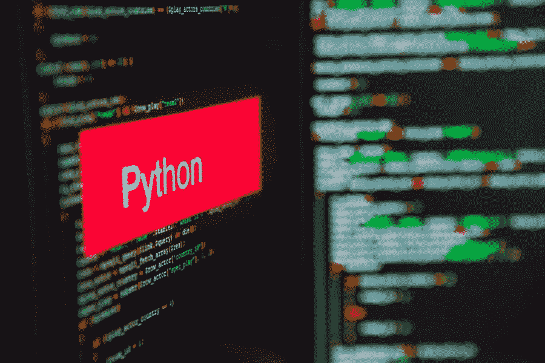

# 如何成为一名成功的栈开发者

> 原文：<https://medium.com/visualmodo/how-to-become-a-successful-stack-developer-7b3d930cf27d?source=collection_archive---------0----------------------->

成为一名栈开发人员意味着理解这种编程架构的基本和高级原则。你将在软件开发的客户端和服务器端工作。因此，如果您使用数据库、服务器、API 以及前端和后端技术的各种功能，那将是最好的。如果您对这些信息感兴趣，那么请继续阅读，了解如何成为一名成功的栈开发人员。

# 如何成为一名成功的栈开发者

# 1 获得必要的技能

在一个完美的世界里，你可以在一夜之间成为一名全栈开发者。但是，这种情况不太可能发生，因为您需要首先获得不同的技能并理解各种编程工具。

如果您想成为一名成功的堆栈开发人员，您需要了解以下几个方面:

*   前端技术

成为基本前端技术的大师，例如 CSS3、HTML5 和 JavaScript。如果你在 React 和 NodeJS 以及其他第三方库的全栈开发方面也有额外的知识，公司会考虑雇佣你。

*   开发语言

作为一个全栈软件工程师，你还应该至少懂一门服务器端开发语言。一些例子包括 Java、Python 和 Ruby。

*   网页设计

了解网页设计的知识和原则，以帮助组织和他们的客户开发和修复原型和用户界面/UX 设计。

*   计算机网络服务器

请注意，许多公司都希望雇佣一名熟悉 Apache 或 Nginx 等服务器的堆栈开发人员。此外，考虑学习 Linux 操作系统的细节，因为这方面的知识可以极大地帮助管理服务器。

作为一名栈开发人员，其他需要添加到你的技术简历中的技能可能包括对测试、文档和部署代码的自动化过程的理解。您还应该了解不同的安全问题和协议，以应对和解决不同的软件漏洞。

# 2 掌握一门技术

成为一名成功的堆栈开发人员意味着将您的知识范围扩展到新的领域。你在软件部门的生活将是一种无止境的学习追求。但是，这并不意味着您应该尝试掌握所有的栈开发过程。

相反，掌握一种技术，但保持对其余技术的熟悉。因此，您可以专注于特定的编程语言或工具。但是，由于您随着时间的推移积累了额外的软件知识，您也可以帮助完成其他编程任务。

在这一点上，你可能想知道什么是最好的学习技术。嗯，学习“最佳”技术是相对的，因为答案取决于几个因素。尽管如此，还是要选择一种在不同客户中非常流行的技术。

选择一项著名的技术可能有助于你在该领域的其他专业人士中保持竞争优势。

# 3 构建您的投资组合，成为堆栈开发者

你不需要一开始就成为一个公司下的全职栈开发人员。相反，您可能希望以自由职业者的身份开始您的全栈开发之旅。

作为一名自由职业者，你可以承担不同难度的不同栈开发工作。而且，你有选择接受和拒绝哪些工作的自由。相反，如果你直接在一个组织下工作，你可能没有足够的机会处理不同的编程问题。

记住，所有好的编码工作都是值得的，不管难度有多大。即使编程工作只需要你五分钟的时间，你仍然可以从任务中学到一些东西。获得的额外知识总是有价值的，你甚至可以将这些经验添加到你的文件夹和简历中。

另外，请注意，每个栈开发人员都必须从头开始。因此，如果你没有在特定的公司获得特定的职位，不要感到沮丧。尽管如此，在成为全栈开发人员之前，您可以从其他工作描述开始。这些其他职位的一些例子有:

*   初级全栈开发人员
*   软件开发工程师
*   API 工程师

如果你想成为一个成功的栈开发者，另一个建立你的投资组合的方法是做一些你自己的东西。创造高质量的产品。让其他用户利用您个人开发的代码或软件来帮助在 IT 社区内建立信任。

利用这个机会来观看、感受和体验开发出来的最终产品。从头开始构建应用程序，并保护其参数以降低恶意软件入侵的风险。旨在开发一种能够转化为良好构建的代码或软件的奉献水平。

# 成为堆栈开发人员的最后一句话

成为一名成功的栈开发人员的道路可能是漫长而艰难的，但这并非不可能。获得正确的技能，掌握一项技术，建立你的投资组合。遵循这些指导原则，随着时间的推移，您可能会与业内其他成功的全栈开发人员发生冲突。