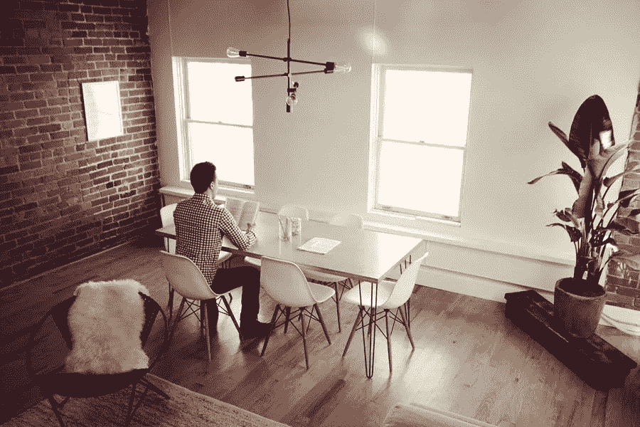

# 如何提升您的家庭办公流量？

> 原文：<https://medium.com/visualmodo/how-to-boost-your-home-office-flow-62fc7d36fb74?source=collection_archive---------0----------------------->

在家办公可以非常自由，让你的创造力飙升。它可以让你更容易适应客户的时间表。然而，如果你不偶尔改变一下你的环境，你的生产力和创造力会受到影响。我们有一篇文章，提供了关于如何提高工作效率和促进家庭办公流程的最佳建议，以帮助您在工作日获得更多收益。

# 如何提升您的家庭办公流量？

# 极简主义可以提高你的家庭办公效率

在工作环境中，杂乱和过度刺激会分散注意力，所以尽量不要过分讲究。此外，这可能有点平衡的作用。创造一个临床环境会让人感到压抑。你想要干净和经典，而不是沉闷和平淡。

如果可能的话，选择一些标志性的东西来装饰你的办公室必需品，以及当你精力充沛时可以愉快地融入背景的柔和颜色。

# 键盘和鼠标

当你长时间工作时，你会想要合适的鼠标和键盘。做你的研究，找到一些感觉舒适，符合你审美的东西，并且不会用它们特殊的声音打扰你。

与普通办公室相比，这些小细节刺激较少，因此很重要，如果处理不当，可能会分散注意力。最后，作为一个额外的提示，不要忘了调整你的鼠标速度到最适合你的速度。

# 虚拟办公室解决方案提升您的家庭办公流程

借助虚拟办公室解决方案，您可以利用传统办公室的诸多优势，而不必担心资本投资或前期资本。

# 舒适的椅子

你花几个小时坐在办公椅上；一个漂亮的、符合人体工程学的、舒适的座椅物有所值。

# 灵感

建立一个迷你神龛来促进你的家庭办公流程。一些珍贵的小摆设，一件镶框的艺术品，一张特别的照片放在你的书桌上。所以，这激励你去创造和/或完成工作，这样你就可以离开那里。

总之，一张巴黎的照片可以激发你内心的灵感，或者你孩子的照片会提醒你，你所做的一切都是为了他们。