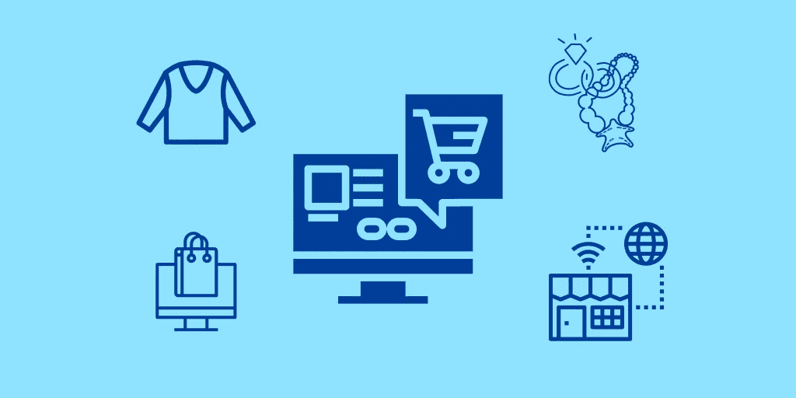

# 如何建立一个有竞争力的网店

> 原文：<https://medium.com/visualmodo/how-to-build-a-competitive-online-store-8b60c2d86400?source=collection_archive---------0----------------------->

如果你已经不再遵守亚马逊和易贝等大型电子商务商店作为在线零售商强加给你的限制性政策，那么就不要再忍受了。取而代之的是，拿起你的球，离开主要的市场，在互联网的其他地方设立你的摊位。现在看看如何创建一个有竞争力的商店。

通过建立你自己的网上商店，你将完全控制你的销售命运——你会发现自己在玩一个不同的游戏，在这个游戏中，规则是你自己制定的。然而，如果你想让你的商店真正与电子商务世界的主要参与者竞争，那么你必须将下面的建议付诸实践。

# 创建有竞争力的网上商店？

# 创建移动应用程序

如果你不让你的客户从他们手机的应用程序商店下载应用程序，你很快就会发现你的企业在客户竞争中落后了。

这是因为，如今，客户希望能够通过应用程序浏览在线商店，而不是在网络上，因为应用程序在移动设备上更流畅、更容易导航——事实上，这现在是客户的期望，而不仅仅是愿望。

出于这个原因，开发和提供应用程序应该是你的主要目标之一，如果不是主要目标的话——查看 DesignRush 的[软件开发目录](https://www.designrush.com/agency/software-development)，找到适合你商店风格和规模的移动应用程序开发者。

# 提供流行的支付选项

提供受欢迎的付款方式，这样可以减少结账时弃车的风险。你需要让支付过程尽可能简单，并为他们提供一系列选择。例如，如果你不包括 PayPal，那么你就忽略了一大部分潜在客户。

# 提供集中的产品系列

如果你想为自己建立一个忠诚的客户群，一个会给你带来一次又一次生意的客户群，你需要提供一个集中的产品系列。

有了 aniche，当顾客对你卖的东西有特殊需求时，他们会明确指出你的商店[特别是](https://awards.visualmodo.com/)。你会发现，当他们再次需要时，他们会回到你身边。

不提供一个集中的产品范围，你会发现你的生意很难营销，你会对你实际上卖的是什么产生困惑。

选择产品系列时，你必须考虑许多不同的因素:

*   考虑你自己对什么有热情，以确保如果事情不按你的方式发展，你不会对你的事业感到气馁。
*   只有寻求健康的利润空间
*   选择一个对有可支配收入的冲动型买家有吸引力的系列，因为他们将是你的大部分买家。
*   确保你的产品在网络市场上很受欢迎

# 明智地合作

如果你的目标是经营一家有竞争力的网上商店，你需要明智地合作。你需要与值得信赖的制造商合作，让他们按时按要求的标准生产你的产品，你还需要与一家知名的产品进口商合作。至于后者，你肯定应该考虑与直运公司结盟。这样的公司只需点击几下[按钮](https://visualmodo.com/blog/)，就能把你的商品运送给你的顾客，这意味着你不必储存或运送你出售的任何东西。