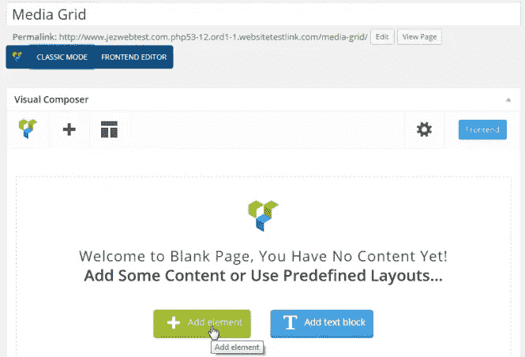
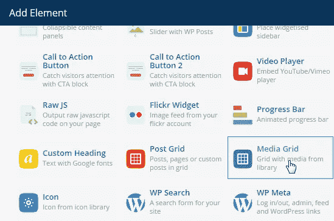
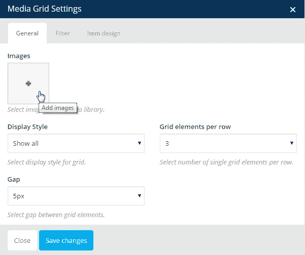
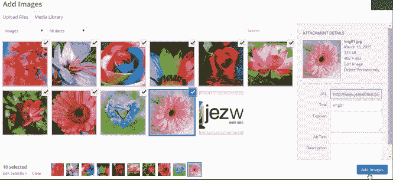
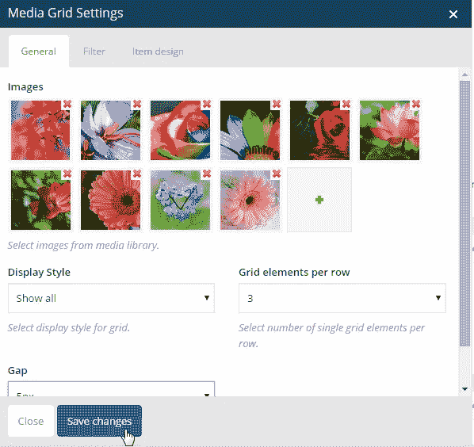
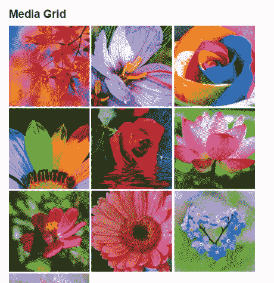
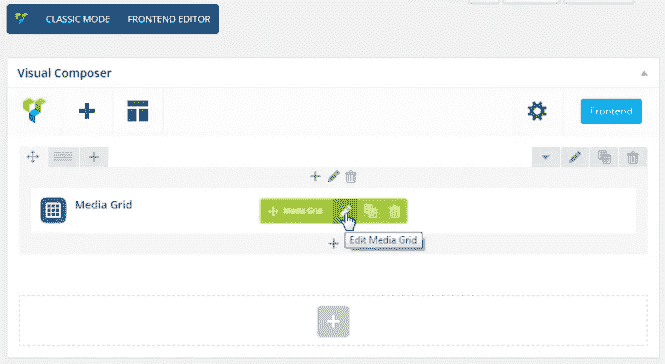
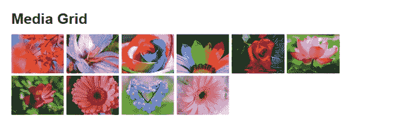
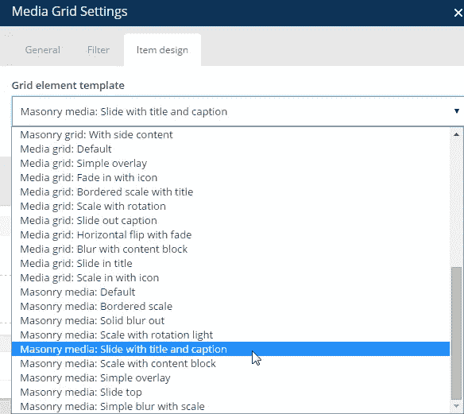

# 如何用 Visual Composer 构建媒体网格

> 原文：<https://medium.com/visualmodo/how-to-build-media-grid-with-visual-composer-f05fd0ce0e1e?source=collection_archive---------0----------------------->

**媒体网格**允许你以一种漂亮的方式显示你的图像，或者如果你喜欢
，你可以定制它。这里有一个关于如何使用页面生成器可视化编辑器插件添加媒体网格的快速指南

1.新增一个 ***页面/帖子*** 。编写图块并点击 ***添加元素>媒体网格***

搜索元素并单击它以打开编辑器窗口。

2.点击 ***+*** 按钮，从你的 WordPress 媒体库添加图片或上传新图片。

3.选择您想要添加到页面中的图像，然后点击 ***添加图像*** 。

4.在 ***媒体网格设置*** 下，您可以自定义设置，不过现在我们将只 ***保存更改*** 来预览我们的图像是否会显示。

5. ***保存*** 你的页面/帖子，在线查看。

这是默认的媒体网格显示。

您还可以更改每行网格元素的数量。为此，返回页面编辑器并点击“编辑媒体网格”铅笔图标，然后更改每行的 ***网格元素*** 。

将 ***每行网格元素*** 改为 6 行，保存并在线查看。

您还可以尝试 ***项目设计*** ，这将根据您的需求为您提供更多定制选项。下面是一些示例输出。

> 默认情况下，所有的 [Visualmodo WordPress 主题](https://visualmodo.com/)都包含了高级的 Visual Composer WordPress 插件，所以你可以非常容易地做到这一点，节省金钱和时间在你的 WordPress 上制作令人惊叹的页面。

# 媒体和砖石媒体网格

使用 WPBakery 页面生成器创建媒体或砖石媒体网格，并使用来自媒体库中的图像。

从 WPBakery 页面生成器*(以前的 Visual Composer)*4.4 版开始，有了新的网格元素:

*   柱子网格
*   后砌体网格
*   媒体网格
*   砖石媒体网格

WPBakery 页面生成器元素菜单下提供了网格元素。

**注:**“帖子网格”和“砖石帖子网格”允许以网格格式显示帖子、页面和自定义帖子类型(例如:Woo Commerce Products)。

# 看视频