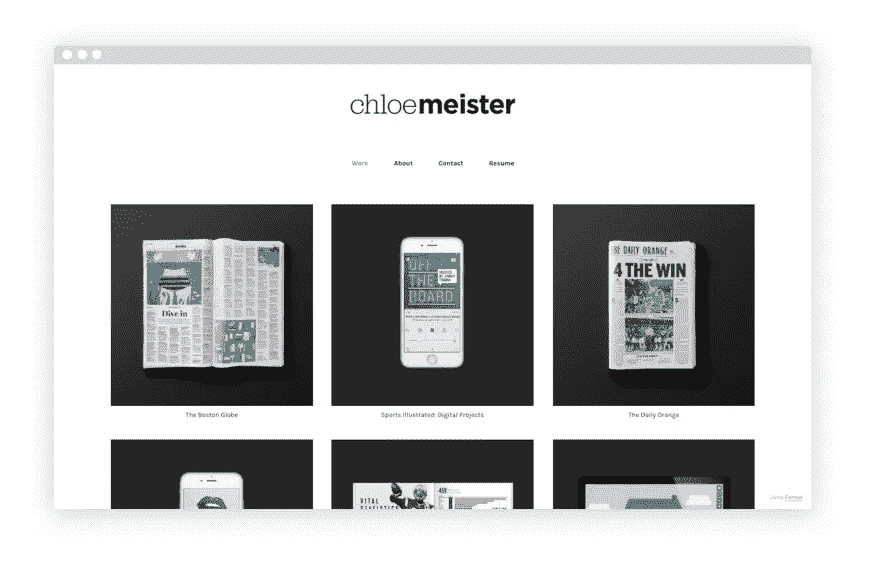
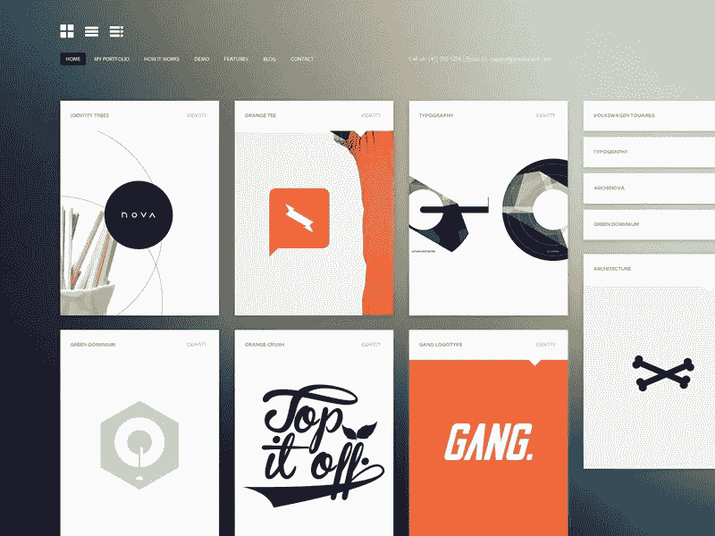
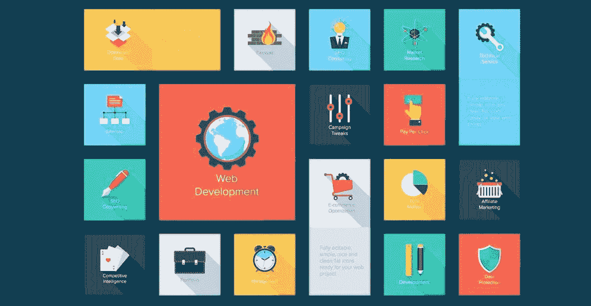

# 如何建立你的网上投资组合

> 原文：<https://medium.com/visualmodo/how-to-build-your-online-portfolio-2216fed21d37?source=collection_archive---------0----------------------->

吸引追随者

随着越来越多的在线一代，在线作品集变得越来越受欢迎。拥有一个更新良好、对访问者友好且美观的网站，你可以吸引合适的访问者来提升你的创造性。以下是建立你的在线作品集并吸引更多[关注者](https://visualmodo.com/)时需要记住的几件事:

# 如何建立你的网上投资组合

# 吸引追随者

**使用适合你媒体的主题**

作家的作品集和摄影师的作品集看起来会有很大的不同。确保你选择的主题适合你所选择的媒体。例如，如果你的目标是写作作品集，不要选择一个让你的作品看起来杂乱无章的主题；如果你的目标是图形或摄影作品集，不要选择一个以较低分辨率呈现照片的主题。

**使用 SEO 技巧**

如果你正在制作网上书面内容，无论是通过博客文章还是新闻特写，那么最好看看[搜索引擎优化](https://searchenginewatch.com/2016/04/13/30-quick-and-easy-seo-tips-for-small-businesses/)或 SEO。

如果潜在的读者正在搜索与你的文章相关的关键词，SEO 将帮助你的文章到达搜索引擎的第一页。有很多方法可以做到这一点，比如使用一个合适的标题，在文章中包含外部链接，使用关键词来缩小搜索范围。

**鼓励你的访客订阅**

另一种确保你的内容、艺术、摄影或其他媒体被看到和参与的方法是确保你的访问者不断回来。

你可以说服他们[订阅你的网站](https://www.entrepreneur.com/article/311960)，这将通过电子邮件更新他们，或者如果你使用 WordPress，通过他们的 WordPress 通知，每当你的作品集上有新帖子时。

但是，您可以通过[theemailfinder.co](http://theemailfinder.co/email-verification/)等网站，只需输入相关域名，手动编制自己的电子邮件列表。如果你想针对特定的组织，这是一个很好的工具。一旦你有了电子邮件地址，你就可以向你的名单发送新闻稿和时事通讯，包括更新、报价和任何其他必要的信息，让他们了解你和你的网站的最新情况，让他们记住你和你的网站。

**利用社交媒体**

随着社交媒体的兴起，以及大多数当代人每天都在使用不同的平台，推销自己和自己的作品变得越来越容易。

吸引新访客的方法之一是保持一个或两个活跃的社交媒体账户，在那里你可以发布你作品的片段，并提供你作品集的进一步链接。

确保使用最适合您所选平台的适当风格。例如，如果你必须利用 Twitter 的新字符限制，但图像偶尔会比[单词](https://visualmodo.com/)说得更多。

同样，对于 Instagram 来说，高质量的图片比粗糙、不可读的图片效果更好，这些图片可能会吓跑潜在的访问者。

社交媒体平台也是与你所在领域的其他创意人员建立联系的好方法。所以，不要害羞，评论一位同行艺术家的照片，他们会感谢你的支持，你甚至可能因此成为朋友。此外，你可以使用社交媒体来探索可能的合作，并进一步让你的工作在那里，增加你的曝光率。

偶尔，像付费演出和[佣金](https://visualmodo.com/)这样的机会可能会在社交媒体上做广告，所以从长远来看，拥有一个保存良好的社交媒体账户可能是值得的。

考虑到这些因素，你就有了一个正常运行的网站和稳定的经常访问者的基础。