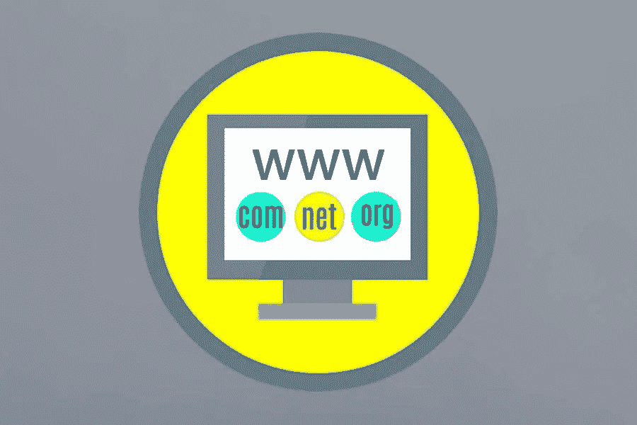

# 如何购买域名完整指南

> 原文：<https://medium.com/visualmodo/how-to-buy-a-domain-name-complete-guide-d9106f340f1f?source=collection_archive---------0----------------------->

开始一个博客或网站的第一步是买一个域名，在这篇文章中你会看到一个正确购买域名的完整指南。域名是你的博客/网站的唯一名称。例如，Visualmodo.Com 是我们的域名。每当你在浏览器上输入这个域名，你就会进入我们的博客。

# 购买域名的完整指南

域名让难以记忆的数字互联网地址变得友好起来。互联网上的每台计算机都有一个唯一的互联网协议(IP)号。域名代表一个或多个 IP 号码。例如，域名 whitehouse.gov 的 IP 地址是 104.109.178.94。整个目的是给用户一个容易记住的句柄，这样当发送电子邮件到。比如说，美国总统，你可以输入 president@whitehouse.gov，而不是更笨拙的 president@104.109.178.94

# 域名注册商到底在做什么？

所有域名记录都存储在一个名为注册表的中央数据库中。对于要识别的域名，需要将其与所有相关信息一起添加到数据库中。

ICANN 允许域名注册机构代表您更改数据库中的域名信息。域名注册商还提供了易于使用的工具，让您可以通过网络浏览器进行更改。所以，让我们来看看如何轻松地为你的网站地址选择最好的域名注册商。

# 如何买到合适的域名？

并非所有的域名注册商都有出售所有域名扩展的许可。例如，一些域名注册商只能销售带有特定国家扩展名的域名(如。木卫一，。在，或者。ly)。

每个域名注册商可以提供不同的服务以及域名注册。一些注册商可能会提供更便宜域名作为他们的促销优惠，而另一些可能会提供免费的附加服务来吸引客户。在选择最佳域名注册商时，我们会考虑以下四个标准:

# 等待的游戏

甚至当你注册并支付你的域名。所以，你不一定能在几个小时甚至几天内使用这个名字。[域必须传播](https://visualmodo.com/subdomain-creation-guide-and-tips/)。这意味着官方域名注册机构必须更新您网站的域名系统信息。此外，这是后端发生的事情，不需要您的任何输入。

此外，一些注册服务商承诺几乎立即注册该域名，但是，延迟时间可能长达七天。不过，通常情况下，你应该会在 48 小时内看到域名在网上运行。

# 名字便宜

。com 扩展—8.88 美元/年(以 10.88 美元/年的价格续订)
。org 扩展—12.98 美元/年
。网络扩展——11.98 美元/年
WHOIS 隐私——免费
谷歌 G 套件——6.00 美元/月
电子邮件——免费 2 个月(续订 3.88 美元/年)
虚拟主机——1.28 美元/月(续订 2.88 美元/月)
SSL 证书——3.88 美元/年

# 购买域名指南:GoDaddy 价格

。com 扩展—2.99 美元/年(以 17.99 美元/年的价格更新)
。组织扩展—11.99 美元/年(以 20.99 美元/年的价格续订)
。网络扩展—13.99 美元/年(续订 19.99 美元/年)
WHOIS 隐私—9.99 美元/年
电子邮件—1.99 美元/年(续订 4.99 美元/年)
网站构建者&托管—第一个月免费(续订 5.99 美元/月)
SSL 证书—托管时提供

# 域名 com 价格

。com 扩展—9.99 美元/年(以 13.99 美元/年的价格续订)
。org 扩展—14.99 美元/年
。网络扩展—12.99 美元/年(续订 15.99 美元/年)
WHOIS 隐私—8.99 美元/年
Google G 套件—6.00 美元/月
虚拟主机—1.99 美元/月(续订 3.75 美元/月)
SSL 证书—3.33 美元/月
SiteLock 安全—2.08 美元/月

# 购买域名指南:社会句柄

在一个完美的世界里，你会选择一个社交账号也可用的域名。但是，这不是一个完美的世界。所以，我对此的看法是，获得一个好域名已经够难了。不要因为增加了这个标准而使事情变得更加困难或者几乎不可能。当谈到拿起社会处理，你会有选择。你可以发挥创意，甚至有可能从现在的主人那里获得把手。