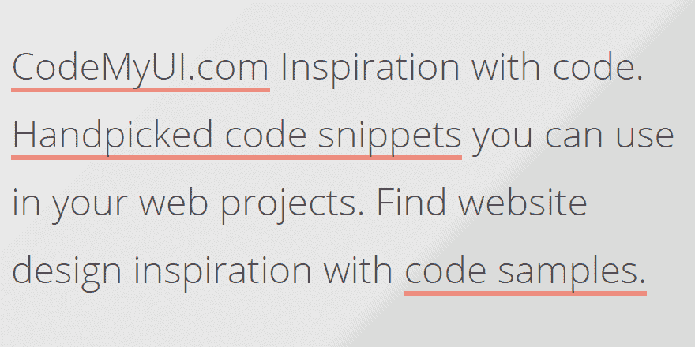

# 如何更改网页上的链接下划线

> 原文：<https://medium.com/visualmodo/how-to-change-link-underlines-on-a-webpage-12e438269e9a?source=collection_archive---------0----------------------->

编辑链接文本样式

现在看看如何使用 CSS 简单地编辑网页上的链接样式和 hiperlink 文本样式，使您的链接看起来更棒，更有吸引力。

默认情况下，web 浏览器有特定的 CSS 样式，它们应用于特定的 HTML [元素](https://visualmodo.com/)。如果您没有用您站点自己的样式表覆盖这些默认值，那么将应用这些默认值。对于超链接，默认的显示样式是所有链接的文本都是蓝色的，并带有下划线。浏览器这样做是为了让网站的访问者可以很容易地看到链接的文本。许多网页设计师不喜欢这些默认样式，尤其是下划线。

谢天谢地，CSS [使得](https://visualmodo.com/wordpress-themes/)改变这些下划线的外观或者完全删除它们变得很容易。



# 更改链接样式

# 删除文本链接上的下划线

带下划线的文本比不带下划线的文本更难阅读。此外，许多设计师根本不关心下划线文本链接的外观。在这种情况下，您可能希望完全删除这些下划线。

要从文本链接中删除下划线，您将使用 CSS 属性 text-decoration。下面是您为此编写的 CSS:

a { text-decoration:无；}

用那一行 [CSS](https://visualmodo.com/wordpress-themes/) ，你可以移除所有文本链接的下划线。尽管这是一个非常通用的样式(它使用了一个元素选择器)，但它仍然比默认的浏览器样式更具特异性。因为这些默认样式是创建下划线的基础，所以您需要覆盖它们。

# 删除下划线的注意事项

从视觉上看，删除下划线可能正是您想要完成的，但是您在这样做时也应该小心。

不管你喜不喜欢带下划线的链接，你都不能说它们能清楚地看出哪些文本是链接的，哪些不是。如果您取消了下划线或更改了默认蓝色链接颜色，您应该确保将其替换为仍然允许链接文本突出显示的样式。

这将为你网站的访问者带来更直观的体验。


# 不要给非链接加下划线

关于链接和下划线的另一个注意事项是，不要为了强调而给不是链接的文本加下划线。人们已经开始期望带下划线的文本是一个链接，所以如果你为了强调而给内容加下划线(而不是加粗或斜体)，你会传递错误的信息，会让网站用户感到困惑。

# 将下划线更改为点或破折号

如果您想保留文本链接的下划线，但改变默认的下划线样式，即“士兵”线，您也可以这样做。你可以用点来代替实线来给你的链接加下划线。为此，您仍将删除下划线，但您将用“下边框样式”属性替换它:

```
a { text-decoration: none; border-bottom:1px dotted; }
```

因为您已经删除了标准下划线，所以虚线下划线是唯一出现的下划线。

你可以做同样的事情得到破折号。只需将底部边框样式更改为虚线:

```
a { text-decoration: none; border-bottom:1px dashed; }
```

# 更改下划线颜色

另一种吸引链接注意力的方法是改变下划线的颜色。只要确保颜色符合你的[配色方案](https://www.thoughtco.com/creating-web-color-scheme-3466772)即可。

```
a { text-decoration: none; border-bottom:1px solid red; }
```

# 双下划线

使用双下划线的技巧是你必须改变边框的宽度。如果你创建一个 1px 宽的边框，你会得到一个看起来像单下划线的双下划线。

```
a { text-decoration: none; border-bottom:3px double; }
```

您也可以使用现有的下划线制作带有其他功能的双下划线，例如其中一条线是虚线:

```
a { border-bottom:1px double; }
```

# 不要忘记链接状态

您可以在不同的状态下为链接添加边框底部样式，例如:悬停、:活动或:已访问。当您使用“hover”伪类时，这可以为访问者创建一个很好“翻转”风格的体验。要在鼠标悬停在链接上时显示第二条虚线下划线:

```
a { text-decoration: none; }
a:hover { border-bottom:1px dotted; }
```