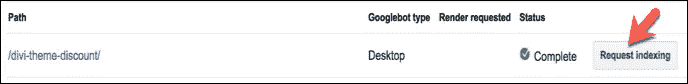

# 如何在 WordPress 中更改文章网址

> 原文：<https://medium.com/visualmodo/how-to-change-post-url-in-wordpress-d27e15d0559d?source=collection_archive---------0----------------------->

## 不失去排名

改变旧帖子的网址是我从来没有想过要做的事情。如果邮报失去了谷歌的排名怎么办？我有这种感觉，当谈到改变一个现有的网址。了解如何在不损失排名的情况下更改帖子 URL。

在第[页的 SEO 清单](https://visualmodo.com/meta-description-seo-write/)中，我提到在 URL 中添加聚焦关键词可以帮助你排名。很多读者问我他们是否应该改变旧帖子[的网址](https://visualmodo.com/)来添加关键词。我说不是，我还是建议不要为了添加关键词而更改网址。

# 如何更改帖子网址？

最近我遇到了一个情况，我不得不改变一篇文章的 URL 结构。一位代销商经理让我从一篇文章甚至网址中删除某个关键词。也许，这违反了他们的规则。

我不得不这样做，但我不想失去排名。我采取了一些行动后，改变了网址，你猜怎么着，我没有失去排名。

在这篇文章中，我将向你展示我在改变旧文章网址后保持排名的 3 个步骤。

**步骤#1:将旧 URL 重定向到新 URL (301 重定向)**

当你改变一个 URL 时，大多数时候 WordPress 会自动将旧的 URL 重定向到新的 URL。但是如果 [WordPress](https://visualmodo.com/) 没有呢？

最好的办法是，建立一个 301 重定向。它是将访问者和搜索引擎机器人从旧网址永久发送到新网址的过程。它将站点的链接汁转发到新的 URL。

像所有事情一样，你可以通过使用插件来完成。[重定向](https://wordpress.org/plugins/redirection/)是[管理 301 个重定向和修复 404 个错误](https://roadtoblogging.com/wordpress-redirection-plugin/)的 WordPress 插件。也可以用 Yoast SEO 高级版来做。以下是如何使用重定向插件做到这一点。

在[安装并激活插件](https://roadtoblogging.com/install-wordpress-plugin/)后，

一旦你已经[安装并激活插件](https://roadtoblogging.com/install-wordpress-plugin/)，进入 WordPress 仪表盘>工具>重定向。你会发现“添加新的重定向”选项。

只需在“源 URL”框中输入旧的 URL，在“目标 URL”框中输入新的 URL。然后点击“添加重定向”按钮。就是这样。您的旧网址将被重定向到新网址。

现在搜索引擎蜘蛛会找到你的新网址并索引它，同时会删除你的旧网址。

**第二步:更新内部链接到新的网址**

虽然你不能改变文章的外部链接，但是你绝对可以改变内部链接。

查找链接和更改 URL 可能需要一些时间。但这值得你花时间。它帮助搜索引擎机器人找到你的新网址，并迅速索引。

你可以从[谷歌搜索控制台](https://roadtoblogging.com/verify-wordpress-site-on-google-webmaster-tools/)找到一个 URL 的内部链接。登录到搜索控制台并选择站点。然后去搜索流量>内部链接，输入旧网址。然后点击“查找”。

它将显示 [URL](https://visualmodo.com/) 的内部链接。忽略标签、类别等页面。只去单帖，更新旧网址。

正确的内部链接使搜索引擎机器人更容易索引和排列正确的页面。

**第三步:使用 Fetch as Google 更快地索引你的新网址**

当你改变一个网址，机器人需要时间爬网址和索引。你可以让它更快。

搜索控制台有一个名为“获取为谷歌”的选项，让你提交你的更新网址索引。

转到谷歌搜索控制台，选择域名。然后展开抓取菜单，点击“获取为谷歌”链接。在输入字段中输入新的 URL，然后单击“获取”按钮。

如果获取状态为完成，请单击“请求索引”按钮。

选择“仅爬网此 URL”并单击“转到”按钮。

您的新网址将很快被编入索引。有时，它会在 5 分钟内发生。

**交给你了**

这些是我更改 URL 后遵循的步骤。谷歌花了时间索引网址，但我没有失去排名。令人惊讶的是，我不得不从 URL 中删除一个焦点关键词，但排名保持不变。

你曾经改变过你的博客文章的现有网址吗？与我们分享你的经验。