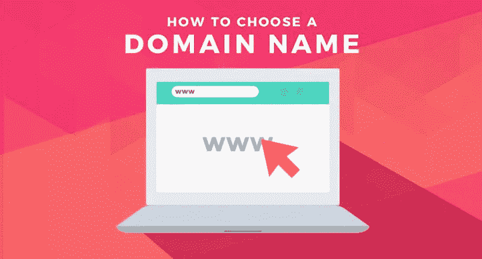
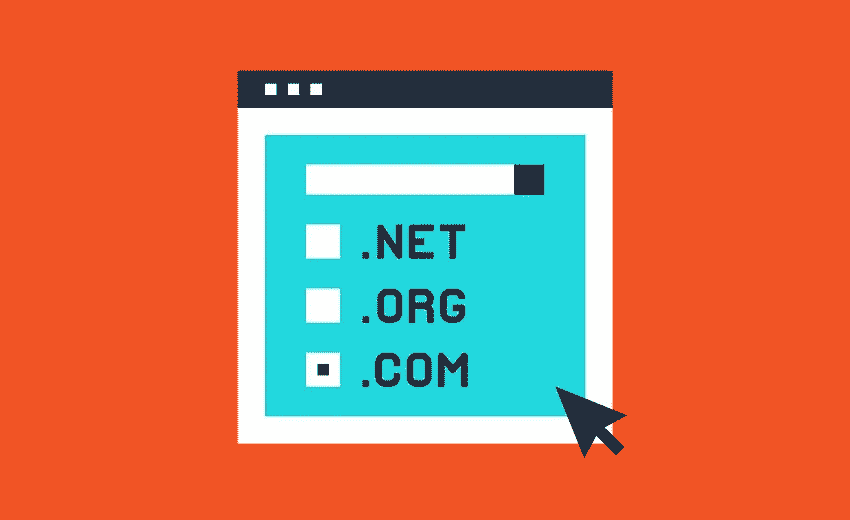

# 如何选择域名？

> 原文：<https://medium.com/visualmodo/how-to-choose-a-domain-name-ccc1f1dff76a?source=collection_archive---------0----------------------->

你需要花多少心思来选择你的域名？真的有那么重要吗？选择域名类似于选择公司名称，需要深思熟虑。你的域名就是你在网上的身份；你要确保你选择的域名不仅适合你的业务，而且容易找到和推广。

选择一个域名是你要做的第一件事，当你要开始你的网站。这不是一件容易的工作。当你发现所有酷的名字都被注册后，你可能会觉得很难。由于没有理想的[名](https://visualmodo.com/)，许多人随意取了一个名字，犯了一些常见的错误。为了避免这些错误，让事情对你来说更容易，我将分享 10 个选择域名的技巧。

# 1.关键词丰富与品牌域名

首先你需要决定你是想选择一个关键词丰富的域名还是一个品牌域名。如果你不知道这两种类型的域之间的区别，这里有一个例子。

*   【BestProducts.com】关键词丰富的域名:T2
*   【TheWirecutter.com】品牌域名:T4

两者都是产品相关的网站。但只有第一个域名包含关键字“产品”。所以是关键词丰富的域名。第二个域名是一个独特的名称，比第一个更具品牌效应。

**关键词丰富域**可以有两种类型——完全匹配域(EMD)和部分匹配域(PMD)。让我们看一个例子:

*   **精确匹配域**:BestProductsForAcne.com
*   **部分匹配域**:BestProducts.com

EMD 不好看。人们过去购买 EMD 是为了联盟营销的目的。几年前，很容易对精确匹配的域名进行排名。但是事情已经改变了。现在 EMD 不管用了。所以远离 EMD。

另一方面，**部分匹配域**做得不错。因为它包含一个相关的关键字，所以很容易理解这个博客是关于什么的。让它成为品牌并不困难。

*   HealthAmbition.com
*   TechCrunch.com

现在让我们谈谈品牌域名。

**品牌域名**与小众关键词无关。这是一个独特的名字。例如，Labnol.org 是一个科技博客。该领域并不代表其利基。其实 Labnol 没有任何意义。

*   ShoutMeLoud.com
*   Hongkiat.com
*   Mashable.com

关于品牌域名最好的事情是，它允许你在不改变域名的情况下改变定位。也可以拓展自己的小众。一旦你决定了，你想选择哪种领域，让我们转移到其他点。

# 2.使发音和拼写变得容易

看看这些域名:

*   Mashable.com
*   Problogger.com
*   Lifehacker.com

所有这些网站都很受欢迎。共同的是，他们的域名很容易发音和拼写。你的域名是你品牌的名字。所以要让它容易发音和拼写。不要使用复杂和不常用的词。让它被记住。

# 3.保持简洁明了

没有理想的域名长度。尽量保持简短。域名短容易记。但是很难找到短域名。我建议你将域名控制在 10-15 个单词以内。

同时，你需要确保域名是简单的。不要使用任何复杂的词语。例如，visualmodo.com 不是一个很短的域名。但是很简单。

# 4.去吧。com 扩展

。com 是最流行的域名扩展。人们记住的是你博客的名字，而不是扩展名。如果您的域名以其他扩展名结尾，如。找到你的博客可能有点困难。所以去吧。com 扩展名。如果。com 扩展不可用，请使用其他流行的扩展，如。网，。co，。org 等。不要跟。信息或。商务扩展。有很多带有这些扩展名的垃圾域名。

# 5.避免使用连字符、数字和冠词

很难辨别包含连字符的域名。假设你的领域是 Tech-tips.com。你必须对线下的人说“tech hyphen tips dot com”。有可能大多数人忘记了连字符，最终去了 techtips.com。同样的事情也发生在数字或文章领域。人们会忘记数字和文章。

尽管一些网站如 Digital-photography-school.com、9lessons.info、thewirecutter.com 等非常受欢迎，但这些都是例外。他们已经在这里很长时间了。尽量避免连字符，数字，或文章的领域。

# 6.避免侵犯版权和商标

侵犯版权和商标会严重损害你的博客。你可能会失去这个域名。所以在选择域名之前还是谨慎为好。确保你的域名不会与其他商业名称冲突。例如，你不能在你的域名上使用脸书、[等术语。但是，我不是律师。我无法在专业上帮助你。如果你有任何困惑，你应该和律师谈谈。](https://visualmodo.com/)

# 7.单数对复数

看看这两个领域:

BestProducts.com 和 BestProduct.com

BestProducts.com 是主要领域。但是有些人可能会去 BestProduct.com 而不是 BestProducts.com。如果你的域名包含这样的东西，我会建议你购买两个域名。这样你就不会失去任何访客。您可以选择一个作为主域，并将另一个重定向到主域。

# 8.确保社交网址可用

购买域名后要做的一件重要事情是确保社交媒体网址的安全，比如 https://facebook.com/yourdomain.。如果你打算给任何特定的社交媒体网站更多的关注，最好确保你想要的网址是可用的。你可以使用这个工具——knowem.com

# 9.用你的名字作为域名

如果你不能为你的博客想出正确的域名，你可以用你的名字作为域名。一些博客作者用个人名字作为域名做得很好。

*   SethGodin.com
*   MichaelHyatt.com
*   NeilPatel.com
*   AmyLynnAndrews.com

你甚至可以像 Hongkiat.com 一样使用你名字的一部分作为域名。你也可以使用你的域名的一部分和其他单词，如 HuffingtonPost.com，GoinsWriter.com。即使你没有任何用你的名字作为域名的计划，如果有域名的话，抢注也是个不错的主意。以后你可以把它用作个人博客或作品集网站。

# 10.使用域名生成器

依赖域名生成器不是一个好主意。但是这些生成器可以帮助你得到一些想法。这里有一些你可以尝试的工具。

[Shopify 域名生成器](https://www.shopify.com/tools/business-name-generator):这是你能使用的最酷的工具。它产生了一些好的领域想法。

[相同网格](http://www.namemesh.com/):快速显示不同扩展名的可用域名。

BustAName:这是另一个获得域名创意的工具。

# 注册域名的地方

一旦你为你的博客找到了合适的名字，就该注册域名了。

有几个域名注册商。Namecheap 和 GoDaddy 最受欢迎。我使用并推荐 Namecheap。你也可以用 Bluehost 托管获得一个免费的域名。

# 托管域名的位置

虽然你可以在域名注册商那里托管你的域名，但我不推荐这样做。最好把你的网站放在一个知名的主机上。

# 轮到你了

如果你还没有找到合适的域名，请放松。您可以稍后更改域名。所以不要想多了。就用你觉得好听的名字吧。完美的域名是不存在的。如果你已经找到了域名，一切都是为了你的博客。