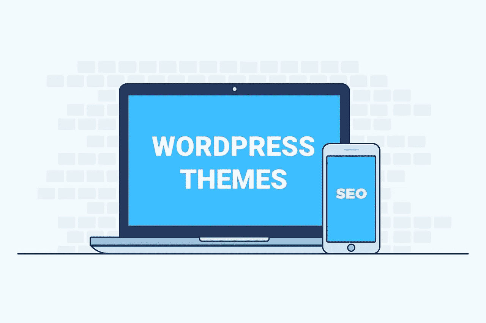

# 如何选择一个 SEO 友好的主题

> 原文：<https://medium.com/visualmodo/how-to-choose-an-seo-friendly-wordpress-theme-afa4866a4f79?source=collection_archive---------0----------------------->

创建一个新的 WordPress 站点博客很容易，但是在一个竞争激烈的网络世界中维持它是困难的。互联网上有这么多 WordPress 驱动的网站，你的网站或博客有何不同？如果你使用正确的插件、特性和部件，那么你就能优化你的博客。不仅仅是插件，你对主题的选择也很重要。[高级主题](https://visualmodo.com/wordpress-themes/)现已推出，可帮助您优化页面。为你的网站增加流量是很重要的，所以选择一个 SEO 友好的 WordPress 主题可以帮助你在 Google 中获得更高的排名。

# 选择一个 SEO 友好的 WordPress 主题

是时候找到你的 SEO 友好主题了。我们准备了一份简短的清单，列出了您在做出选择时需要考虑的事项。所有这些有形的因素都在这个或那个程度上影响着你未来的网站 SEO。

# 编码良好的主题

如果你的网站编码糟糕，没有搜索引擎会称赞你的网站。只信任知名的提供者，阅读评论，最重要的是，亲自检查主题的代码有效性。首先，在不同的浏览器和不同的屏幕上检查你的网站。以这种方式测试主题将揭示主要的编码缺陷。一切都好吗？

# 响应式设计

您是否知道该网站目前超过 50%的流量来自移动设备？如果你的网站响应能力很差，谷歌(和其他引擎)会在移动 [SERPs](https://en.wikipedia.org/wiki/Search_engine_results_page) 上攻击你。这对你意味着什么？由于你的主题反应迟钝，你可能会损失高达 50%的网站流量。

如何防止这种情况？在不同的视口和不同的设备上测试你的主题。为了确保它的响应是无敌的，使用这些工具:【ResponsiveDesignChecker.com】T4 和[谷歌网站管理员工具](https://www.google.com/webmasters/tools/mobile-friendly/)

要在购买之前检查主题的响应性，请使用主题的现场演示。您可以试玩以下完美响应主题的现场演示:

# 表演

不是很快，但准确地说是非常快。众所周知，网站速度很大程度上决定了你在谷歌的搜索引擎优化排名。此外，网站速度极大地影响了用户在你网站上的体验。所以，无论如何，你不能错过这个选择网站主题的建议。

# 装载时间

用超轻主题包寻找新一代主题。这样的主题可能包含大量的文件，但是由于新一代的文件结构，它们仍然像羽毛一样轻。Edge 是一个加载速度很快的 WordPress 主题的好例子。

# 开发架构

网站架构代表了你的网站页面相互链接的方式。网站架构的主要方面是网站的导航、内部链接和内容。如果你的主题拥有强大的网站架构，机器人会更好地索引和抓取你的页面。在某种程度上，他们将能够看到你的网站的所有内容，这给你一个良好的搜索引擎优化提升。

故事还没完。健全的网站架构对发现你网站内容的机器人和真人都有好处。良好的网站结构为每个用户创造了难忘的体验，并确保更多的客户转化。

# 架构组织

模式标记增强了您的网站代码，使其更容易被机器人看到和抓取。本标注由 Schema.org[提供。尽管这种标记对网站 SEO 非常有益，但并不是所有的主题开发者都像](http://schema.org/) [Visualmodo](https://visualmodo.com/about/) 那样将它包含在他们的产品中。

# 结论

如果你计划建立一个 WordPress 网站，那么为你的网站选择一个 SEO 主题。它将为您提供移动设计、响应能力和跨浏览器兼容性等功能，从而优化您的 SEO 网站功能。您还可以选择一个具有用户友好导航、拖放编辑器和翻译功能的主题。一个具有 SEO 功能的 WordPress 主题可以为你的网站做很多事情。这将有助于提高用户参与度，增加网站流量。优质的 WordPress 主题为你的博客提供了 SEO 功能以及其他很酷的插件。