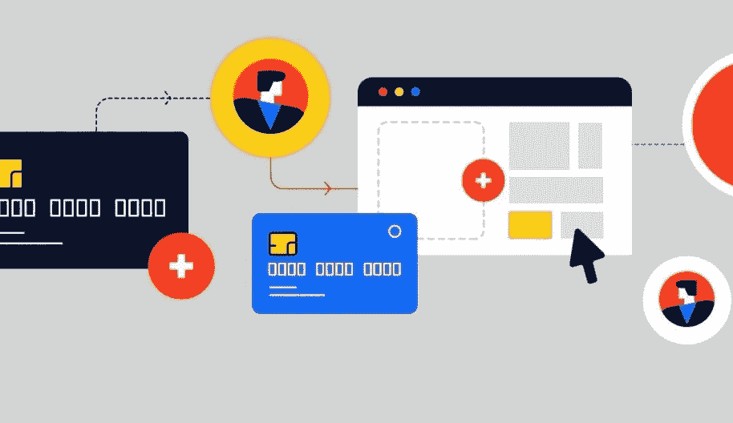

# 如何为您的在线业务选择最佳的支付提供商

> 原文：<https://medium.com/visualmodo/how-to-choose-the-best-payment-provider-for-your-online-business-43a353049194?source=collection_archive---------0----------------------->

在线支付现在是数字世界的一个巨大组成部分，如果你想跟上不断变化的电子商务网络开发工具，你必须迎头赶上。当谈到为你选择最好的支付提供商时，互联网上有许多选择，但在这种情况下，有太多的选择不是一件好事。你必须选择对你的客户和你的生意都有利的供应商。

至少可以说，没有一个好的支付提供商是有害的，所以这里有一些你在选择时应该考虑的事情:

# 选择最佳支付提供商

# 评估您需要的付款方式

众所周知，Visa 和 MasterCard 是全球最受欢迎的在线购物工具，因此它们是大多数在线商店的默认选项和强制选项，因为人们可以很容易地使用各自银行的借记卡或信用卡。尽管该选项对于本地购买和本地受众来说似乎完美无缺，但一些进行国际购买的用户可能会面临困难(尚未证实他们的本地银行是否有助于向世界任何角落支付信用卡)，因此如果他们无法轻松获得用于国际购买的信用卡，他们会寻找有用的替代方案。

因此，基本上，支付方式无论是信用卡还是借记卡、银行账户提款、转账，甚至支票都有不同的用途，并提供不同的后端支持。你需要弄清楚你需要什么样的支付方式，然后你要确保你的提供商有你需要的选择。通过考虑您的目标受众、银行服务法规和两端涉及的服务提供商来评估您需要的支付方式。了解客户通过选择的系统进行支付的难易程度非常重要。

# 他们准备好兑换外币了吗？

同样，你的目标受众也是一个需要考虑的因素，因为这个因素取决于你是在本地还是在全球范围内。如果你被限制在一个国家或州，你不必担心外币[兑换](https://visualmodo.com/blog/)(或者多种货币、结算货币、替代支付等等。就此而言)。当本地处理器必须处理本地流量和本地支付时，连接到本地处理器的本地处理器不会给你带来任何麻烦。

但是，如果你是一个全球性的电子商务网站，你让你的客户用他们的本地货币支付，你将不得不考虑外币兑换。您希望确保您的提供商提供多种主要货币的支付，这样您的客户就不会遇到麻烦(遇到不利的汇率或不知道他们发送了多少钱)，并且当您收到错误的货币时，您也不必支付费用。

支付过程中涉及的金融机构可以指定他们的国际支付扣除费用，但货币汇率是不可预测的，因此拥有一个提供不同主要货币支付的提供商有助于您为不同全球货币相对于您的标准货币的汇率的增减做好准备。

# API 是每个可靠支付系统的核心

相信我们，当我们说你想更喜欢提供 API 集成的支付提供商。简而言之，API 保证你的客户和用户可以选择直接从你的网站上购买你提供的任何东西。

如果您的支付提供商不提供 API 集成或不是由 API 支持，您的潜在客户将被 it 重定向到他们的网站，并且他们都将被要求在表单中填写他们的详细信息。重定向和表单完成方法不仅耗时，而且可能会让你失去一些潜在客户。人们希望把东西放进购物车，然后轻松付款，而不必担心额外的表格和安全问题，否则，他们会放弃他们的购物车。

这就是为什么说 API 是每一个可靠的支付系统的核心，因为你需要确保结帐过程是完美的和足够有效的，这样你就不会失去客户，也不会降低你的转化率。对支付处理程序有疑问或不愿意在他们被重定向到的表格中分享个人信息会让你的客户回头。

# PCI 合规性和强大的欺诈保护

如果您的支付提供商不符合 PCI 标准，您需要离开。说真的，不要继续那个合同。找到一家完全遵守 PCI 规则和条例的支付提供商。PCI(或支付卡行业)为所有处理信用卡的公司制定了数据安全标准(DSS)。这确保了支付提供商是您企业的安全选择。

如果您的支付提供商满足 PCI 的所有安全要求，并为您的在线买家提供最大限度的保护，这可能有助于减少安全漏洞的机会，同时确保您和您的客户的高度隐私。您将处理客户的未加密信用卡号码，您的责任是确保他们的数据是安全的。最好的支付网关提供强大的欺诈保护工具，而那些没有的，他们不应该出现在你的在线电子商务业务的潜在支付提供商名单上。

# 考虑你的经营地点和公司

你需要问的一个问题是，你正在考虑的支付提供商是否在正确的国家运营。不同国家的复杂法律使得跨境支付不是一件容易的事情。许多在线支付提供商不提供国际支付解决方案，或者仅限于少数特定国家。

确保您的提供商在您希望开展业务的地区和国家提供对个性化店面形式的全面支持(使用当地语言和货币)。在多个国家/地区开展业务的支付提供商允许您使用这些国家/地区的支付网关服务，因为您需要在您希望处理和存入的国家/地区的某个地方注册。

# 移动优化是你的朋友

世界日益进步和现代化。手机和智能手机不再是稀罕物，它们实际上是极其普通的技术设备。在这个发达的世界里，称手机为某些人的必需品并不为过。考虑到这一点以及很大一部分目标受众和回头客将通过手机或智能手机购物的可能性，如果您的支付提供商不能有效地支持或提供移动优化，将会对您的业务造成极大的损害。

如果你的支付提供商不提供移动优化的解决方案，这也是一个信号，表明他们不准备给你经营电子商务业务所需的支持。专业且易于操作的网站设计、高效的行动号召(尤其是一键购买选项)以及与移动钱包的集成是您的提供商需要提供的移动优化工具。

# 定价和消费者支付问题

尽管大多数支付提供商提供类似的定价方案，但与国际银行机构的合作关系允许他们快速处理您本地账户的国际交易。这就是为什么你要审查他们收取的价格。根据金额清算所需的时间(以天为单位)审查它们的价格。请求快速和迅速的支出显然会比花费几天的支出多。

在选择特定的支付提供商之前，要求他们保持透明，并向您解释如果出现任何消费者支付问题，他们计划采用什么方法。这很公平，因为你将你和你的客户的钱和信息委托给他们，你必须确保你和你的客户的隐私、安全或金钱都不会受到威胁。同样重要的是，事先知道是否出现与支付相关的问题(例如，出现最低余额费用、付款不成功或延迟，或者向不满意的客户退款等)。)他们会收取或不收取额外的费用。

# 结论

市场上的顶级支付提供商不一定是最适合您企业的。我们已经告诉了您在选择满足您在线业务需求的最佳支付提供商时需要考虑的因素，现在您必须就这些因素提出问题，因为最佳网关或支付提供商是道德价值观、安全性、创新、技术和忠诚度的结合。当涉及到你的支付提供商时，不要妥协，因为不仅你和你的客户的钱，而且双方的敏感信息都处于危险之中。

Asad Ali 是一位拥有超过 8 年经验的数字营销专家。目前，他在 GO-Gulf 工作，这是一家 [网络开发公司](https://www.go-gulf.ae/) *，在那里他参与了许多 SEO 项目&并成功地开展了数字营销活动。你可以在*[*LinkedIn*](https://pk.linkedin.com/in/asadaliseo)*上找到他。*