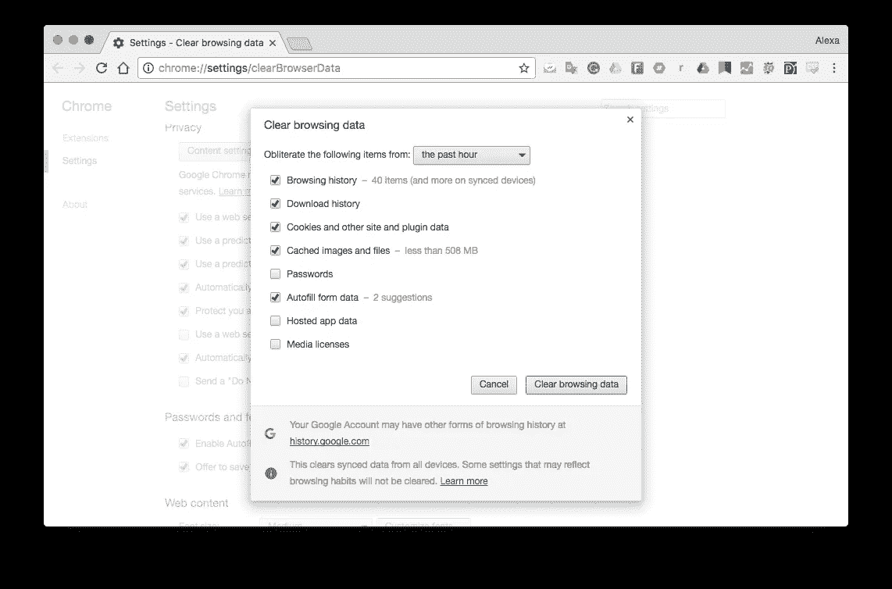

# 如何清除浏览器缓存

> 原文：<https://medium.com/visualmodo/how-to-clear-browser-cache-9a7c1b3ef7b1?source=collection_archive---------0----------------------->

如果你是一名开发人员或设计人员:缓存页面可以加载旧的内容，这将不会正确显示您的更新。甚至在一些页面布局改变之前，你会看到旧的页面布局内容，现在看看如何清理你的浏览器缓存。

在大多数浏览器中，你可以从*设置*或*选项*菜单中的*隐私*或*历史*区域清除缓存，当然这取决于浏览器。Ctrl+Shift+Del 也适用于大多数浏览器。

虽然热键组合在大多数非移动浏览器中都有效，但是清除浏览器缓存的具体步骤完全取决于你使用的浏览器。下面你会找到一些浏览器和设备的具体说明，以及链接到更广泛的教程，如果你需要他们。

# 浏览器缓存到底是什么？

你的浏览器缓存，发音类似于 *cash* ，是网页的集合，包括文本、图像和其中包含的大多数其他媒体，存储在你的[硬盘](https://visualmodo.com/)或手机存储器中。拥有一个网页的本地副本有助于你下次访问时快速加载，因为你的电脑或设备不必再从互联网上下载所有相同的信息。浏览器中的缓存数据听起来很棒，那么你为什么要清除它呢？

# 为什么必须清除缓存？

如果你是一名开发人员或设计师:缓存页面可以加载旧的内容，这将不会显示你的内容。甚至在一些页面布局改变之前，你会看到旧的页面布局内容。

你当然不需要*去做*去做，反正不是作为电脑或智能手机维护的一个常规部分。然而，我想到了一些清除缓存的好理由… [清除缓存会迫使浏览器从网站上检索最新的副本，这应该会自动发生，但有时却不会。](https://visualmodo.com/)

如果您遇到 404 错误或 502 错误(以及其他错误)，有时表明您的浏览器缓存已损坏，您可能还需要清除缓存。

删除浏览器缓存数据的另一个原因是为了释放硬盘上的空间。随着时间的推移，缓存可能会变得非常大，因此清除它可以恢复一些以前使用的空间。不管你为什么想这样做，在当今所有流行的浏览器中，清除缓存都是很容易做到的。

# 如何清除浏览器缓存

# Chrome:清除浏览数据

在 Google Chrome 中，清除浏览器缓存是通过*设置*中的清除浏览数据区来完成的。从那里，检查**缓存的图像和文件**(以及任何你想删除的东西)，然后点击或点击**清除浏览数据**按钮。

假设你使用的是[键盘](https://www.lifewire.com/what-is-a-keyboard-2618153)，清除*浏览数据*的最快方法是通过 **Ctrl+Shift+Del** 键盘快捷键。

如果没有键盘，点击或单击**菜单**按钮(有三条堆叠线的图标)，然后点击**更多工具**，最后点击**清除浏览数据…** 。

详见[如何清除 Chrome 中的缓存](https://support.google.com/chrome/answer/2392709?visit_id=0-636388181934126876-2271256505&rd=1)[*support.google.com*。

**提示:**从*中选择**开始时间**从*中清除以下项目*顶部的选项清除浏览数据*窗口以确保你得到一切。

在 Chrome 的手机浏览器中，进入**设置**，然后进入**隐私**。从那里，选择**清除浏览数据**。在该菜单中，勾选**缓存图像和文件**，按下**清除浏览数据**按钮一次，然后再次确认。

# Internet Explorer:删除浏览历史记录

在大多数 Windows 计算机上预装的浏览器 Microsoft Internet Explorer 中，清除缓存是从删除浏览历史记录区域完成的。从这里，检查**临时互联网文件和网站文件**，然后点击或轻触**删除**。

与其他流行的浏览器一样，删除浏览历史设置的最快方式是通过 **Ctrl+Shift+Del** 键盘快捷键。

另一个选项是通过**工具**按钮(齿轮图标)，接着是**安全**，然后是**删除浏览历史……**。

请参见[如何清除 Internet Explorer 中的缓存](https://www.lifewire.com/how-to-clear-the-cache-in-internet-explorer-2624707)以获取全套说明。提示: Internet Explorer 经常将浏览器缓存称为临时 Internet 文件，但它们是一回事。

# 火狐:清除所有历史记录

在 Mozilla 的 Firefox 浏览器中，你从浏览器的*选项*中的*清除最近历史*区域清除缓存。到达后，检查**缓存**，然后点击或点击**立即清除**。

**Ctrl+Shift+Del** 键盘快捷键可能是打开这个工具最快的方式。通过**选项**，然后是**隐私&安全**，最后是从*历史*区域的**清除你最近的历史**链接，也可以从 Firefox 的菜单按钮(三行的“汉堡”按钮)中获得。完整教程见[如何清除 Firefox 中的缓存](https://www.lifewire.com/how-to-clear-the-cache-in-firefox-2624704)。

**提示:**不要忘记从*时间范围中选择 **Everything** 来清除:*组选项，假设那是你想要清除缓存结束的时间范围。

如果你正在使用 Firefox 的移动应用程序，点击右下角的菜单，然后从该菜单中选择**设置**。找到*隐私*部分，点击**清除私人数据**。确保选择了**缓存**，然后点击**清除私有数据**。用 **OK** 确认。Firefox Focus 是 Firefox 的另一款移动浏览器，你可以使用应用程序右上角的**擦除**按钮来清除缓存。

# Safari:空缓存

在苹果的 Safari 浏览器中，清除缓存是通过*开发*菜单完成的。只需点击或点击**开发**，然后**清空缓存**。有了键盘，用 **Option-Command-E** 快捷键清除 Safari 中的缓存就超级简单了。

如果需要更多帮助，请参见[如何清除 Safari 中的缓存](http://help.apple.com/safari/mac/9.0/#/sfri20948)[*help.apple.com*。**提示:**如果您在 Safari 菜单栏上没有看到*开发*，请通过 [**首选项**](https://visualmodo.com/) 启用它，然后选择**高级**，接着选择**在菜单栏中显示开发菜单**选项。从移动 Safari 中清除浏览器缓存，就像在 iPad 或 iPhone 上一样，是在不同的应用程序中完成的。从您的设备中，打开**设置**应用程序，然后找到 **Safari** 部分。

在那里，向底部滚动并点击**清除历史和网站数据**。点击**清除历史和数据**进行确认。

# Opera:清除浏览数据

在 Opera 中，清除缓存是通过*清除浏览数据*部分完成的，这是*设置*的一部分。打开后，检查**缓存的图像和文件**，然后点击或轻触**清除浏览数据**。调出*清除浏览数据*窗口的最快方法是通过 **Ctrl+Shift+Del** 键盘快捷键。

如果没有键盘，单击或轻触主菜单按钮(浏览器左上角的 Opera 标志)，然后单击**设置**、**隐私&安全**，最后单击**清除浏览数据……**按钮。勾选**缓存图像和文件**选项，然后按**清除浏览数据**。

详细说明参见[如何清除 Opera 中的缓存](http://help.opera.com/Windows/12.10/en/cache.html)[*help.opera.com*。**提示:**一定要选择顶部的**时间开始**选项，这样你就一定会清除所有内容！

您也可以从移动 Opera 浏览器中清除缓存。点击底部菜单中的 Opera 图标，然后导航至**设置>清除…** 选择要删除的内容:保存的密码、浏览历史、cookies 和数据，或全部。

# 边缘:清除浏览数据

在微软新版 Windows 中的 Edge 浏览器中，清除缓存是通过*清除浏览数据*菜单完成的。打开后，检查**缓存的数据和文件**，然后点击或点击**清除**。到*清晰浏览数据*菜单的最快方式是通过 **Ctrl+Shift+Del** 键盘快捷键。

另一个选项是通过**更多**按钮(带有三个水平点的小图标)，接着是**设置**，然后是**选择要清除的内容**按钮，在*清除浏览数据*标题下。

参见[如何清除微软 Edge](https://support.microsoft.com/errors?) 中的缓存【支持 *.microsoft.com* 获取更广泛的帮助。**提示:**点击或单击**显示更多**，同时在*清除浏览数据*菜单中查看清除缓存文件和图像时可以清除的其他项目。

要从 Edge mobile 浏览器中删除缓存文件，请使用菜单右侧的按钮进入菜单，然后选择**设置**。进入**隐私>清除浏览数据**选择您想要删除的内容；您可以选择缓存、密码、表单数据、cookies 等等。

# 维瓦尔第:清除浏览数据

Vivaldi 浏览器基于 Google Chrome 浏览器，因此清除其缓存非常类似。

像在 Chrome 上一样，你可以通过*清除浏览数据*区域清除维瓦尔第的缓存。从那里，检查**缓存的图像和文件**，从顶部菜单中选择**开始时间**(如果您想这样做)，然后点击或单击**清除浏览数据**。点击或点击 **Vivaldi** 按钮(V 形图标)，然后点击 **Tools** ，最后点击 **Clear Private Data…** 。

和 Chrome 以及大多数浏览器一样， **Ctrl+Shift+Del** 键盘快捷键也可以调出这个菜单。

# 关于清除 Web 浏览器中的缓存的更多信息

大多数浏览器至少有基本的缓存管理设置，至少你可以选择你希望浏览器为缓存的网站数据使用多少空间。有些浏览器甚至让你选择在每次关闭浏览器窗口时自动清除缓存，以及其他可能包含私人信息的数据。

如果您有兴趣了解如何使用浏览器的缓存系统做这些更高级的事情，请查看我在上面大多数浏览器特定部分提供的更详细信息的链接。

在大多数浏览器中，你可以覆盖一个 w [eb 页面的](https://visualmodo.com/)存储缓存，而不用删除浏览器收集的所有缓存。本质上，这将只为该特定页面擦除和补充缓存。这通常通过在刷新时按住**换档**键来完成。