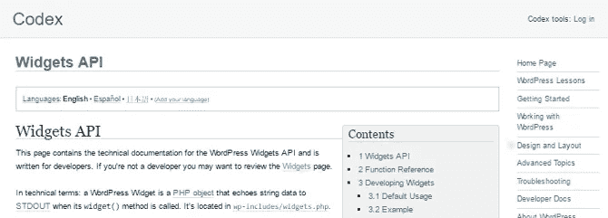
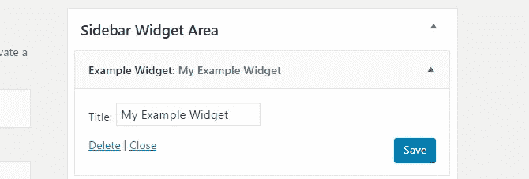
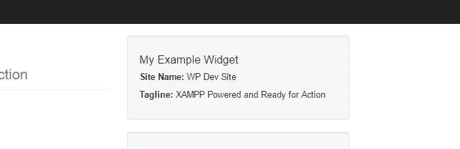
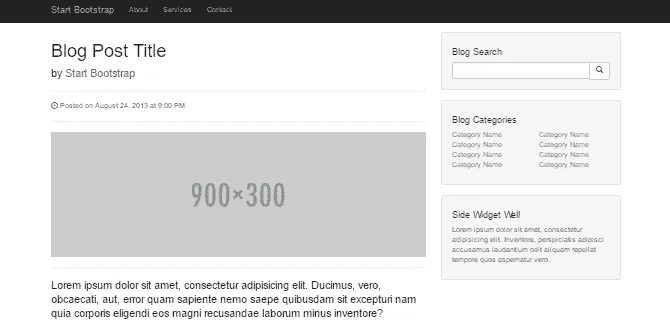
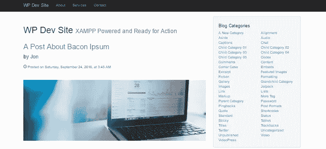

# 如何编写你自己的定制 WordPress 小部件

> 原文：<https://medium.com/visualmodo/how-to-code-your-own-custom-wordpress-widget-b7f4759ff098?source=collection_archive---------1----------------------->

你曾经想要为你的 WordPress 网站创建一个自定义的小部件吗？虽然 WordPress 确实包含一个内置的文本小部件，可以用来显示 HTML 以及嵌入的 CSS 和 JavaScript，但如果你想做更多的事情，文本小部件就不能满足你。了解如何编写你自己的定制 WordPress 小部件

如果您想从您的网站数据库中抓取一些内容并在一个小部件中显示它，该怎么办？解决方案是编写一个定制的侧边栏小部件。虽然这听起来像是一项艰巨的任务，但只要你有基本的 PHP 技能，这是你力所能及的。

因此，跟随本教程，您将学习如何创建两个不同的小部件:

*   一个简单的小部件，显示小部件标题、站点标题和站点标语。
*   一个稍微复杂一点的小部件，显示所有类别的列表，这些类别按字母顺序排序并分成两列。

准备好学习自定义 WordPress 小部件创建的基础知识了吗？我们开始吧。

# WordPress 小部件构建基础

为了完成本教程，您需要做好三件事情:

*   WordPress 开发环境
*   基本的 PHP 编码技能
*   基本的 WordPress 开发经验

WordPress 网站崩溃只需要一个错误的逗号或丢失的花括号，如果你相对来说是编程新手，当你试图定位违规代码时，你的网站可能会宕机几分钟或更长时间。出于这个原因，在您尝试在一个真实的网站上使用它之前，您绝对应该让您的小部件在本地开发环境中工作。

过去，我们已经写了很多关于本地开发环境的文章。就我个人而言，[我使用 XAMPP](https://premium.wpmudev.org/blog/setting-up-xampp/) ，但是任何本地主机服务器都可以。选择一个并运行它。

如果你从来没有写过一行 PHP 代码或者编写过一个基本的 WordPress 插件，那么这篇教程可能有点超出你的能力范围。然而，好消息是，你可以通过非正式的方式学习你需要知道的一切，通过我们的 [WordPress 初学者开发系列](https://premium.wpmudev.org/blog/wordpress-development-beginners-getting-started)，或者通过在[学院](https://premium.wpmudev.org/academy)注册一个即将到来的课程。

如果你满足了这三个基本要求，你就可以开始编写代码了。我们开始吧。

# Widgets API

你可以在 WordPress Codex 中找到更多关于 Widget API 的信息。

您可以通过向以下两个位置之一添加代码来创建一个新的 WordPress 小部件:

*   一个自定义插件，如果你想在多个主题或者多个网站上使用这个插件。
*   活动主题的*functions.php*文件——可以是子主题，也可以是完全自定义的主题。

仅仅为了举例，您可以在 GitHub 上找到本教程中描述的简单侧边栏小部件的完整代码。如果你不确定在哪里写你的代码，或者只想立刻看到整个代码，[下载那个插件的副本](https://github.com/jpen365/example-widget-plugin/releases/tag/1.0)。

WordPress 小部件是用一点面向对象的编程[创建的](https://premium.wpmudev.org/blog/advanced-wordpress-development-introduction-to-oop)。扩展了`[WP_Widget](https://developer.wordpress.org/reference/classes/wp_widget/)`类来创建每个小部件。`WP_Widget`类包含近 20 种不同的方法。然而，对于基本的小部件，您实际上只需要使用其中的四个:

*   `__construct()`:注册基本小工具信息。
*   `widget()`:包含小部件输出——当小部件被添加到小部件区域时，您在站点前端实际看到的内容。
*   `form()`:定义在 WordPress 管理区域显示的小部件设置。
*   `update()`:当新设置保存在 WordPress 管理区时，更新小工具设置。

除了这四个方法之外，`[add_action](https://developer.wordpress.org/reference/functions/add_action/)`函数还用于将自定义小部件函数绑定到`[widgets_init](https://developer.wordpress.org/reference/hooks/widgets_init/)`钩子上。

# 示例小部件#1:显示小部件标题、站点标题和标语

首先要做的是像这样扩展`WP_Widget`类:

在这种情况下，新 widget 函数的名称是`jpen_Example_Widget`。请注意， *jpen* 只是我添加到所有自定义函数的前缀，以避免与其他插件、主题或 WordPress 核心中的任何函数冲突。您可以使用适合您的小部件的任何名称，如果您想遵循最佳实践，可以添加前缀。

我们将使用上面列表中提到的四种方法编写函数，并将所有四种方法嵌套在我们的小部件函数中。然后，在最后一步，我们将编写一个函数来注册小部件。

让我们从`__construct()`方法开始方法编写过程。

## WP _ Widget::_ _ 构造()

`[__construct()](https://developer.wordpress.org/reference/classes/wp_widget/__construct/)`方法用于为小部件分配 id、标题、类名和描述。下面是构造函数创建第一个示例小部件的样子:

'example_widget '，' description' = > '这是一个示例小部件'，)；parent::_ _ construct(' Example _ Widget '，' Example Widget '，$ Widget _ options)；}?>

要理解这个函数，先从以`parent::__construct()`开头的那一行开始。这一行创建了一个新的小部件，id 为`'example-widget'`，名称为`'Example Widget'`，有两个小部件选项:类名和简短描述。

所有这些代码都在`jpen_Example_Widget`中，用于向 WordPress 注册小部件，然后在管理区显示小部件的标题和描述。

## WP_Widget::widget()

下一步是使用`[widget()](https://developer.wordpress.org/reference/classes/wp_widget/widget/)`方法定义将在站点前端显示的小部件输出。

`widget()`所做的是包含生成小部件显示的实际内容的代码。`widget()`的内容可以是任何东西，但通常会包括一些 PHP。否则，你可以使用 WordPress 内置的文本小部件。

在我们的例子中，我们将为用户提供显示自定义小部件标题的选项。所以我们需要获取标题，然后使用`get_bloginfo()`来显示博客标题和标语。下面是我们将使用的代码:

**网站名称:**

**标语:**

在这个函数中有几件事情需要你花时间去理解:

*   `$args[]`:这个变量加载[一个参数数组，可以在构建小部件输出](https://codex.wordpress.org/Function_Reference/register_sidebar)时使用。当注册侧边栏区域时，`$args`中包含的值由活动主题设置。
*   `$instance[]`:该变量加载与小部件当前实例相关的值。如果您向侧边栏添加一个小部件两次，每个`$instance`将保存特定于小部件每个实例的值。
*   `[widget_title filter](https://codex.wordpress.org/Plugin_API/Filter_Reference/widget_title)`:返回当前小工具实例的标题。
*   `[get_bloginfo()](https://developer.wordpress.org/reference/functions/get_bloginfo/)`:这个函数可以用来返回 WordPress 网站的各种元数据，包括网站名称和标语。

在使用上面列表中的信息定义了几个变量之后，代码接着产生实际的输出，其中包括来自`$args`的信息、标题、网站名称和标语。

注意，几乎每个小部件都应该包含`'before_widget'`、`'after_widget'`、`'before_title'`和`'after_title'`参数。它们对于确保每个小部件嵌套在特定于主题的 HTML 标签中是必要的。

整个`widget()`方法应该嵌套在`jpen_Example_Widget`中。

## WP_Widget::form()

方法`[form()](https://developer.wordpress.org/reference/classes/wp_widget/form/)`用于给将显示在 WordPress 管理区的小部件添加设置字段。

在这个部门，包含许多选项的小部件将会非常复杂。然而，在我们的示例小部件中，我们想要做的只是允许用户为小部件指定一个自定义标题。所以事情很简单。

get _ field _ id(' Title ')；？> " name = "get _ field _ name(' title ')；？> " value="  " />

该函数通过调用参数`$instance`返回小部件特定实例的当前值。然后，我们检查当前的实例信息，看标题是否为空。如果不是，我们显示当前标题。

接下来，嵌套在段落标记中的标签和输入元素为用户创建一个带标签的输入字段，以便添加新的标题。

将这段代码添加到`jpen_Example_Widget`后，小部件设置将如下所示:

## WP_Widget::update()

下一步是使用`[update()](https://developer.wordpress.org/reference/classes/wp_widget/update/)`方法更新 WordPress 数据库中的信息。

这个方法需要两个参数:`$new_instance`和`$old_instance`。第一个包含添加到小部件设置表单的值。第二个包含现有的设置—如果有的话。

`update()`方法应该适当地验证新设置，然后将它们分配给`$instance`变量，并返回更新后的变量。如果这听起来有点复杂，下面的例子应该可以澄清一些事情。

在我们的示例小部件中，我们所做的只是更新标题。所以我们需要做的就是:

1.  从新实例中获取标题，
2.  去掉可能添加到小部件标题中的任何 HTML 或 PHP 标签，
3.  将标题分配给实例，然后
4.  返回更新的实例。

## 注册小部件

流程的最后一步是使用`add_action`函数和`widget_init`钩子注册小部件。以下是如何做到这一点:

首先，我们创建一个函数来注册小部件，并使用小部件对象名来标识它。接下来，我们使用`widgets_init`钩子和注册函数的名称将注册函数绑定到 WordPress。

这位代码加在`jpen_Example_Widget`的外*。当它被调用时，它将调出具有适当名称的部件，在本例中是`jpen_Example_Widget`，并运行部件中包含的所有代码。*

有了这最后一点代码，我们可以将我们的小部件添加到侧边栏，根据我们的喜好进行配置，并在侧边栏中显示我们的站点标题和标语，如下所示:

# 示例小部件#2:在两列中显示类别

不久前，我写了一篇教程，解释如何[将任何 HTML5 模板转换成 WordPress 主题](https://premium.wpmudev.org/blog/convert-html5-template-wordpress-theme/)。然而，我在该教程中没有做的是重新创建模板中包含的任何侧边栏小部件。因此，我们的第二个示例小部件将是来自 Start Bootstrap 的[博客文章 HTML5 模板的类别列表侧边栏小部件。](https://startbootstrap.com/template-overviews/blog-post/)

下面是原始 HTML5 模板中侧边栏小部件的外观:

重新创建这个小部件比我们的简单示例小部件需要更多的代码，但实际上它并不复杂。事实上，`_construct()`、`form()`、`update()`功能基本不变。这个小部件和我们之前的例子之间唯一真正的区别是`widget()`输出方法包含了更多的代码。

这样做的原因是，为了创建小部件内容，我们需要生成一个所有类别的列表，将列表按字母顺序排序，然后将类别分成两列。虽然有各种各样的方法可以做到这一点，这里有一种方法可以完成这项工作。

首先，我创建了`widget()`函数:

接下来，我创建了几个变量:

'名称'，'顺序' = > ' ASC ')；$ cat _ count = 0；$ cat _ col _ one =[]；$ cat _ col _ two =[]；？>

标题和类别变量是不言自明的。它们包含小部件标题和所有类别的列表。

`$cat_count`变量将用于跟踪类别的总数，以便我们可以将它们分类到两个列表中。两个列变量`$cat_col_one`和`$cat_col_two`将用于将类别分成两列。

接下来是遍历所有类别并将它们分成两列的函数。

[% 3 $ s](”%1$s”)’、ESC _ URL(get _ category _ link($ category-> term _ id))、esc_attr( sprintf( __('查看%s 中的所有帖子'，' textdomain ')、$category->name))、ESC _ html($ category-> name))；if(＄cat _ count % 2！= 0){ $ cat _ col _ one[]= $ category _ link；} else { $ cat _ col _ two[]= $ category _ link；}}?>

对于每个类别，`$cat_count`变量迭代并创建一个`$category_link`。然后，基于当前的`$cat_count`——无论是偶数还是奇数——`$category_variable`被添加到第一列或第二列变量中。

此外，这段代码还将每个类别嵌套到一个列表项中，并使用一个类`"list-unstyled"`来匹配原始模板中使用的类和 HTML。

最后，我们需要实际打印出`$cat_col_one`和`$cat_col_two`来呈现类别列表:

该代码遍历每个类别列变量，并将每个类别列表打印到一个 div 中。分配给小部件的类和 HTML 结构反映了原始模板中包含的类和结构，以确保原始模板 CSS 资源中包含的样式正确应用于新的小部件。

下面是侧边栏小部件完成后的样子。如果你回头看看上图中模板中的原始版本，你会发现这是一个完美的匹配！

如果您想查看创建这个侧边栏小部件的完整代码，请在 GitHub 的简单博客主题的[*functions.php*文件中查找`WP_Widget`类的`jpen_Category_List_Widget`实例。](https://github.com/jpen365/simple-blog-theme/blob/master/functions.php)

# 创建您自己的自定义小部件

创建自定义侧边栏小部件涉及到使用相当复杂的`WP_Widget`类。虽然这看起来有点令人生畏，但好消息是你可以将这个过程归结为五个步骤:

使用`__construct()`定义基本微件信息。

使用`widget()`定义微件输出。

使用`form()`创建管理设置菜单。

使用`update()`来更新 widget 设置。

使用`add_action()`将 widget 对象绑定到合适的挂钩上。

虽然创建自定义小部件可能有点复杂，但要创建强大的自定义小部件，您需要掌握的知识相对有限。想想这五个功能，你就能把你能想到的任何想法变成一个 WordPress 小部件。

如何编写你自己的定制 WordPress 小部件——visual modo[https://visualmodo.com/](https://visualmodo.com/)