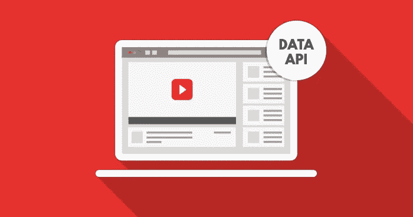
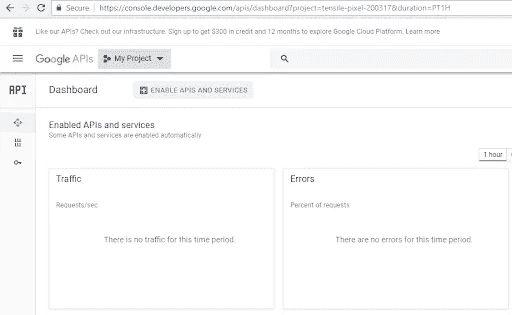
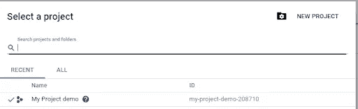
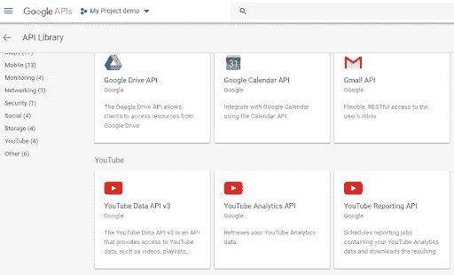
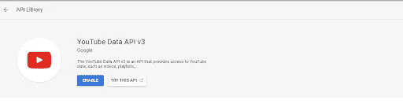
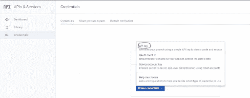
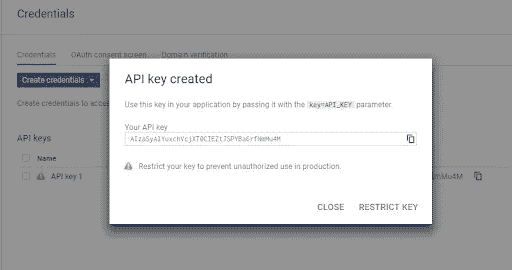
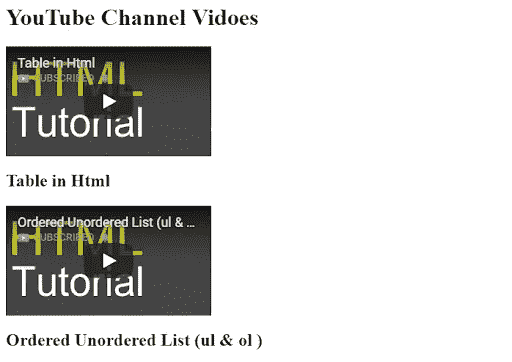

# 如何用 PHP 连接 Youtube API

> 原文：<https://medium.com/visualmodo/how-to-connect-youtube-api-with-php-ed5f70659cc7?source=collection_archive---------0----------------------->

YouTube 是世界上最受欢迎的视频共享平台，拥有大量视频、电影、节目、纪录片和其他相关内容。YouTube 于 2005 年开发，归谷歌所有，拥有世界上最大的视频数据库，包含不同的细分市场。你可以在平台上观看你选择的任何东西，它还允许你创建/上传你自己的视频到平台上。根据一项调查，全球每月花时间在[平台](https://visualmodo.com/blog/)上观看视频的访客数量约为 60 亿小时。谈到它在开发中的便利性，data YouTube API 提供了一种快速访问 YouTube 数据的方法，您将在本文中看到如何将它与 PHP 连接起来。

# 将 YouTube API 键连接到 PHP

而如今，YouTube 也成为了数字营销的一个很好的渠道。因为公司确实瞄准了为其产品和服务做广告的平台。

谈到它在开发上的便利性，YouTube 的数据 API 提供了一种快速访问 YouTube 数据的方式。它包括视频、播放列表、频道和其他相关数据。所以，要开始使用 YouTube 数据 API，首先，你要在 google 上创建一个账号，并获取 API key。因为它将用于生成 API 请求，然后提供对平台的访问。

在这篇文章中，我将演示如何通过使用 Youtube 数据 API 来获取 API 密钥和获取 YouTube 视频。

# 先决条件

出于本教程的目的，我假设您在 web 服务器上安装了一个 PHP 应用程序。我的设置是:

*   PHP 7.x
*   谷歌账户

我使用了一个托管的云服务器来托管我的 PHP 应用程序。因为它让我可以完全专注于我的工作，而不会将我的注意力转移到任何物理服务器问题上。此外，它还为 PHP web 应用程序提供了优化的[托管，拥有先进的工具和功能。](https://www.cloudways.com/en/php-cloud-hosting.php)

# 获取 Youtube API 密钥

在托管云服务器上成功安装应用程序后，下一步是注册一个谷歌账户，然后从[谷歌控制台](https://console.developers.google.com/apis/dashboard?project=tensile-pixel-200317&duration=PT1H)获取 API 密匙。

在 Google API 控制台中，单击选择项目链接并创建项目。

在左侧导航菜单中，单击库链接。然后在 YouTube APIs 部分，点击 YouTube 数据 API 链接。

现在要访问 YouTube 数据，启用 **YouTube 数据 API v3** 来访问所需数据。

在左侧导航菜单中，单击凭据链接。然后点击 Create credentials 按钮并选择 API key 后。

屏幕[上将出现一个对话框，包含](https://visualmodo.com/wordpress-themes/)您的 API 密钥，您将在 YouTube 数据 API v3 请求中使用该密钥。

# 使用 YouTube 数据 API v3 获取 Youtube 视频

YouTube 数据 API 返回包含视频固有信息的 JSON 数据。它包括标题，描述，缩略图等。

$ API _ Key = ' Insert _ Your _ API _ Key '；

$ channelID = ' Insert _ Channel _ ID '；

$ maxResults = 10

$ video list = JSON _ decode(file _ get _ contents(' https://www . Google APIs . com/YouTube/v3/search？order = date & part = snippet & channelId = '。$channelID。&maxResults= '。$maxResults。&key= '。$API_key。"));

# 使用 PHP 的 Youtube 视频列表

循环浏览$videoList->项目，列出 YouTube 频道中的视频。

foreach($ video list-> items as $ item){

if(isset($item->id->videoId)){

回声报

[”https://www.youtube.com/embed/’.$item-](”https://www.youtube.com/embed/’.$item-)

id->videoId。" frame border = " 0 " allow full screen >

## ’。$item->代码片段->标题。

’；

}

}

除了视频列表中的视频 ID 和标题，您还可以显示符合您要求的其他首选信息。

# 结论

综上所述，本文向您展示了如何创建和使用 YouTube API 从该平台获取视频的简单方法。从从 Google 控制台生成 API 密匙到在 PHP 应用程序中使用它，本文涵盖了解释整个过程的详细步骤。在这个[演示](http://phpstack-166178-487185.cloudwaysapps.com/)中可以进一步看到整个执行过程。如果你对这篇文章有更多的问题，你可以在下面的评论区提问。

***作者简介:*** *Sajjad 是*[*Cloudways*](https://www.cloudways.com/en/?id=309377)*—一个托管云托管平台的社区经理。他喜欢帮助店主、商人和营销人员建立他们的业务和创业。*