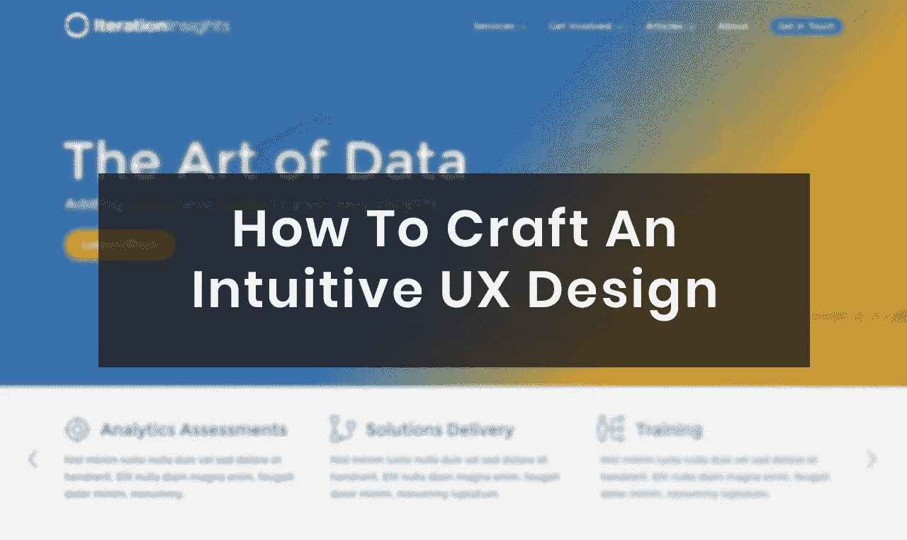

# 如何制作直观的 UX 设计

> 原文：<https://medium.com/visualmodo/how-to-craft-an-intuitive-ux-design-6b85d3f92cf0?source=collection_archive---------0----------------------->

用户体验可能是你的网站区别于竞争对手的决定性特征。经过微调的 UX 设计有助于最大限度地减少客户的挫折感，并减少他们在您的平台上遇到的挑战。它有助于创造符合客户需求的解决方案和体验。在这篇文章中，你将学习如何制作一个直观的 UX 设计。

这篇文章将帮助您了解如何制作一个直观的 UX 设计。从测试到目标和目的，再到最终产品，我们会全程为您服务。

如果你正在寻找一家公司来帮助你的网站的用户体验和界面，看看你所在地区的一些专业的网页设计公司。一定要看看他们的投资组合和结果，以确保他们符合你自己的目标。

目录

1.  什么是 UX 设计？
2.  如何规划你的 UX 设计
3.  打造你的设计
4.  用户测试
5.  结论

# 什么是用户体验设计？

用户体验设计是创建你的网站/应用程序的过程，带领用户在你的平台上进行一次正确的旅程。你的用户将如何体验这一旅程？完成后他们会有什么感觉吗？你的产品会如何影响他们的生活，会实现他们的目标吗？这就是 UX 设计的全部。

UX 不同于用户界面，因为用户体验仅仅是通过视觉艺术来衡量用户的情感体验。我们融入了一点心理学，试图更深入地了解我们的设计如何影响我们的用户。

“用户体验设计”这个术语是由当时在苹果工作的心理学家唐纳德·诺曼在 90 年代创造的。他观察了用户从最初购买到安装和使用产品的体验。当时的 Mac 电脑装在巨大的盒子里，很重，需要一段时间来安装，实际使用电脑的整体体验并不是很好。他为苹果如何测试和[创造今天的产品设计](https://visualmodo.com/5-reasons-use-videos-online-marketing/)提供了基础。

简而言之，这就是 UX 的设计。你不能只看一个产品如何帮助人们的生活。你需要关注每一个步骤，从你网站的最初入口，到购买过程，到产品最终如何帮助他们。一切都需要循环往复。

制作一个好的 UX 设计需要的不仅仅是一些好的设计技巧。这需要对你的客户如何思考以及他们将如何在情感上穿越你的平台有一个坚定的理解。这需要大量的测试和研究。找到带他们实现最终目标的最佳流程。

# 如何规划你的 UX 设计

UX 设计的规划过程与传统的设计模式既相似又不同。你仍然需要在整个用户界面设计中加入线框、情绪板和品牌元素。

区别在于你如何将用户的需求和最终目标融入其中，同时确保在整个过程中保持他们的情绪。他们的旅程将如何开始，将把他们引向何方。那么，你能确保他们在旅程结束时达到目标吗？他们对这次旅行会有什么样的情绪反应？购买后，该产品将如何影响他们的生活？这就是你如何创造一个成功的 UX 设计。

请记住，用户体验涵盖了用户与公司合作的所有方面，从服务到产品。用户体验也取决于产品的使用方式，所以要对产品如何帮助用户的生活有一个明确的理解，并充分利用这一点。

*   迭代洞察网站计划的草图

# 不要为自己设计

不要根据你的需求来设计网站。这被称为“虚假共识”，你认为设计一个网站/应用程序的方式可以遍历它并到达最终目标。

你和你的用户在各方面都不同。不要去想你自己或者你会在站台上做什么。你需要对你的观众有一个坚定的理解，以及他们将如何与网站互动。

# 打造你的 UX 设计

当你完成计划后，是时候开始制作你的 UX 设计了。与您的团队合作，提出最佳决策，让用户体验保持在竞争优势之上。这里的目的是增加转化率，降低跳出率，满足客户，让他们觉得有必要回到你的网站或推荐给其他人。

现在，我们将通过一些方法来帮助你在你的项目中采用成功的 UX 设计。

# 让你的设计变得实用、有用和容易理解

“88%的网上购物者表示，如果用户体验不佳，他们不会再光顾某个网站。” —小商业天才

在保持简单性的同时，用户的体验应该是惊人的。你在整个网站流程中涉及的步骤越多，失去的用户就越多。

即使在结帐表单中增加一个字段，也可能意味着获得用户和失去用户之间的差别。不让事情变得太复杂。你的设计流程的每一个方面都应该服务于一个目的，对任何用户都是可用的和可访问的。

Iteration Insights 是一家商业智能公司，其目标是简化合作伙伴的数据，以创建更高效的流程，并提供对其数据的关键见解。他们的网站向他们的潜在客户介绍了整个过程，以及他们如何能够在一个易于使用的界面中受益于他们的服务，从而提供良好的体验。

对于他们的网站设计，我们希望为他们的用户体验做一些关键的方面，使他们在竞争中脱颖而出:

*   网站结构中内容类型的适当分离，即服务、社区参与、文章
*   主要关注寻找服务的潜在客户的内容层次
*   次要重点是信息和社区参与
*   针对每种用户类型的主页

–我们的第一个迭代洞察主页模型设计

对于潜在客户来说，网站需要看起来专业，但它也需要成为商业智能顾问通过他们的文章和活动学习和参与的中心。它需要将他们的公司定位为一个在他们的领域有声望的专家团队。

*   我们的第一页模型的后半部分

# 看看每个设计方面的情感影响

更好的用户界面可以将你网站的转化率提高 200%，更好的 UX 设计可以将转化率提高 400% —弗雷斯特

从结账按钮的颜色到主页上的行动号召部分；任何事情都会对用户产生情感上的影响。在你开始 A/B 测试之前，你需要试着理解你的用户的情绪，以及你的元素会如何影响他们。

同样，用户体验并不完全是关于用户如何从 A 点到 b 点，而是关于他们从最初进入网站到收到产品以及产品对他们生活的影响的感受。

通过对网站中不同元素的情感影响有一个坚定的理解，你可以提前开始做出最佳的决定。适当的 UX 设计将有助于立即提高点击率，并带来更多的转换。

# 设计时考虑所有设备，打造直观的 UX 设计

*“尽管近 75%的用户喜欢移动友好型网站，但 96%的消费者表示，他们遇到过明显不是为移动设备设计的网站。”* —用谷歌思考

如今消费者可以使用如此多的设备，为每种设备精心设计你的网站是非常重要的。用户在台式机上的体验应该与您的手机或平板电脑设计相当。不要因为懒惰或者因为你认为它不重要而轻视一个设备。

因为有很多网站没有为他们的移动用户进行适当的设计，如果你的网站提供了特别的体验，它就为更多的人回到你的网站敞开了大门。谷歌的 Think With Google 还表示，如果一个网站能提供手机友好的体验，74%的用户会再次访问该网站。

# 如何测试你的 UX 设计

*“目前只有 55%的公司进行 UX 测试。”* —小商业天才

测试你的网站或应用程序是 UX 设计的一个重要部分。您应该尽可能快地对测试进行优先级排序，即使您只完成了设计的一小部分。你越早开始用真实用户测试你的平台，你的产品在项目结束时就越好。适当的测试也能让你在竞争中领先。

**这里有一些正确测试你的 UX 设计的技巧:**

# 使用同意帮助你测试的真实的人

利用朋友和家人是很好的，但是他们不是你创造一个成功的 UX 设计的最佳选择。

找到在现实生活中会使用你的产品的人，给他们机会到幕后测试你的产品。为此，你可以创建一个邀请表单，让人们注册，并扩展到不同的地方，你认为你将能够找到愿意提供帮助的人。

您可以在不同的地方找到测试员:

*   首先，Reddit
*   其次，LinkedIn
*   在线论坛
*   最后，博客