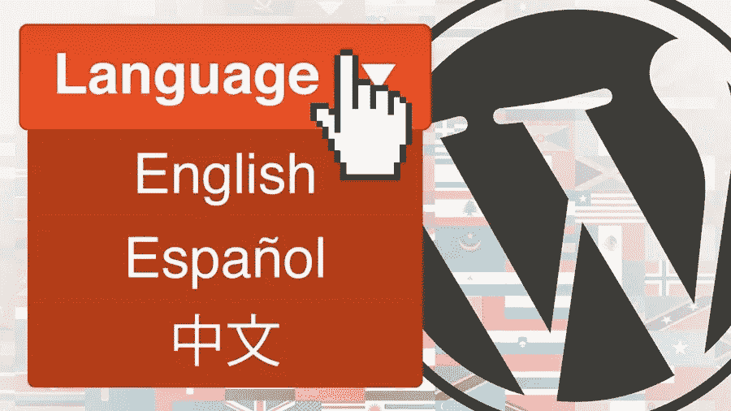

# 如何创建多语言 WordPress 博客

> 原文：<https://medium.com/visualmodo/how-to-create-a-multilingual-wordpress-blog-4945587fd426?source=collection_archive---------0----------------------->

## 简易指南

是的，这是一个越来越小的小世界。希望扩大受众和收入的企业正在寻求向海外扩张。当他们这样做的时候，他们明白翻译和本地化他们的网站，博客，甚至社交媒体帖子的需要。那么如何创建一个多语言的 WordPress 博客呢？

博客尤其重要，因为它们是公司与潜在客户建立关系、提供重要信息、娱乐甚至激励的手段。

好消息是——这很容易。另一个好消息呢？如果你想要一个多语言博客，你不需要设置一个多种语言的博客或者为你选择的每种语言安装独特的 WordPress。

# 如何创建多语言 WordPress 博客？

**两种方法**

你有两个选择来建立你的多语言 WordPress 网站。

1.  您可以手动将所有博客文章翻译成您选择的语言。
2.  你可以使用谷歌翻译，这是一种机器翻译。虽然谷歌机器翻译肯定在不断改进，但你可能不会对结果完全满意。

如果你有资源和预算，第一个选择显然是最好的。这种方法将为您提供最准确的翻译，包括图像和媒体在内的翻译将考虑目标受众的文化适宜性。

如果你选择使用谷歌翻译，质量将不会那么好，图像/媒体将不会考虑文化适合性。如果你选择这个选项，每个帖子上会有一个“切换器”,允许用户选择自己喜欢的语言。

**手动翻译选项**

**下面是这个选项的简单步骤:**

1.  安装 Polylang 插件。一定要激活它。
2.  在您的仪表板上，转到“设置”并选择“语言”这是您将如何配置您选择的语言(您可以随时添加更多。)
3.  在语言设置中，有三个选项卡:
4.  第一个是“语言”在这里，您将添加实际的语言。请务必确定默认语言，然后确定您想要使用的其他语言。
5.  第二个选项卡是“字符串翻译”在这里你可以添加你的博客的标题，简短的描述，然后是你想用的每种语言的日期和时间格式。
6.  第三个选项卡是“设置”选择您的默认语言，这是您的博客首次被访问时的显示方式。然后，您还需要设置其他技术设置，比如 URL。在开始时，不改变 URL 可能是一个好主意。

还要注意，在这个设置页面上，你会被问到“漂亮的永久链接”通过选择第二个选项，您将进一步优化您的帖子以进行多语言 SEO。

此外，选中检测浏览器语言的选项，因为这将自动以用户语言显示文章。

完成后，请务必点击“保存”按钮。

*   现在添加内容。你要做的就是写一篇新文章。在“添加新帖子”屏幕上，按照说明添加标题等。它会自动添加默认语言的文章，但是你可以选择你已经选择的其他语言。所以，现在你要做的就是把你的文章翻译成你想要的语言，回到屏幕，从右边的选项中选择语言，然后添加翻译后的文章。

如果你的博客被分成不同的类别，你也可以把它们翻译过来。只需进入“文章”，然后“类别”添加每个类别，并检查你想要的语言。

*   在你的博客网站上放置一个多语言的 WordPress“切换器”。

你也可以在你的[侧边栏](https://visualmodo.com/)区域添加一个切换器，让用户选择你的帖子翻译成的语言。只需转到“外观”，然后是“部件”你可以选择“语言切换器”,然后通过名字甚至国旗来选择你的语言。完成后记得点击“保存”。因此，当一个帖子被拉起时，读者可以从侧边栏中选择他/她的语言。

为什么这是你的最佳选择

翻译是这样的。不仅仅是翻译的问题。这也是本地化的问题。如果你想在国外赢得观众，你的内容，你的视觉效果，以及所有其他的东西都必须在文化上适合每一个观众。

仅仅因为这个原因，你应该使用一个有信誉的翻译服务。作为信息和资源，请查看[Word Point](https://thewordpoint.com/services/localization)专业翻译/本地化服务应该为您做什么的最佳实践解释。它应该有您的目标语言的本地专家，应该提供人工翻译，应该为您的职位分配单独的翻译人员，并且应该在整个本地化过程中始终安排您和您的翻译人员之间的定期交流。您希望参与所有关于本地化的决策。

**谷歌翻译选项**

如果你没有人工翻译的预算或资源，你可以选择使用谷歌翻译——这种资源会自动将你的博客文章翻译成你选择的任何语言，从而创建一个多语言的 WordPress 网站。

你可以这样做:

1.  您必须首先安装并激活谷歌语言翻译插件。
2.  就像手动翻译一样，您必须配置插件。进入“设置”并选择谷歌语言翻译。然后您将看到所有可用语言的列表。
3.  这种配置可以通过多种方式进行定制，因此您需要浏览所有选项并选择您想要的。
4.  因为这可能会有点棘手，所以你最好的办法是利用提供的[谷歌翻译教程](https://www.wpbeginner.com/plugins/how-to-add-google-translate-in-wordpress/)，一步一步地完成详细的说明。

希望本指南已经为您提供了您需要的信息:

1.  选择您的选项——手动翻译或谷歌翻译
2.  使用正确的插件进行设置，并了解如何配置它们
3.  用你的好帖子接触外国受众，扩大这些受众，同时发展你的业务。

# 作者

玛格丽特·里德是一名自由撰稿人，她正在寻找个人和职业发展的新途径。目前她在 Word Point 公司工作，并试图在博客生涯中提升自己。玛格丽特是一位经验丰富、自我激励的专家，她无法想象没有写作的生活。