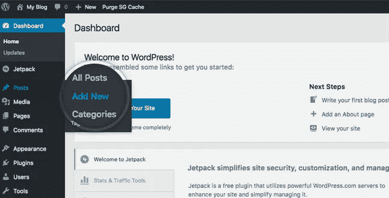
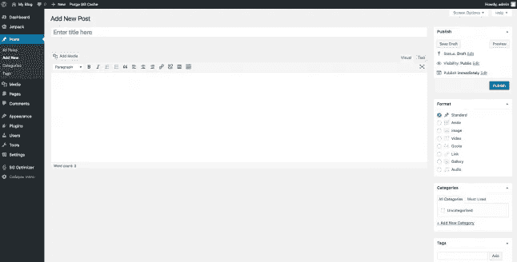
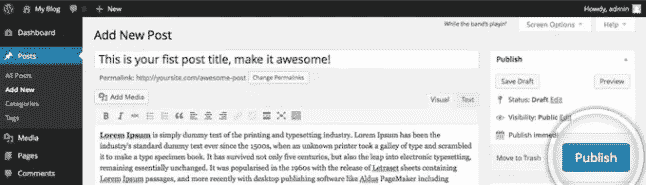
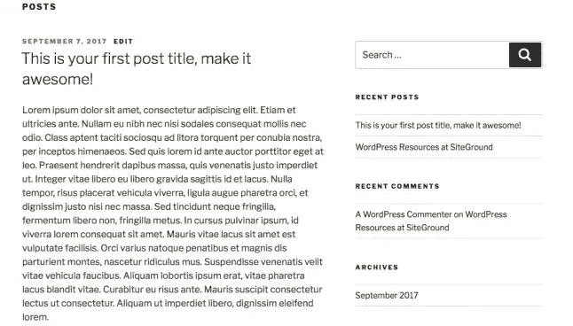

# 如何创建一个 WordPress 帖子

> 原文：<https://medium.com/visualmodo/how-to-create-a-wordpress-post-3ddf633a22eb?source=collection_archive---------0----------------------->

本教程解释了如何在你的网站上为你的博客、杂志或其他自定义帖子类型(如作品集或图库)创建一个新的 WordPress 帖子。

要开始创建你的第一篇 WordPress 文章，在 WordPress 仪表盘的左侧找到**文章**菜单。您可以将鼠标悬停在文章链接上，或者单击将其展开以显示子菜单。

# 了解如何创建新的 WordPress 文章

本教程解释了如何在你的 WordPress 网站上创建新文章。首先你需要登录你的网站管理面板，进入**帖子- >添加新的**。

在这个页面上，你会看到 [WordPress](https://visualmodo.com/) 帖子编辑器。本页最重要的部分是:

*   **文章标题** —在此字段中输入文章的标题。在你的主题上，它会显示在你的内容上面。
*   **文章内容** —你可以使用 WordPress WYSIWYG 编辑器添加文章的实际内容。请注意，它有两个选项卡— **可视化**(使用编辑器格式化您的文本)和**文本**(直接添加您的 HTML 代码)。

一旦你输入了你的第一个 WordPress [帖子](https://codex.wordpress.org/Writing_Posts)的内容，你需要**发布**它。发布会将您的帖子带到您的实际网站上。

就是这样！现在，您可以进入网站首页查看新创建的博客文章。

**标题/标题框**

你文章的标题。您可以使用任何短语、单词或字符。避免使用同一个标题两次，因为这将导致问题。你可以在帖子中使用逗号、撇号、引号、连字符/破折号和其他典型的符号，比如“我的网站——看着你呢，孩子”。然后 WordPress 将对其进行清理，生成一个用户友好的、URL 有效的帖子名称(也称为“帖子 slug”)，以构成帖子的永久链接。

**正文复制框**

空白框，您可以在其中输入文字、链接、图像链接以及您希望在网站上显示的任何信息。您可以使用可视视图或文本视图来撰写帖子。有关文本视图的更多信息，请参见下一节[视觉与文本视图](https://codex.wordpress.org/Writing_Posts#Visual_Versus_Text_Editor)。

**预览按钮**

允许您在正式发布文章之前查看文章。