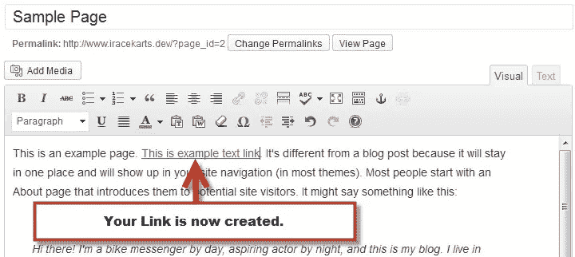
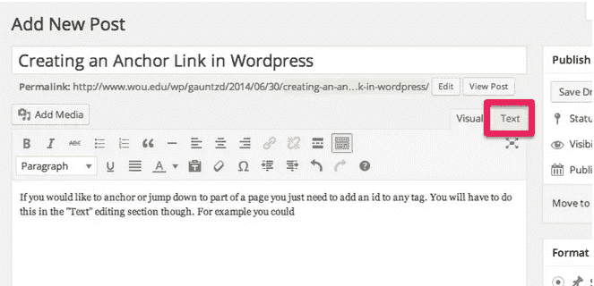

# 如何创建锚定链接

> 原文：<https://medium.com/visualmodo/how-to-create-anchor-links-19f21608870e?source=collection_archive---------1----------------------->

## 在 WordPress 中

在这个“如何做”系列中，我将展示你必须创建命名的锚链接，或者有些人在 WordPress 中称之为锚标签。如果你在一篇长文章或页面中有不同的部分，你希望访问者能够点击一个链接，比如在你创建的目录中，跳转到这篇文章的不同部分，那么你就需要使用锚链接。

在 WordPress 中创建锚链接并不像它应该的那样简单，但是只要遵循下面的步骤，你就可以轻松地创建[锚](http://theme.visualmodo.com/stream/)链接，不需要任何编码技能。

# 创建锚点链接

1.  选择并编辑要在其中创建锚点链接的页面或帖子。
2.  接下来点击帖子/页面上的**“Text”**标签，查看其源代码。

1.  现在你可以看到页面的源代码了，你只需要把这些代码添加到你想要放置锚点的地方。不，你可以改变标签中的 id 和标题来满足你的需要。
    `<a id="section1">Section 1</a>`
2.  您现在可以切换回 [**可视**](https://visualmodo.com/) 选项卡来创建链接。要创建链接，突出显示你想让用户点击的文本到你的锚链接，对于链接，使用你的锚标签中的 id，前面加一个散列符号。所以在我的例子中，链接应该是:
    `#section1`

1.  就是这样！保存并发布或预览您的草稿以进行测试。在我的例子中，当我点击“如何在 [WordPress](https://visualmodo.com/) 中调整图片大小”时，它会把我带到那个部分。单击上一个链接查看真实示例。

# 注意

您还可以创建跨页面的命名锚点链接。所以正如你在上面的例子中看到的，我们没有跳转到这篇文章的不同部分，而是导航到一个新的 URL，然后跳转到那个部分。要做到这一点，只需在创建链接时输入您想要导航到的页面的 URL，后跟散列 id。上面的链接有这个代码作为链接:
`https://www.visualmodo.com/how-to-create-named-anchor-links-in-wordpress/#section1`